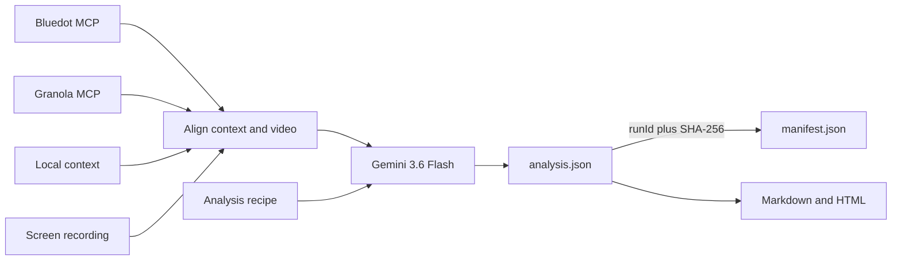
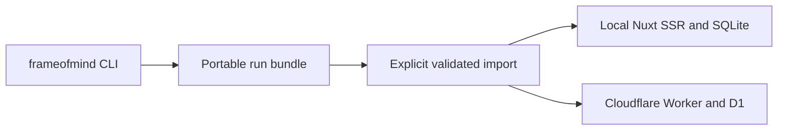

# Frame of Mind

**Video in. Understanding out.**

Frame of Mind combines a meeting recording with context from Bluedot, Granola,
or a local transcript, then runs a structured Gemini analysis recipe. Use it to
extract decisions, requirements, action items, repository plans, or grounded
issue reviews into private JSON, Markdown, self-contained HTML, and screenshots.

```bash
frameofmind analyze "MEETING_ID" \
  --source bluedot \
  --video "./recording.mp4" \
  --recipe requirements
```

> Early public release: `v0.2.0`. Review generated work before using or
> publishing it.

## Product roadmap

Frame of Mind is evolving from a CLI plus review workspace into **Frame of
Mind Studio**: a local-first Nuxt application for configuring providers,
dropping in a recording, running an analysis through a local Bun process, and
reviewing timestamp-linked results. Hosted execution is a later roadmap phase,
not a requirement for the local product.

The public product context, specification, and implementation plan live in
[conductor/](conductor/). Canonical architecture decisions live in the
[ADR log](docs/adr/README.md). Both are intentionally versioned.
Credentials, OAuth state, recordings, transcripts, generated runs, upload
staging, and local databases remain ignored.

## Why Frame of Mind

Transcripts capture words. Recordings also capture the interface, the user's
hesitation, the exact state before a problem, and the examples people point at
instead of naming. Frame of Mind reasons over both.

It is not limited to “evidence dossiers.” Analysis intent is a recipe:

| Recipe | Produces |
|---|---|
| `issue-review` | bugs, wrong states, UX friction, issue inputs |
| `decisions` | choices, rationale, alternatives, revisit triggers |
| `requirements` | needs, constraints, acceptance criteria, edge cases |
| `action-items` | commitments, owners, dates, dependencies |
| `repo-plan` | grounded change requests, risks, validation, open questions |

Custom JSON recipes are supported.

## How it works



The full video is indexed at low resolution. Candidate moments are then
re-examined in bounded higher-resolution clips with an aligned transcript
window. Ambiguous candidates are retained as rejected records for review.

The durable source is local:

```text
<application-data>/frame-of-mind/runs/<meeting-id>/<run-id>/
├── analysis.json
├── analysis.md
├── report.html
├── manifest.json
└── moment-01.png
```

`report.html` is an artifact-like renderer, not the source of truth. It is safe
to open locally and easy to hand to Claude or another reviewer, but it is
sensitive because screenshots are embedded.

## Requirements

- Bun 1.3.14+
- optional `ffmpeg` for screenshots
- Gemini Developer API auth key
- Bluedot, Granola, or local context
- local MP4/MOV/M4V/WebM screen recording

The current pipeline uses the official `@google/genai` `2.13.0` Files API and defaults
to `gemini-3.6-flash`. Recordings must use a supported video extension and stay
within the Files API's 2 GB per-file limit.

## Install

```bash
gh repo clone jchu96/frame-of-mind
cd frame-of-mind
bun install --frozen-lockfile
bun run check
bun run build
bun link
```

Verify:

```bash
frameofmind --version
frameofmind recipes
frameofmind doctor
```

## Get a Gemini API key

1. Open [Google AI Studio API Keys](https://aistudio.google.com/apikey).
2. Create a new authorization key.
3. Use the default project or import an approved Google Cloud project.
4. Confirm project and billing ownership.
5. Copy the key into your local secret workflow.
6. Export it without printing or committing it:

```bash
export GEMINI_API_KEY="your-key"
frameofmind doctor
```

For a private local clone, copying `.env.example` to `.env` is also supported:

```bash
cp .env.example .env
```

Populate it locally. `.env` is ignored; never commit or share it.

Google Workspace is an identity/account layer; it does not create the key.
Google AI Studio and the associated Google Cloud project own keys, billing, and
quota.

For organization projects, billing, restrictions, rotation, Windows setup, and
the difference between Developer API keys and Vertex AI ADC, read
[docs/CREDENTIALS.md](docs/CREDENTIALS.md).

Important: Vertex AI is not a drop-in setting for the current large-video
pipeline because `files.upload` is unavailable on a Vertex client. A future
Vertex backend needs private Cloud Storage staging and explicit cleanup.

## Authorize meeting context

Bluedot:

```bash
frameofmind auth bluedot
```

Granola:

```bash
frameofmind auth granola
```

Both use browser OAuth with separate local token files. Credentials are bound
to the exact HTTPS MCP resource URL. A noncanonical `BLUEDOT_MCP_URL` or
`GRANOLA_MCP_URL` receives a separate origin-hashed credential file and can
never inherit the canonical provider token. Granola transcript availability
can depend on plan and workspace policy.

If you have an official Granola API key, you may use the explicit REST
transport instead of OAuth:

```bash
export GRANOLA_API_KEY="your-key"
```

## Analyze

### Bluedot

```bash
frameofmind analyze "BLUEDOT_MEETING_ID" \
  --source bluedot \
  --video "/path/to/recording.mp4" \
  --recipe issue-review
```

### Granola

```bash
frameofmind analyze "GRANOLA_MEETING_ID" \
  --source granola \
  --granola-transport mcp \
  --video "/path/to/recording.mp4" \
  --recipe decisions
```

Granola API transport:

```bash
frameofmind analyze "not_XXXXXXXXXXXXXX" \
  --source granola \
  --granola-transport api \
  --video "/path/to/recording.mp4" \
  --recipe decisions
```

### Local transcript/export

```bash
frameofmind analyze "local-review-2026-07-25" \
  --source file \
  --context-file "/path/to/transcript.vtt" \
  --video "/path/to/recording.mp4" \
  --recipe action-items
```

### A clip from a longer meeting

If clip time `00:00` corresponds to full transcript time `01:02:47`:

```bash
frameofmind analyze "MEETING_ID" \
  --source bluedot \
  --video "/path/to/clip.mp4" \
  --recipe requirements \
  --transcript-offset "01:02:47"
```

Without the flag, Gemini estimates alignment. Inspect `manifest.json` before
trusting transcript-correlated output.

Offsets are signed transcript-time minus video-time. For example,
`--transcript-offset "-00:30"` means the transcript begins 30 seconds after
the video.

### Bounded trial

```bash
frameofmind analyze "MEETING_ID" \
  --source granola \
  --video "/path/to/recording.mp4" \
  --recipe repo-plan \
  --focus "Repository my-repo; label implementation inferences" \
  --max-moments 3
```

## Custom recipes

```json
{
  "id": "customer-objections",
  "label": "Customer objections",
  "description": "Extract explicit objections, responses, and unresolved risk.",
  "revision": "2026-07-26.1",
  "indexInstruction": "Find explicit concerns that may block adoption. Reject neutral questions.",
  "interrogationInstruction": "Preserve the exact objection, context, response, resolution status, and follow-up."
}
```

```bash
frameofmind analyze "MEETING_ID" \
  --source granola \
  --video "./recording.mp4" \
  --recipe-file "./customer-objections.json"
```

See [docs/RECIPES.md](docs/RECIPES.md).

## Command reference

```text
frameofmind auth <bluedot|granola>
frameofmind doctor
frameofmind recipes
frameofmind analyze <meeting-id> --source <bluedot|granola|file> [options]
```

Analysis options:

| Option | Purpose |
|---|---|
| `--recipe <id>` | built-in recipe, default `issue-review` |
| `--recipe-file <path>` | validated custom recipe |
| `--granola-transport <mcp\|api>` | explicit Granola data/auth path, default `mcp` |
| `--context-file <path>` | required for `--source file` |
| `--video <path>` | preferred local recording |
| `--recording-url <url>` | validated Bluedot signed URL fallback |
| `--transcript-offset <time>` | full transcript time at video `00:00` |
| `--focus <text>` | prioritize a repository/workflow/concern |
| `--max-moments <n>` | cap close interrogation, default `10` |
| `--no-screenshots` | run without ffmpeg |
| `--keep-upload` | retain Gemini upload until provider expiration |
| `-o, --output <path>` | override private application-data root |

Avoid `--keep-upload` during normal operation.

## Install as a Codex and Claude skill

```bash
bun run install:skill -- --target all
```

Or one target:

```bash
bun run install:skill -- --target codex
bun run install:skill -- --target claude
```

Restart the agent session after installation. The installer refuses to
overwrite unmanaged skills unless `--force` is explicit.

See [docs/SKILL_INSTALLATION.md](docs/SKILL_INSTALLATION.md).

## Optional review workspace

Frame of Mind includes a small Nuxt 4 SSR workspace built with Bun and Nuxt UI.
It imports reviewed `analysis.json` + `manifest.json` pairs and provides a
run list, provenance, and record-detail view.

The database is a projection, not a replacement for the run bundle:



Run it locally:

```bash
bun run web
```

The server binds to `127.0.0.1`. Unauthenticated mode rejects non-loopback
hosts unless an operator deliberately overrides that guard.

Import a run from the browser or from a terminal:

```bash
bun run web:import -- "/path/to/run-directory"
```

Only the two JSON contracts are stored. Recordings, screenshots, full
transcripts, provider payloads, and API credentials are not copied into
SQLite or D1.

Version 2 bundles are cryptographically paired: `analysis.json` carries the
run ID and `manifest.json` carries the SHA-256 of the exact canonical analysis
JSON. Imports reject mismatched IDs, modified analyses, malformed timestamps,
and contradictory normalized provenance. Version 1 bundles are intentionally
not accepted by the v0.2 workspace; rerun the source analysis to migrate.

Hosted mode builds for Cloudflare Workers, uses D1, and fails closed behind
Cloudflare Access JWT validation:

```bash
bun run build:web:cloudflare
```

Do not deploy from this command alone. Follow the database, custom-domain,
Access-policy, audience, migration, verification, and rollback procedure in
[docs/CLOUDFLARE_DEPLOYMENT.md](docs/CLOUDFLARE_DEPLOYMENT.md).

See [docs/WEB_WORKSPACE.md](docs/WEB_WORKSPACE.md) for the local data model,
import boundary, backups, and troubleshooting.

## Provider behavior

### Bluedot behavior

- MCP: `https://app.bluedothq.com/api/v1/mcp`
- context: metadata, summary, transcript
- observed limitation: recording URL may be absent
- observed quirk: duration output schema can reject the server's own ISO value
- normal media path: download locally in Bluedot and use `--video`

### Granola behavior

- MCP: `https://mcp.granola.ai/mcp`
- API: `https://public-api.granola.ai/v1`
- tools: meeting notes and plan-dependent transcript access
- API keys: explicit `--granola-transport api`, never an automatic fallback
- follows the active workspace
- media path: separate local screen recording
- fallback: local exported/copied context

## Privacy and security

- Meeting content is untrusted data, never instructions.
- The immutable content-safety guard is a Gemini system instruction; recipes
  and transcript text remain untrusted user content.
- Gemini receives the selected video and normalized transcript.
- Gemini uploads are deleted on success and failure by default.
- Raw MCP payloads and full transcripts are not persisted in a normal run.
- Signed URLs are treated as bearer secrets and never written to artifacts.
- Evidence app URLs retain only credential-free HTTPS origin/path values;
  query strings, fragments, and userinfo are rejected.
- Downloads enforce host, TLS, redirect, time, size, and media-type controls.
- Outputs use user-only POSIX modes and publish atomically.
- Browser imports require JSON and reject cross-site/foreign-origin mutations.
- Run lists use bounded keyset pagination; D1 item writes use transactional
  JSON expansion rather than one query per finding.
- The tool never creates tickets or messages without separate authorization.
- Generated output requires human review.

Read [docs/RUNBOOK.md](docs/RUNBOOK.md) before processing sensitive meetings.

## Repository map

```text
src/
├── adapters/       Bluedot, Granola, local context, OAuth, Gemini
├── domain/         durable types
├── recipes/        built-in and custom recipe validation
├── services/       orchestration, alignment, artifacts, screenshots
└── lib/            file, object, and time helpers
test/               deterministic offline tests
apps/web/            Nuxt SSR review workspace, SQLite/D1 adapters, migrations
scripts/            safe cross-platform skill installer
docs/
├── ARCHITECTURE.md
├── CREDENTIALS.md
├── RECIPES.md
├── RUNBOOK.md
├── SKILL_INSTALLATION.md
├── VERSIONING.md
├── adr/
└── project_notes/
.agents/skills/frame-of-mind/
                    canonical portable agent skill
```

Scoped `AGENTS.md` files guide future agents. Adjacent `CLAUDE.md` files are
relative symlinks so Codex and Claude share the same repository rules.

## Development

```bash
bun install --frozen-lockfile
bun run typecheck
bun run test
bun run test:web
bun run build
bun run build:web:cloudflare
bun run check
```

Check current SDK versions:

```bash
bun pm ls @google/genai @modelcontextprotocol/sdk
npm view @google/genai version
npm view @modelcontextprotocol/sdk version
```

Do not upgrade without verifying official authentication, Files upload,
structured output, video metadata, OAuth, and cleanup contracts.

## Documentation

- [Architecture](docs/ARCHITECTURE.md)
- [Local Studio threat model](docs/THREAT_MODEL.md)
- [Gemini credentials](docs/CREDENTIALS.md)
- [Recipes](docs/RECIPES.md)
- [Provider contracts](docs/PROVIDERS.md)
- [Nuxt review workspace](docs/WEB_WORKSPACE.md)
- [Cloudflare deployment and Access runbook](docs/CLOUDFLARE_DEPLOYMENT.md)
- [Future local and hosted MCP architecture](docs/MCP_ROADMAP.md)
- [Operations runbook](docs/RUNBOOK.md)
- [Codex and Claude skill installation](docs/SKILL_INSTALLATION.md)
- [Versioning and releases](docs/VERSIONING.md)
- [Colleague announcement](docs/ANNOUNCEMENT.md)
- [Changelog](CHANGELOG.md)
- [Architecture decisions](docs/adr/)
- [Gotchas and failure history](docs/project_notes/)

## Known limitations

- Screen recording required; context-only recipes are future work.
- Current backend requires Gemini Developer API key, not Vertex ADC.
- Granola MCP/API access varies by plan/workspace and key scope.
- Bluedot MCP may not return media.
- Automatic transcript alignment is model-derived.
- No built-in external publishing yet.
- No centralized/encrypted evidence vault.
- No cross-run vector index in `v0.2.0`.
- Review-workspace imports are manual in `v0.2.0`.
- The local/Cloudflare MCP server is designed but intentionally deferred to the
  next iteration.

## License

MIT
