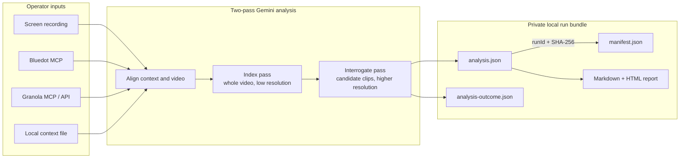
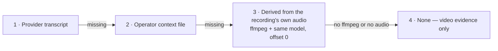
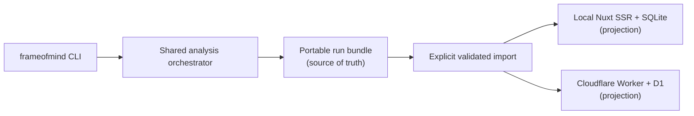

# Frame of Mind

**Video in. Understanding out.**

Frame of Mind is a local-first AI analyst for screen recordings. Point it at
a recorded meeting, user call, demo, or teaching session; pick a **recipe**
for what you want out of it; and it watches the video with Gemini — the
pixels, not just the words — and returns structured, evidence-cited findings
you can act on. Every claim is anchored to a timestamp, validated against a
strict local schema, and stored privately on your machine.

One run produces:

- **findings that match your intent** — issues, decisions, requirements,
  action items, a repository change plan, or communication coaching;
- **proof for each finding** — timestamps, verbatim UI text, reporter
  quotes, and screenshots of the exact moment;
- **a portable private bundle** — JSON contracts, Markdown, and a
  self-contained HTML report, with SHA-256 provenance in a manifest.

Meeting context from Bluedot or Granola (or a local transcript file) enriches
the analysis when available; a bare recording works too — Frame of Mind can
even derive its own transcript from the recording's audio.

[Install](#install) ·
[Quickstart](#analyze) ·
[Recipes](#recipes) ·
[Local Studio](#launch-the-local-studio) ·
[Documentation](#documentation)

> [!IMPORTANT]
> Early public release (`v0.3.0`). Review generated work before using or
> publishing it. Generated output always requires human review.

## Status as of 2026-08-22

- Local Studio Phases 1–8 are shipped: per-launch authentication, Connections,
  recording/context staging, the Intent/Context/Recording/Run composer,
  durable single-concurrency jobs, Activity recovery, retained playback and
  digest-verified reattachment, local exports, and unified maintenance. The
  implementation receipts and verification commands are recorded in the
  [Local Studio plan](conductor/tracks/local-studio_20260726/plan.md) and
  [Studio browser suite](apps/web/e2e/smoke/studio-smoke.spec.ts).
- Phase 9 release hardening is in progress. Documentation, classification,
  repository hygiene, fresh-clone platform testing, and hosted-track
  reconciliation are complete in this slice; only the operator/adversarial
  release gate (9.4) remains pending in the
  [Phase 9 checklist](conductor/tracks/local-studio_20260726/plan.md#phase-9-public-release-hardening-and-phase-b-roadmap).
- Hosted Studio remains dark and undeployed. Principal scoping (Slice 1),
  durable Workflows (Phase 3), composer/activity/publication (Phase 4), spend
  and telemetry Tasks 5.3–5.4, and Phase 6 preparation artifacts are built and
  contract-tested. ADR 0018 Amendment 1 in PR #65, upload Tasks 2.1–2.4,
  retention/capture Tasks 5.1–5.2, and the Phase 6 deployment gate remain
  pending. The current source of truth is the
  [Hosted Studio track](conductor/tracks/hosted-studio_20260822/).

## Why watch the video at all?

Transcripts capture words. Recordings also capture the interface, the user's
hesitation, the exact state before a problem, and the examples people point
at instead of naming. Frame of Mind reasons over both — and every finding
must cite visible or spoken evidence, or it is rejected.

Under the hood, v0.3.0 uses Google's documented resumable Files upload
protocol and a Gemini-safe response schema while the complete Zod contract
stays authoritative locally. An invalid structured response gets one
regeneration attempt with sanitized feedback; a terminal failure is isolated
to its candidate, valid candidates are retained, and sanitized receipts prove
what completed without storing provider payloads.

## Recipes

Analysis intent is a recipe:

| Recipe | Produces |
|---|---|
| `issue-review` | bugs, wrong states, UX friction, issue inputs |
| `decisions` | choices, rationale, alternatives, revisit triggers |
| `requirements` | needs, constraints, acceptance criteria, edge cases |
| `action-items` | commitments, owners, dates, dependencies |
| `repo-plan` | grounded change requests, risks, validation, open questions |
| `communication-coaching` | observed delivery, intent/impact, missed cues, guidance |

Custom JSON recipes are supported, either as two instruction strings or as a
structured **charter** — stance, allowed questions, acceptance, label
vocabulary, worked exemplars, rejection, and boundaries — rendered
deterministically by the executor under the untrusted-data guard (ADR 0016).
The built-in `issue-review` recipe is a charter. See
[docs/RECIPES.md](docs/RECIPES.md).

## How it works



The complete operator-selected video is indexed at low resolution. Candidate
moments are then re-examined in bounded higher-resolution clips with an
aligned transcript window. Ambiguous candidates are retained as rejected
records for review.

When no transcript is supplied, resolution walks a ladder before giving up:



A derived transcript uses generic speaker labels, is never stored, and can be
disabled with `--no-derived-transcript`. Recordings longer than ten minutes are
transcribed in ten-minute windows — each with a short lead-in overlap for
boundary context — then stitched back onto recording time, because one request
cannot emit a verbatim transcript of an hour-long meeting. If any window fails,
the run continues with no transcript rather than one containing a silent gap.

The durable source of truth is local:

```text
<application-data>/frame-of-mind/runs/<meeting-id>/<run-id>/
├── analysis.json
├── analysis-outcome.json
├── analysis.md
├── report.html
├── manifest.json
└── moment-01.png
```

> [!WARNING]
> `report.html` is a rendered artifact, not the source of truth. It is safe
> to open locally and easy to hand to a reviewer, but it is sensitive:
> screenshots are embedded.

## Requirements

- Bun 1.3.14+ (Node.js 22+ for the linked `frameofmind` executable)
- `ffmpeg` for smoke tests, derivative clips, screenshots, and derived transcripts
- A Gemini Developer API key
- Bluedot, Granola, or local context (optional — video-only runs are supported)
- A local MP4/MOV/M4V/WebM screen recording within the Files API 2 GB limit

The pipeline uses the official `@google/genai` `2.17.1` Files API and
defaults to `gemini-3.7-flash`. `gemini-pro-latest` is accepted for in-depth
runs but is a mutable alias, so it is less reproducible than a pinned model.

## Install

```bash
gh repo clone jchu96/frame-of-mind
cd frame-of-mind
bun install --frozen-lockfile
bun run build:cli
bun run build:web
bun link
```

Verify:

```bash
frameofmind --help
frameofmind --version
frameofmind recipes
frameofmind doctor
```

Contributors should also run the complete repository gate:

```bash
bun run check
```

The full fresh-clone Studio boot is continuously tested on macOS and Linux.
On Windows, use WSL or Git Bash with Bun 1.3.14+ and keep the checkout on LF:

```bash
git config --global core.autocrlf false
git config --global core.eol lf
```

Windows CI repeats the frozen install, CLI/web builds, and CLI help check, but
does not yet boot Local Studio; the headless Studio boot contract currently
runs on macOS and Linux only.

Maintainers can verify upload, both structured model passes, and exact remote
cleanup with generated media before processing a real meeting:

```bash
bun run smoke:gemini
```

### Get a Gemini API key

1. Open [Google AI Studio API keys](https://aistudio.google.com/apikey) and
   create a key (the default project works; billing is owned by the
   associated Google Cloud project).
2. Export it without printing or committing it:

```bash
export GEMINI_API_KEY="<your-key>"
frameofmind doctor
```

For repeat use, `cp .env.example .env` and populate it locally — `.env` is
ignored and must never be committed. Organization projects, key restrictions,
rotation, and Windows setup live in [docs/CREDENTIALS.md](docs/CREDENTIALS.md).

> [!NOTE]
> Vertex AI is not a drop-in backend: `files.upload` is unavailable on a
> Vertex client, so the large-video pipeline requires a Developer API key. A
> future Vertex backend needs private Cloud Storage staging and explicit
> cleanup.

### Authorize meeting context

```bash
frameofmind auth bluedot
frameofmind auth granola
```

Both use browser OAuth with separate local token files bound to the exact
HTTPS MCP resource URL; a noncanonical endpoint URL gets its own
origin-hashed credential file and can never inherit the canonical token.
With an official Granola API key, the explicit REST transport is available
instead: `export GRANOLA_API_KEY="<your-key>"`.

## Analyze

Bluedot context plus a local recording:

```bash
frameofmind analyze "<bluedot-meeting-id>" \
  --source bluedot \
  --video "/path/to/recording.mp4" \
  --recipe issue-review
```

Granola (MCP transport by default; `--granola-transport api` for REST):

```bash
frameofmind analyze "<granola-meeting-id>" \
  --source granola \
  --video "/path/to/recording.mp4" \
  --recipe decisions
```

A local transcript or export:

```bash
frameofmind analyze "<stable-id>" \
  --source file \
  --context-file "/path/to/transcript.vtt" \
  --video "/path/to/recording.mp4" \
  --recipe action-items
```

A clip from a longer meeting — if clip time `00:00` corresponds to full
transcript time `01:02:47`:

```bash
frameofmind analyze "<meeting-id>" \
  --source bluedot \
  --video "/path/to/clip.mp4" \
  --recipe requirements \
  --transcript-offset "01:02:47"
```

Offsets are signed transcript-time minus video-time
(`--transcript-offset "-00:30"` means the transcript starts 30 seconds after
the video). Without the flag, Gemini estimates alignment — inspect
`manifest.json` before trusting transcript-correlated output.

> [!TIP]
> For a fast bounded trial, add `--max-moments 3` and a `--focus` string.
> For an in-depth pass (denser sampling, layered observation/inference
> prompts), add `--depth deep`, optionally with `--model gemini-pro-latest`:

```bash
frameofmind analyze "<stable-id>" \
  --source none \
  --video "/path/to/recording.mp4" \
  --recipe communication-coaching \
  --depth deep \
  --model gemini-pro-latest \
  --focus "Compare my stated goal with audience response and identify missed cues"
```

`deep` increases whole-video sampling and adds layered prompts under the
current two-pass schema; the role-separated Flash-discovery / Pro-reasoning
pipeline remains future work under ADR 0014.

### Custom recipes

```json
{
  "id": "customer-objections",
  "label": "Customer objections",
  "description": "Extract explicit objections, responses, and unresolved risk.",
  "revision": "2026-07-27.1",
  "indexInstruction": "Find explicit concerns that may block adoption. Reject neutral questions.",
  "interrogationInstruction": "Preserve the exact objection, context, response, resolution status, and follow-up."
}
```

```bash
frameofmind analyze "<meeting-id>" \
  --source granola \
  --video "./recording.mp4" \
  --recipe-file "./customer-objections.json"
```

The charter format (recommended for new recipes) and its slot rules are
documented in [docs/RECIPES.md](docs/RECIPES.md).

### Command reference

```text
frameofmind auth <bluedot|granola>
frameofmind doctor
frameofmind recipes
frameofmind analyze <meeting-id-or-stable-id> --source <bluedot|granola|file|none> [options]
```

| Option | Purpose |
|---|---|
| `--recipe <id>` | built-in recipe, default `issue-review` |
| `--recipe-file <path>` | validated custom recipe |
| `--granola-transport <mcp\|api>` | explicit Granola data/auth path, default `mcp` |
| `--context-file <path>` | required for `--source file` |
| `--video <path>` | preferred local recording |
| `--recording-url <url>` | validated Bluedot signed URL fallback |
| `--transcript-offset <time>` | full transcript time at video `00:00` |
| `--focus <text>` | prioritize a repository/workflow/concern |
| `--depth <standard\|deep>` | sampling/prompt rigor, default `standard` |
| `--model <id>` | Gemini model for both current passes |
| `--max-moments <n>` | cap close interrogation, default `10` |
| `--no-screenshots` | run without ffmpeg screenshots |
| `--no-derived-transcript` | skip transcribing the recording's own audio |
| `--keep-upload` | retain Gemini upload until provider expiration |
| `--remote-file <name>` | reuse a retained Gemini upload (`files/...`) of the same recording |
| `-o, --output <path>` | override private application-data root |

Avoid `--keep-upload` during normal operation. Its intended use is iterating on
the same long recording: a `--keep-upload` run prints the retained file name,
and a follow-up run with `--remote-file <name>` plus the same `--video` skips
the re-upload. The reused file is verified against the local recording's
SHA-256 and is never deleted by the reusing run; it expires on the provider's
schedule (about 48 hours).

## Launch the local Studio

**Frame of Mind Studio** is the local-first Nuxt application for configuring providers,
dropping in a recording, running an analysis through a local Bun process, and
reviewing timestamp-linked results. The public product context, spec, and
plan live in [conductor/](conductor/).

```bash
cp .env.example .env
# Add GEMINI_API_KEY and, optionally, GRANOLA_API_KEY.
bun run studio
```

Studio opens a one-time URL in your default browser and exchanges it for an
HttpOnly, SameSite=Strict session cookie; every data-bearing page and API
requires that cookie, and restarting Bun invalidates the session. If the
browser cannot open, opt into terminal output for that launch with
`FRAME_OF_MIND_STUDIO_PRINT_URL=1 bun run studio`.

> [!WARNING]
> The printed Studio URL is a temporary local bearer credential. Do not paste
> it into chat, issues, recordings, or shared logs.

What works today:

- **Home** — durable job queue, five recent runs, sanitized provider health,
  one primary New analysis action, and shared Intent/Context/Recording
  readiness that routes to the first incomplete required section.
- **Connections** — credential presence/source/lifetime only; keys pasted
  into Studio live in process memory, are never stored in SQLite, and are
  never returned to the browser. A fourth Telemetry card shows whether
  opt-in, codes-only Sentry error reporting is on or off and links to its
  privacy and disable steps.
- **Recording** — one MP4/MOV/M4V/WebM through an accessible picker/drop
  zone. Selection alone uploads nothing; after explicit retention consent,
  Studio streams parts to private local storage with pause, retry, verified
  resume, and a server-owned expiry on every staged copy.
- **Intent** — canonical built-in recipe cards, optional bounded focus, strict
  instruction-only custom-recipe JSON, and the current default Gemini model
  under advanced controls. The refresh-safe draft stores only recipe, focus,
  and model; built-ins pin their catalog revision. Custom recipes can be saved
  as drafts but cannot run until the staging contract ships.
- **Context** — exactly one source (Bluedot MCP, Granola MCP, Granola API,
  or a local file up to 8 MiB in five text formats), stored as an opaque
  content-bound receipt that expires after one hour, never a filename or body;
  recording-only analysis is a separate explicit choice. Context drafts no
  longer own or store a media receipt.
- **Jobs** — a local-only SQLite job/event repository and single-concurrency
  Bun worker share the CLI's typed orchestrator; immutable model and recipe
  receipts bind each job, and staged paths never enter SQLite or an HTTP
  response.
- **Run** — an authenticated final receipt revalidates the live sealed media,
  explicit video-only or committed enriched context, pinned built-in recipe,
  model, focus, and exact server-owned retention lifetime. **Start analysis**
  creates or safely replays one durable local job and then clears the four
  browser resume hints. When Context is absent or still uncommitted, Run can
  commit the same explicit recording-only choice used by the Context page and
  re-evaluate readiness in place. If the retry key is already bound to different input,
  Run links back Home or offers an explicit fresh receipt that replaces only
  the Run key and preserves the prepared Intent, Context, and Recording.
- **Activity** — every bounded local job grouped as Active, Finished, or Needs
  attention, with elapsed time, relative last activity, and honest progress:
  real counts render as counted values, while stages without counts say In
  progress and show their place in the seven-stage flow. Detail adds the current
  stage start and a complete paged job timeline. All timing and progress values
  include full text for assistive technology. List polling stays live while
  Activity is visible, including for empty or all-terminal lists; detail polling
  stops at a terminal job, freezing elapsed time at that transition. Both pause
  in hidden tabs, back off after errors, and preserve the last good result.
  Detail offers only state-permitted actions: cancel,
  retained-recording retry, exact-provider reconnect, completed-results
  re-import, or failed-cleanup retry; each confirms inline and list rows expose
  cancel only. Failure banners show only their sanitized operator message;
  successful jobs link to the completed run. A Technical details disclosure
  and copyable v1 support receipt share one privacy-safe closed allowlist.
- **Review** — successful runs open a responsive findings/video/detail
  workspace with keyboard-operable accepted/rejected filters and candidate
  markers. Selecting a finding seeks its canonical evidence timestamp; J/K and
  arrow-key shortcuts move between findings, and meeting-backed excerpts show
  the signed transcript alignment separately from video time. When a
  server-owned retained recording is still live, the browser plays it through
  a session-protected opaque-run-ID route with bounded single-range responses;
  paths never enter the URL or response. Ephemeral, expired, or cleaned media
  can be reattached from the operator's original file only after the server
  streams its SHA-256 and matches the run manifest. A mismatch returns a
  sanitized code and deletes the private staged copy. Copy Markdown and
  download-bundle actions are built from explicit analysis/manifest
  allowlists, include no media, and never publish to GitHub, Asana, or another
  external service. Analysis and transcript-derived text is rendered
  literally, never as HTML.
- **Maintenance** — one local-only planner runs at startup and on a configurable
  interval, removes expired or abandoned Studio staging, and marks inactive
  jobs interrupted only after the stale horizon passes without a worker
  heartbeat. Live retained receipts and operator-owned source recordings are
  never deleted. Home shows the last changed run, and the authenticated
  diagnostics route returns only sanitized IDs, reason codes, and counts.

The CLI remains available for direct analysis, while Local Studio now exposes
the same shared executor through the deliberate Run receipt. Custom recipe
drafts remain blocked until their private staging contract ships.
Details: [docs/WEB_WORKSPACE.md](docs/WEB_WORKSPACE.md),
[docs/THREAT_MODEL.md](docs/THREAT_MODEL.md), and
[docs/RUNBOOK.md](docs/RUNBOOK.md).

## Optional review workspace

A small Nuxt 4 SSR workspace imports reviewed `analysis.json` +
`manifest.json` pairs and provides a run list, provenance, and record detail.
The database is a disposable projection — the run bundle stays authoritative:



```bash
bun run web                                  # binds to 127.0.0.1
bun run web:import -- "/path/to/run-directory"
```

Only the two JSON contracts are stored — never recordings, screenshots, full
transcripts, provider payloads, or credentials. Meeting-backed v2 bundles are
cryptographically paired (`manifest.json` carries the SHA-256 of the exact
canonical analysis JSON); v3 records explicit video-only runs with
`context.mode: "none"` and no fabricated meeting provenance. Imports reject
mismatched IDs, modified analyses, malformed timestamps, and contradictory
provenance. `analysis-outcome.json` separates indexed, selected,
limit-omitted, validated, accepted, rejected, and failed candidates; a
whole-run failure after upload publishes only a sanitized
`failure-manifest.json`. Version 1 bundles are unsupported — rerun the
analysis to migrate.

Hosted mode builds for Cloudflare Workers with D1 and fails closed behind
Cloudflare Access JWT validation:

```bash
bun run build:web:cloudflare
```

That command emits the deterministic `hosted-entry.mjs` production wrapper and
runs the AD-11 artifact boundary gate. The committed Wrangler examples keep
hosted routes disabled at runtime. Before any operator deployment, run the
under-60-second local release rehearsal:

```bash
bun run rehearse:hosted-release
```

It exercises local D1 migration replay, both Worker dry-runs, boundary
fixtures, byte-stable local import, and the previous-artifact rollback drill;
success prints `HOSTED_RELEASE_REHEARSAL PASSED`.

The dark hosted execution path uses an internal sibling Workflows Worker,
reached from the public Nuxt Worker through a service binding. When explicitly
built and enabled, an Access-authenticated user can choose intent and
video-only context, use an existing sealed recording receipt, start analysis,
follow sanitized activity, cancel or retry eligible attempts, and open the
validated published run in the existing viewer. Recording upload is not
available in hosted Studio yet; the Recording page says so and contains no
upload implementation.

Hosted jobs, media receipts, activity, and published runs are bound to the
validated Access principal. IDs owned by another principal resolve as not
found, and no sharing or ownership-transfer route exists. Publication first
validates the exact `analysis.json`/`manifest.json` pair, then projects it into
D1 in one atomic batch. These routes remain absent from the normal Worker build
and return not found when the hosted runtime flag is off. They are implemented
but are not deployed or enabled. Verify the two-Worker, two-principal, and
focused browser contract with `bun run test:hosted-workflows-http`; the earlier
topology proof remains in the
[spike receipt](docs/spikes/hosted-workflows-spike-2026-08-22.md).

The same dark path now reserves a versioned conservative token estimate before
each initial or linked attempt and reconciles it from Gemini usage receipts on
terminal cleanup. The v2 plan includes the maximum schema-repair generation
and every configured transport retry for each video-bearing step. Actual usage
above the reservation fails closed as indeterminate and can never increase
committed spend beyond the reserved ceiling. Zero-claim cancellations and
failures release their reservations; a hosted-only, principal-scoped janitor
idempotently settles terminal or expired reservations. Per-principal caps,
video rate, prompt/output headroom, and maximum interrogation calls are
operator configuration, not browser input.
Hosted telemetry uses a strict ADR-0017 codes-only port, but the Phase 6 Tier A
release shape keeps delivery off because `GEMINI_API_KEY` is its only allowed
secret. Enabling a sibling-Worker `SENTRY_DSN` is a separate reviewed boundary
expansion; the public Worker contains neither provider nor telemetry secrets.

> [!CAUTION]
> Do not deploy from that command alone. Follow the database, custom-domain,
> Access-policy, audience, migration, verification, and rollback procedure in
> [docs/CLOUDFLARE_DEPLOYMENT.md](docs/CLOUDFLARE_DEPLOYMENT.md).

## Provider behavior

| | Bluedot | Granola |
|---|---|---|
| Endpoint | `https://app.bluedothq.com/api/v1/mcp` | MCP `https://mcp.granola.ai/mcp` · API `https://public-api.granola.ai/v1` |
| Context | metadata, summary, transcript | meeting notes; transcript access is plan-dependent |
| Media | recording URL may be absent — download locally and use `--video` | separate local screen recording |
| Notes | duration schema can reject the server's own ISO value | API transport is explicit (`--granola-transport api`), never an automatic fallback; follows the active workspace |

## Privacy and security

- Meeting content is untrusted data, never instructions. The immutable
  content-safety guard is a Gemini system instruction; recipes and transcript
  text remain untrusted user content.
- Gemini receives the selected video and, in the current index pass, the full
  normalized meeting transcript. Video clipping does not automatically reduce
  transcript transfer.
- Gemini upload deletion is attempted on success and failure by default; a
  failed attempt is recorded honestly, with provider expiration as backstop.
- Invalid JSON, schema mismatches, and overlong fields get one bounded repair
  attempt. One bad detail does not erase other validated candidates.
- Raw MCP payloads and full transcripts are not persisted in a normal run.
- Signed URLs are bearer secrets and never written to artifacts. Evidence app
  URLs retain only credential-free HTTPS origin/path values.
- Downloads enforce host, TLS, redirect, time, size, and media-type controls.
- Outputs use user-only POSIX modes and publish atomically.
- The tool never creates tickets or messages without separate authorization.
- Sentry telemetry is off unless `SENTRY_DSN` is set. When enabled it sends
  synthetic error codes in newly constructed, allowlisted events plus approved
  job/recipe/model/timing/version metadata only—never transcripts, recordings, findings, paths, filenames,
  meeting IDs, keys, bodies, query-bearing URLs, emails, or IP addresses. See
  [ADR 0017](docs/adr/0017-opt-in-sentry-telemetry.md).
- Hosted review/import authorization is keyed by the validated Cloudflare
  Access `sub`, never by display email. D1 and local SQLite use the same
  principal-scoped `RunStore` contract; local mode binds the reserved
  `local:single-user` principal. Service-token principals are denied on the
  browser `/api/runs*` surface.

Read [docs/RUNBOOK.md](docs/RUNBOOK.md) before processing sensitive meetings.

## Repository map

```text
src/
├── adapters/       Bluedot, Granola, local context, OAuth, Gemini
├── domain/         durable types and versioned contracts
├── recipes/        built-in and custom recipe validation
├── services/       orchestration, alignment, artifacts, screenshots
└── lib/            file, object, and time helpers
test/               deterministic offline tests
apps/web/           Nuxt SSR review workspace, SQLite/D1 adapters, migrations
apps/web/e2e/       Playwright Studio journeys with synthetic fixtures
apps/workflows/     dark Cloudflare Workflows execution Worker
scripts/            safe cross-platform skill installer
conductor/          product context, spec, and implementation plan
docs/               guides, runbooks, adr/, project_notes/
.agents/skills/     canonical product skill + pinned official Google skills
```

Scoped `AGENTS.md` files guide future agents; adjacent `CLAUDE.md` files are
relative symlinks so Codex and Claude share the same rules. To install the
product skill for Codex and Claude:

```bash
bun run install:skill -- --target all
```

See [docs/SKILL_INSTALLATION.md](docs/SKILL_INSTALLATION.md).

## Development

```bash
bun install --frozen-lockfile
bun run typecheck
bun run test
bun run test:web
bun run test:e2e                     # Local Studio smoke
bun run test:e2e:hosted              # built Nuxt + Workflows Workers
bun run test:e2e:adversarial         # reviewer-derived regressions
bun run test:e2e:canary              # deployed, read-only; env-gated
bun run hosted:local                 # human-driveable hosted Workers; Ctrl+C to stop
bun run build
bun run build:web:cloudflare
bun run test:hosted-access-http
bun run rehearse:hosted-release
bun run check:hosted-stream                 # 1/2/4 MiB materialization-bound Worker oracle
bun run check
```

Local E2E and hosted-contract runners serialize their resource-heavy
workerd/Chromium lifetimes across worktrees while retaining private ports,
temporary state, D1/Worker/Workflow names, and report directories per run.

Do not upgrade `@google/genai` or `@modelcontextprotocol/sdk` without
verifying official authentication, Files upload, structured output, video
metadata, OAuth, and cleanup contracts.

## Documentation

| Guide | Purpose |
|---|---|
| [Architecture](docs/ARCHITECTURE.md) | boundaries, contracts, trust model |
| [Recipes](docs/RECIPES.md) | built-in intent, charters, custom recipe schema |
| [Meeting-to-issue runbook](docs/MEETING_TO_ISSUE_RUNBOOK.md) | end-to-end meeting → GitHub workflow |
| [Video understanding](docs/VIDEO_UNDERSTANDING.md) | Gemini video/prompt behavior, deep analysis |
| [Artifact composition](docs/ARTIFACT_COMPOSITION.md) | evidence-to-deliverable quality contract |
| [Gemini credentials](docs/CREDENTIALS.md) | keys, restrictions, rotation, Vertex differences |
| [Data classification](docs/DATA_CLASSIFICATION.md) | public/internal/sensitive-runtime locations, retention, visibility, repository hygiene |
| [Provider contracts](docs/PROVIDERS.md) | Bluedot, Granola MCP/API, local context |
| [Web workspace](docs/WEB_WORKSPACE.md) | local data model, import boundary, backups |
| [Local Studio threat model](docs/THREAT_MODEL.md) | session, staging, and credential boundaries |
| [Cloudflare deployment](docs/CLOUDFLARE_DEPLOYMENT.md) | Workers, D1, Access, verification, rollback |
| [Testing strategy](docs/TESTING.md) | test-layer ownership, browser isolation |
| [Operations runbook](docs/RUNBOOK.md) | installation, operations, incident response |
| [Versioning](docs/VERSIONING.md) | release and compatibility policy |
| [Skill installation](docs/SKILL_INSTALLATION.md) | Codex and Claude skill setup |
| [MCP roadmap](docs/MCP_ROADMAP.md) | deferred local/hosted read-only MCP boundary |
| [ADR log](docs/adr/) | durable architecture decisions |
| [Project notes](docs/project_notes/) | gotchas and failure history |
| [Changelog](CHANGELOG.md) | release history |

## Known limitations

- Screen recording required; context-only recipes are future work.
- Current backend requires a Gemini Developer API key, not Vertex ADC.
- Granola MCP/API access varies by plan/workspace and key scope.
- Bluedot MCP may not return media.
- Automatic transcript alignment is model-derived — verify via `manifest.json`.
- No built-in external publishing yet.
