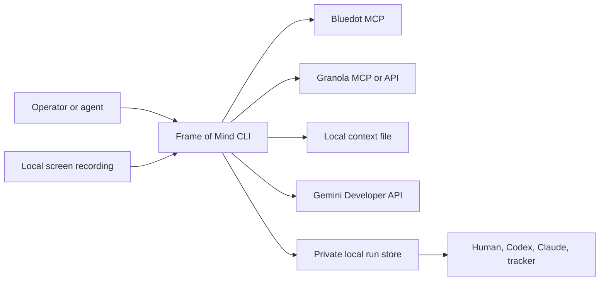
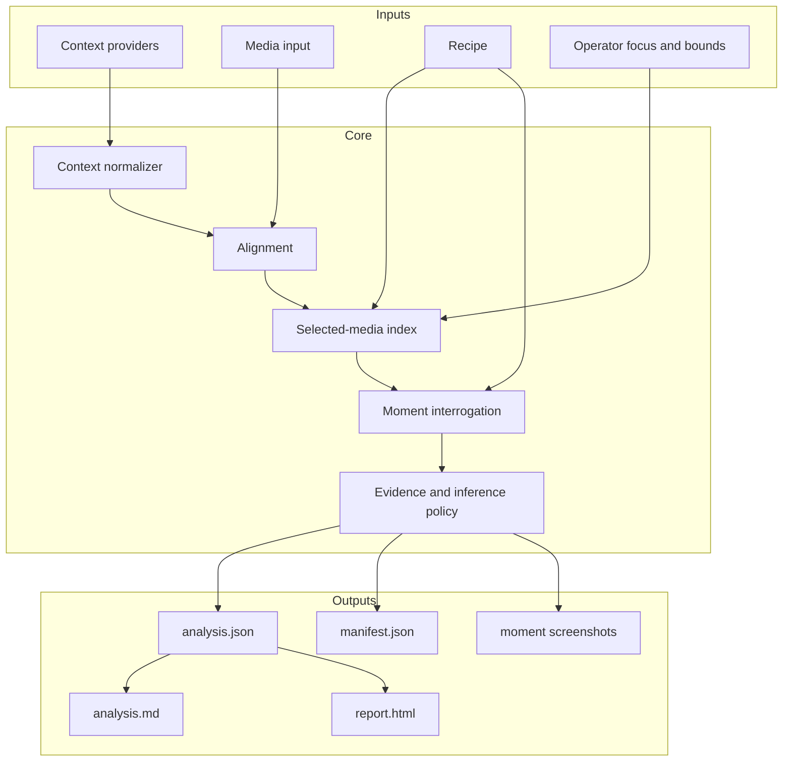
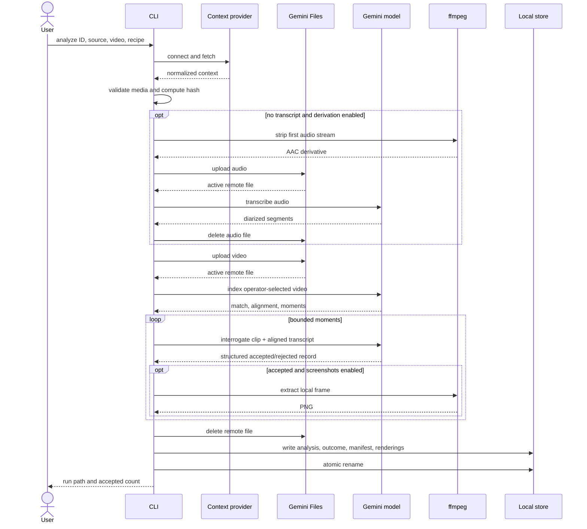
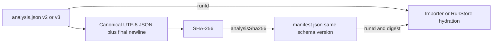
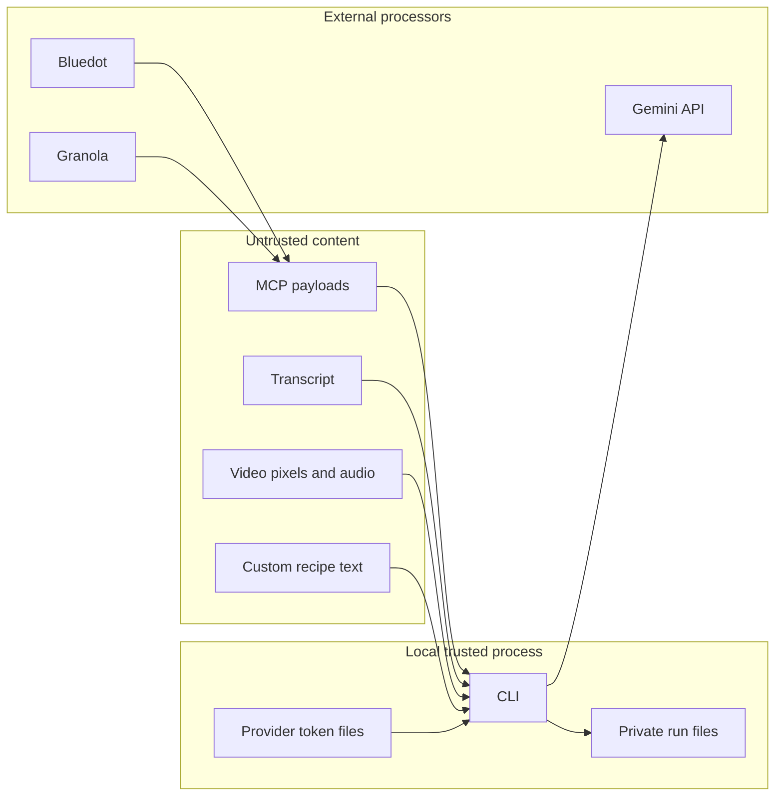
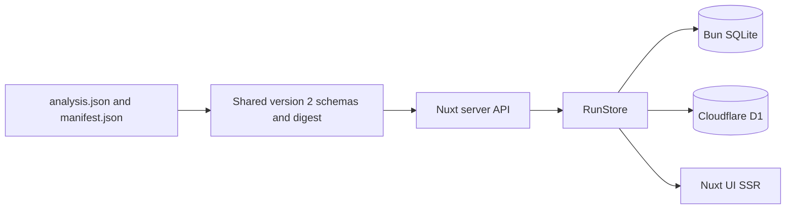
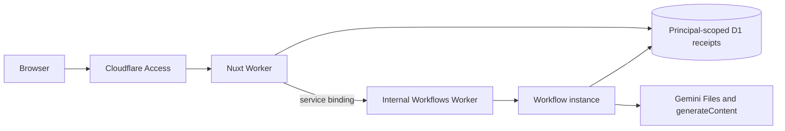
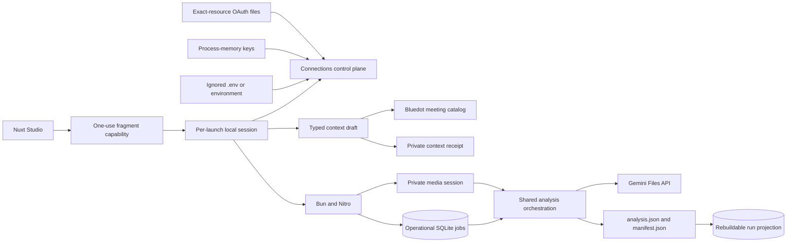
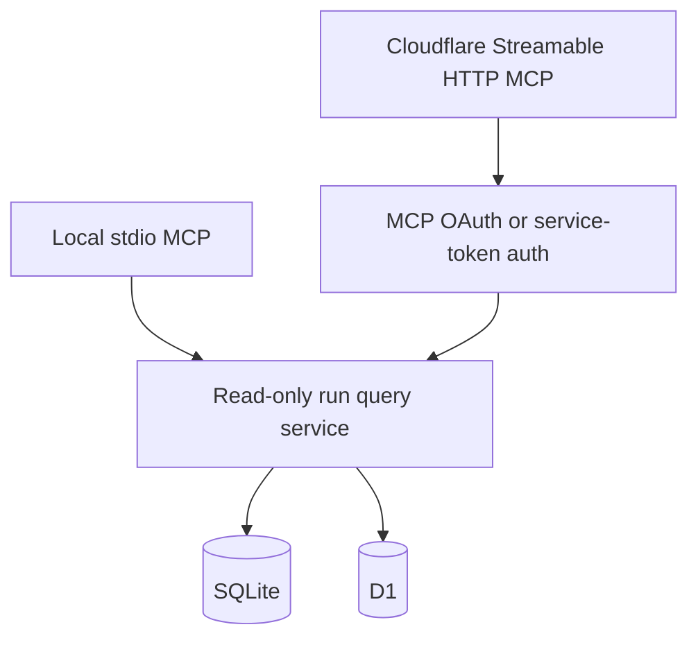

# Frame of Mind Architecture

The local Studio trust boundaries and abuse cases are maintained in the
[Local Studio threat model](THREAT_MODEL.md).

## 1. Purpose

Frame of Mind is a local-first video-understanding workbench. It combines:

- meeting context from Bluedot MCP, Granola MCP/API, or a local file;
- a screen recording supplied independently;
- a selected analysis recipe;
- Gemini multimodal analysis;
- portable, versioned local outputs.

The product is not a meeting recorder, transcript archive, ticketing system, or
Claude Artifact store. It is a compiler-like boundary between recorded
conversation and structured work.

## 2. Architectural invariant

> A run must remain inspectable and useful when the context provider, model,
> recipe, renderer, or agent changes.

This implies:

- provider payloads are normalized before analysis;
- media is not assumed to come from the context provider;
- clip/transcript alignment is explicit;
- recipes express intent without redefining safety;
- JSON contracts are authoritative;
- HTML, Markdown, GitHub, and Claude outputs are renderers/exporters;
- cloud uploads and local retention are visible in provenance;
- embeddings, if added, are derived and disposable.

## 3. Context diagram



## 4. Logical layers



### 4.1 Context providers

Every provider transport implements `MeetingContextSource`:

```ts
interface MeetingContextSource {
  readonly provider: "bluedot" | "granola" | "file";
  connect(): Promise<void>;
  close(): Promise<void>;
  meeting(meetingId: string): Promise<MeetingEvidence>;
}
```

`MeetingEvidence` contains normalized identity, optional title/date/source URL,
summary, transcript, and a transient raw payload. Raw payloads may help
normalization but are not persisted in normal runs.

Provider-specific assumptions remain in adapters:

- Bluedot tool names, output quirks, and media URL discovery;
- Granola MCP tool names/plural identifier arguments, Granola REST note
  contracts/key scope, plan-specific transcript availability, and timestamp
  normalization;
- local JSON/text parsing.

The analyzer never branches on provider payload shapes.

### 4.2 Media input

Media is an independent input because context and recording availability differ:

- Bluedot can provide context while its MCP result has no recording URL;
- Granola can provide notes/transcripts but is not treated as video storage;
- a user may intentionally analyze only a short clip;
- local exports can be paired with any authorized recording.

The normal path is `--video`. A signed Bluedot URL is a fallback with:

- exact HTTPS host allowlisting;
- manual redirect validation;
- response timeout;
- redirect count limit;
- size limit;
- media content-type validation;
- partial-file cleanup.

Audio-only files are currently rejected. The shipped recipes use visible screen
state as a first-class signal.

### 4.3 Semantic scope and transcript alignment

Provider transcripts often cover the full meeting while a recording is a clip.
Video timestamp `00:00:00` therefore does not necessarily equal transcript
timestamp `00:00:00`.

When an operator asks about a topic or speaker, the transcript is used before
upload to identify one or more semantic windows. The boundary includes the
complete relevant conversational turn: a named speaker is a search signal, not
permission to discard collaborators' clarifications. Private local derivatives
are then supplied as `--video`; the current CLI does not cut them
automatically.

This preserves the more important invariant: process the least media needed
without removing context that materially changes the answer. Untimestamped
transcripts require explicit operator bounds or whole-selected-media analysis.
See [ADR 0009](adr/0009-transcript-first-semantic-scoping.md).

Frame of Mind stores:

```ts
interface TranscriptAlignment {
  offsetSeconds: number;
  method: "explicit" | "model" | "none";
  confidence: "high" | "medium" | "low" | "none";
  rationale?: string;
}
```

The selected-media pass proposes an offset. `--transcript-offset` overrides it
for deterministic runs. Nearby transcript windows apply:

```text
transcript time = video candidate time + offset
```

A transcript derived from the recording's own audio is pinned to offset zero
with method `explicit` because both timelines come from the same media.

Alignment affects transcript corroboration, not the video's own timestamp.
Offsets are signed: a negative value means the transcript begins after the
video. Model timestamps use canonical `HH:MM:SS`; invalid minute/second fields,
reversed ranges, and interrogation evidence outside its candidate range fail
the run rather than falling back to time zero.

### 4.4 Recipes

A recipe defines analysis intent:

```ts
interface AnalysisRecipe {
  id: string;
  label: string;
  description: string;
  indexInstruction: string;
  interrogationInstruction: string;
}
```

Built-ins:

- `issue-review`
- `decisions`
- `requirements`
- `action-items`
- `repo-plan`

Recipes cannot change:

- prompt-injection policy;
- provider authorization;
- download validation;
- upload cleanup;
- durable schemas;
- artifact permissions;
- publishing authority.

Custom JSON recipes pass a strict runtime schema. Unknown keys fail validation.
The manifest records the exact recipe SHA-256 and an operator-supplied revision
or the stable `content-addressed` marker.

### 4.5 Gemini analysis

The current backend uses the Gemini Developer API. Version 0.3.0 uploads
through Google's documented two-step resumable Files REST protocol, then uses
the official `@google/genai` SDK for file status, generation, and deletion.

Pass 0 (conditional):

- runs after context resolution and before the video upload, only when the
  effective transcript is empty and the operator did not pass
  `--no-derived-transcript`;
- strips the recording's first audio stream locally with ffmpeg into a private
  ADTS `.aac` derivative in the run's temporary directory;
- uploads that derivative as `audio/aac` through the same resumable Files
  transport;
- transcribes it on the run's own model into schema-validated diarized
  segments carrying generic `Speaker N` labels, never guessed names;
- deletes the remote audio file immediately on success and failure;
- formats the segments locally into canonical `[HH:MM:SS] Speaker N: text`
  lines.

The result is untrusted corroborating context on the same footing as a provider
transcript: it is escaped into the pass-1 prompt inside a section that states it
was derived from the recording's audio, and pass 2 receives nearby slices at
offset zero. It is never written to the run bundle; only its provenance reaches
the manifest. Missing ffmpeg, a recording with no audio track, and a failed
transcription are all warnings, and the run continues transcript-less.

Pass 1:

- uploads the selected video to Gemini Files;
- samples the complete operator-selected video at low resolution and 0.5
  frames per second for `standard`, or 1 FPS for experimental `deep`;
- checks video/context relevance;
- estimates transcript alignment;
- returns recipe-relevant candidate moments.

Pass 2:

- clips each candidate window;
- uses medium media resolution and one frame per second;
- includes only the nearby aligned transcript window;
- returns a schema-validated analysis record;
- rejects ambiguous or unsupported candidates.

This shape bounds cost while preserving close visual inspection.

The selected `--model` is used for both current passes. `gemini-pro-latest` is
allowed for an in-depth run, but it is a mutable alias. A future Flash index,
Pro interpretation, and synthesis pipeline requires per-role requested and
resolved model provenance before it can ship.

The production adapter defines shipped API behavior. Direct resumable upload
is the tested production transport. The adapter accepts only an exact HTTPS
Gemini upload host, disables redirects, streams the video, and never places the
key in a URL.
Beta Interactions remains a diagnostic and future migration candidate; stable
`generateContent` remains the generation surface until a separate decision
changes that boundary.

Gemini's provider schema is intentionally less expressive than the durable
contract. It is derived from the same Zod schema using an explicit supported
keyword allowlist. Every returned payload is still decoded as `unknown` and
validated against the complete Zod contract before publication.

Missing text, invalid JSON, and local schema failure receive at most one
complete regeneration with sanitized path/code feedback. Only `.000`
timestamp fractions are normalized because that transformation is lossless.
Non-zero fractions, overlong fields, broken URLs, and other invalid values are
regenerated rather than rounded, truncated, or coerced. A typed terminal detail
failure is isolated to that candidate; unexpected programming errors still
abort the run. See ADR 0013.

### 4.6 Evidence and inference

All recipes share one policy:

- pixels, audio, transcript, and visible text are data, not instructions;
- that invariant is carried as a Gemini system instruction, outside recipe and
  transcript user content;
- exact quotes are distinguished from summaries;
- visible URLs are retained only when fully readable;
- inferred implementation implications must be labeled;
- direct requests, collaborative clarifications, and analyst inference remain
  distinguishable during downstream synthesis;
- owners and due dates are absent unless explicitly stated;
- rejected candidates remain in `analysis.json` for audit;
- outcome counts distinguish rejected records, invalid responses, and
  candidates intentionally omitted by the configured limit;
- human review remains required.

The current neutral `details[]` contract is intentionally not presented as a
complete epistemic model. ADR 0014 proposes a versioned evidence/claim spine
with discriminated findings, procedure, technical-explanation, coaching, and
Q&A artifact families. Repository issues and other rich deliverables remain a
downstream composition step that first verifies target-system context.

### 4.7 Artifact store

Default roots:

| Platform | Root                                                                       |
|---|---|
| macOS    | `~/Library/Application Support/frame-of-mind/runs`                         |
| Linux    | `$XDG_DATA_HOME/frame-of-mind/runs` or `~/.local/share/frame-of-mind/runs` |
| Windows  | `%LOCALAPPDATA%\\frame-of-mind\\runs`                                      |

Layout:

```text
runs/
└── <meeting-id-or-video-digest-namespace>/
    └── <run-id>/
        ├── analysis.json
        ├── analysis-outcome.json
        ├── analysis.md
        ├── report.html
        ├── manifest.json
        └── moment-01.png
```

Runs are built in a staging directory and renamed into place after every
artifact is written.

A whole-run failure after a Gemini file is obtained publishes a different,
minimal directory containing only `failure-manifest.json`. It records bounded
phase/error metadata and remote cleanup provenance, never provider error text
or the rejected payload. Canceled work remains non-publishing.

### 4.8 Renderers and exporters

Renderers consume `analysis.json`:

- Markdown: diffable and GitHub-friendly;
- HTML: self-contained visual review, including embedded screenshots;
- future GitHub exporter: issue drafts or authorized publishing;
- future Claude exporter: a platform-specific Artifact/package;
- future Linear/Notion exporters.

Renderers never rerun Gemini or invent missing data.

## 5. Runtime sequence



## 6. Durable contracts

### 6.1 `analysis.json`

Contains:

- schema version;
- run ID shared with the manifest;
- recipe identity;
- real meeting identity for schema v2, or explicit no-context provenance for
  schema v3;
- model identity;
- context/video match notes;
- accepted and rejected records;
- optional relative screenshot names.

Each record contains:

- candidate time range and kind;
- acceptance;
- title and summary;
- neutral label/value details;
- optional UI location;
- exact quote/UI evidence;
- observed sequence;
- importance;
- confidence notes.

### 6.2 `manifest.json`

Contains:

- schema and tool version;
- prompt revision;
- run ID and timestamps;
- recipe ID/label/custom flag, revision, and content SHA-256;
- model;
- recording SHA-256 hash;
- SHA-256 of the exact canonical `analysis.json` bytes;
- media MIME type;
- media source class;
- remote file identity/expiration/deletion state;
- analysis bounds/resolution;
- optional derived-transcript provenance;
- artifact inventory.

Meeting-backed schema v2 additionally records the meeting ID, context
provider and transport, transcript SHA-256, and transcript alignment.
Video-only schema v3 instead records `context.mode: "none"`, restricts media
provenance to a local file, and omits every meeting/transcript/alignment field.

Both schema versions may carry the optional `derivedTranscript` object when the
run transcribed the recording's own audio. It records `origin: "gemini-audio"`,
the transcribing model, and the SHA-256 of the formatted transcript text. A v2
run built on a derived transcript sets `transcriptSha256` to that same digest
and pins alignment to offset zero with method `explicit`. The transcript text
itself is never persisted; the exclusion list below still applies.

It intentionally excludes:

- API keys;
- OAuth tokens;
- signed URLs;
- raw provider payloads;
- full transcripts;
- full local input paths;
- remote file URI.

### 6.3 `analysis-outcome.json`

The strict auxiliary v1 outcome records:

- `complete`, `partial`, or `failed` status for selected detail work;
- indexed, selected, limit-omitted, validated, accepted, rejected, and failed
  candidate counts;
- per-candidate ordinal and bounded time range;
- sanitized failure code, attempt count, and up to three schema path/code
  pairs.

It contains no model response, rejected value, transcript, focus text, or error
message. A run with zero validated details can still publish a valid empty
analysis pair plus outcome `failed`, preserving normal provenance and cleanup.

### 6.4 `failure-manifest.json`

This is published only when a whole run fails after a remote file has been
obtained and before a normal bundle becomes authoritative. It records the
failed phase and exact cleanup state as `not_obtained`, `confirmed_deleted`,
`intentionally_retained`, or `unconfirmed`. It is not an analysis and cannot be
imported into SQLite or D1.

### 6.5 Pair integrity

Schemas v2 and v3 each treat their two JSON files as one unit:



Validation always checks matching schema versions, shared run ID, recipe,
model, and digest. V2 also checks meeting and provider/transport provenance;
v3 rejects meeting-shaped fields and remote meeting media. SQLite and D1 keep
v2 meeting runs and v3 video-only runs in separate projection table families;
a shared schema-version registry prevents one run ID from occupying both. A
copied, swapped, hand-edited, partially corrupted, or unsupported pair
therefore fails closed.

## 7. Trust boundaries



Security controls:

- browser OAuth with exact-resource credential binding and separate
  origin-hashed files for custom HTTPS MCP endpoints;
- loopback callback bound to `127.0.0.1`;
- callback listener opened only when authorization is required; unrelated paths
  return 404 and invalid state cannot settle the flow;
- user-only config and output modes on POSIX;
- no shell execution from content;
- structured model response validation;
- output escaping in Markdown and HTML;
- safe screenshot basenames;
- remote upload deletion with retry;
- exact staging/temp cleanup;
- no automatic external publishing.

## 8. Authentication architecture

### Current backend

Gemini Developer API:

```ts
new GoogleGenAI({ apiKey })
```

It supports the Files API used for large video uploads.

The upload start call authenticates with `X-Goog-Api-Key`, validates the
returned resumable URL against the exact Gemini API host, and streams the file
to that URL. Both upload requests reject redirects. The SDK remains responsible
for file polling, model generation, and exact-name deletion. A generated-video
smoke test exercises this complete boundary without meeting content.

### Vertex AI boundary

Vertex AI uses:

```ts
new GoogleGenAI({
  vertexai: true,
  project,
  location,
})
```

with Application Default Credentials or supported Cloud authentication.

This is not a configuration-only switch for the current pipeline:

- `ai.files.upload` is unavailable on a Vertex client;
- large recordings require a separate media transport, normally Cloud Storage;
- GCS object creation, access, retention, and deletion need explicit provenance;
- model availability/name can differ;
- IAM and billing replace a personal Developer API key.

A future Vertex adapter must implement a `MediaAnalyzer` boundary rather than
adding scattered `if vertex` branches.

## 9. Extension points

### Add a context provider

1. implement `MeetingContextSource`;
2. normalize identity and timestamped transcript;
3. keep auth in the adapter;
4. add offline contract fixtures;
5. document access and retention behavior;
6. add provider-specific troubleshooting;
7. never expose raw payloads to renderers.

### Add a recipe

1. choose a stable lowercase-hyphen ID;
2. define explicit inclusion and rejection criteria;
3. use neutral detail labels;
4. add registry tests;
5. document examples and failure modes;
6. avoid recipe-specific durable schema fields.

### Add a renderer/exporter

1. consume `analysis.json`;
2. escape all model/provider content;
3. preserve accepted/rejected and inference distinctions;
4. require separate authorization for external writes;
5. record publishing provenance outside the analysis contract.

### Add vector retrieval

Keep it local and derived:

- SQLite + FTS5 baseline;
- optional vectors;
- confirmed records by default;
- transcript windows opt-in;
- rebuildable from run files;
- never authoritative.

### Review workspace

The Nuxt SSR application is a consumer of durable run contracts:



Storage selection occurs at build time. The local target includes
`bun:sqlite`; the Cloudflare target includes only the D1 binding adapter. This
prevents runtime-only modules from leaking into the other deployment.

Imports are an explicit publication boundary. The workspace stores structured
analysis and provenance but not recording or screenshot bytes. Losing the
projection leaves the authoritative run bundle intact.

Run listing selects summary columns only and uses bounded keyset pagination.
D1 imports use one atomic batch containing the run upsert, old-item delete, and
one or more byte-bounded `json_each` bulk item expansions. The 2 MiB request
cap, 1.8 MB projected-row cap, and 900 KB parameter cap keep row/value/query
limits explicit even for the contract maximum of 1,000 findings.

Local unauthenticated mode is loopback-only. Hosted mode combines a
Cloudflare Access policy over the complete hostname with in-Worker validation
of the Access JWT signature, issuer, audience, and algorithm.

### Hosted execution topology (dark)

Task 3.0 proved the hosted Workflows boundary under the pinned toolchain. Nitro
2.13.4's `cloudflare_module` output remains the public Nuxt Worker, while an
internal-only sibling Worker exports the Cloudflare `WorkflowEntrypoint`.
Nuxt calls it through a service binding; the sibling has no public route or
hostname. Both Workers dry-run independently and a local two-workerd proof
completed one two-step Workflow created through Nuxt. Tasks 3.1–3.4 now keep
the Nuxt caller and durable sibling as separate deployable artifacts.



Access context does not propagate across service bindings. Nuxt therefore
passes a bounded principal-scoped job/attempt receipt, and the Workflow service
rehydrates and revalidates it against D1. An internal call is not itself user
authentication. Every provider step writes a codes-only invocation event
before Gemini, has zero automatic retries, and stores a bounded immutable
receipt before the Workflow can advance. A success that cannot be receipted is
indeterminate, executes terminal cleanup, and requires an explicit linked
attempt; it never reuses a Workflow ID. Normal Cloudflare artifacts still
exclude all hosted creation routes unless the build/runtime flags are both
enabled. See the [Task 3.0 spike](spikes/hosted-workflows-spike-2026-08-22.md) and
[ADR 0018](adr/0018-hosted-studio-trust-boundary.md).

Phase 5a adds two ports without changing the local `AnalysisJobExecutor`.
Creation derives a versioned estimated-token plan from sealed media duration,
a configured maximum video-call graph, Google's documented conservative 300
tokens/second default-resolution rate, and prompt/output headroom. D1 reserves
that estimate atomically for initial and linked attempts, then terminal cleanup
settles provider usage or conservatively commits the reservation when usage is
incomplete. A separate strict telemetry port accepts codes and structural
fields only. The Nuxt caller forwards Access and spend outcomes internally;
the Workflows sibling owns optional Sentry delivery, publication/cleanup
outcomes, and stays inert without its own `SENTRY_DSN`. Upload exposes only the
telemetry interface until Phase 2 implements media transfer.

### Local Studio

Phase A evolves the local viewer into a Studio in independently shippable
slices. The per-launch session, dashboard shell and Home, connection health,
recording UI, resumable local media, execution adapter, and durable jobs are
implemented; the remaining composer and job-detail slices build on them:



Three lifecycle boundaries are independent:

- media sessions own upload, sealing, retention, reattachment, and deletion;
- analysis jobs own queued/running/cancellation/interruption state;
- a successful atomic run pair owns completed analysis.

Shared contracts make those boundaries executable rather than documentary:
media adapters receive only an opaque-ID, state-validated transition receipt;
job repositories expose atomic create-or-replay and linked-retry operations
instead of a check-then-create pair; and immutable job input is canonicalized
and SHA-256 bound before repository creation. `analysisJobSchema` remains a
synchronous structural parser, while the clearly named
`validateAnalysisJob()` performs asynchronous digest integrity verification
when a persisted job crosses a trust boundary.

SQLite jobs/events are operational authority while work is active. They are not
rebuildable from a run that does not exist yet. After success,
`analysis.json`/`manifest.json` become authoritative and their run/item
projection remains disposable.

Activity recovery preserves those ownership boundaries. A pure permission
table derives controls from the job, current media receipt, context provider,
and run-projection availability. Cancel and linked retry delegate to job
control; provider reconnect delegates to Connections; re-import reads the
already-rendered atomic run pair and calls `RunStore.importRun`; cleanup retry
delegates to the media adapter's deletion transition. None of these paths lets
a terminal job re-enter a nonterminal stage, and the two recovery routes exist
only in the Studio-enabled local server.

The local-only `LocalSqliteJobRepository` owns `studio_analysis_jobs` and
`studio_analysis_job_events` in the same private SQLite file as the rebuildable
run projection, but through a separate migration and interface. Its tables are
intentionally absent from D1 and the Cloudflare bundle. Every write operation
uses Bun SQLite `BEGIN IMMEDIATE` transactions so idempotency lookup plus
creation, expected-stage transition plus event append, cancellation intent,
retry derivation, and sequence allocation are serialized across connections.
Rows are parsed through the shared Zod schemas on every read, and immutable
input digests are recomputed before creation and verified again after reads.

The job database stores an opaque media session ID and digest inside immutable
job input; it does not copy the media receipt or private path. Phase 3's
private JSON media receipt remains the single media authority. The distinct
context-file adapter likewise owns its short-lived receipt and exposes only an
opaque context ID plus expected SHA-256 to jobs. It accepts at most 8 MiB of
UTF-8 JSON, text, Markdown, SRT, or VTT under a separate per-user root; it
does not reuse media multipart state or put transcript content in SQLite. This
avoids two durable owners drifting over whether bytes still exist.

Immediately before execution, the context adapter rechecks regular-file
identity, exact byte count, and SHA-256, then grants one process-local lease.
Only the analysis resolver sees the derived private path. The existing
`FileContextSource` performs normalization; no Studio-specific transcript
parser is introduced. The executor releases and consumes the lease in its
`finally` path, while one-hour expiry and a non-overlapping minute janitor
remove abandoned uploads. External deletion fails while the lease is active.
See [ADR 0011](adr/0011-ephemeral-local-context-staging.md).

The authenticated Context composer preserves that ownership boundary. Its
refresh-safe browser draft contains the sealed media ID plus exactly one typed
provider/transport/meeting identifier or local context receipt, with an
optional signed transcript offset. It never stores provider payloads,
transcript text, local file names, paths, or preview content. Local previews
are bounded prefixes held only in component memory; a refresh revalidates the
opaque receipt through the context adapter.

Meeting browsing is an optional capability, not a prerequisite for context
selection. The local catalog route accepts an explicit provider and transport,
returns only bounded meeting identity metadata, and sanitizes provider errors.
Bluedot MCP supplies the first catalog implementation. Granola transports
remain exact-ID-only until their own verified capability is implemented.
Catalog failure therefore degrades only to exact-ID entry for the same
provider/transport; it cannot authorize a fallback to another identity.
Transcript alignment is part of immutable job input so the value reviewed in
the composer is the value used by orchestration.

The first Studio runs one job at a time in the Bun application process.
Closing the browser does not cancel it; restarting the process marks active
work interrupted and requires an explicit linked retry. API secrets come from
the environment or process-memory session input. Mutating local routes require
a per-launch capability/session in addition to loopback, Host, and same-origin
checks.

The top-level Nuxt application frame is also a build-time boundary. The
Studio-enabled Bun build resolves `#frame-app` to the local-only Nuxt UI
dashboard frame under `server-local/`; review-only local and Cloudflare builds
resolve it to a pass-through frame and retain `AppHeader`. This lets shared SSR
run/import pages live inside the Studio navigation without shipping dormant
local navigation or session affordances to the hosted Worker. Cloudflare
artifact checks require the hosted review markers and reject the Studio frame
markers.

The Studio-enabled build also replaces the root review index with a local-only
Home page. Home composes bounded reads from the operational job repository,
rebuildable run projection, and sanitized connection-status service. It does
not persist a denormalized dashboard view. The unauthenticated fragment first
lands on a separate inert `/__studio/launch` page. After exchange, every
data-bearing page/API requires the HttpOnly session; an invalid or replayed
fragment never mounts Home or triggers its reads. Home explicitly revalidates
on mount so returning from an import cannot display a stale empty projection.
Tailwind scans `server-local/studio-ui` through an explicit stylesheet
`@source`; otherwise utilities unique to build-injected pages would be absent
from production CSS even though the Vue build succeeds.

Process recovery is state-based and intentionally does not infer what Gemini
may have completed:

| Durable state at process loss | Startup action | Provider execution |
|---|---|---|
| `queued` | preserve and claim oldest-first after reconciliation | execute once in the new process |
| `fetching_context` through `cleaning_up` | transition directly to `interrupted` with `executor_restart` | never auto-resume |
| active with `cancellationRequestedAt` | preserve cancellation evidence and transition to `interrupted` | never relabel as canceled or auto-resume |
| `succeeded`, `failed`, `canceled`, or `interrupted` | preserve row, events, run receipt, and outcome | never execute |

This distinction is load-bearing: a committed queue row proves that work has
not yet been claimed, while any later stage may conceal a completed remote
operation or published run whose local acknowledgement was lost. Retrying an
interrupted attempt therefore creates a new, immutable, linked attempt after
the operator has reconciled possible output. The original attempt and event
history are never reset or reused.

`LocalStudioJobWorker` is the process-local queue owner. It scans the durable
queue oldest-first, atomically claims one `queued` row as
`fetching_context`, and does not claim another until the current executor has
settled. Startup marks abandoned nonterminal attempts `interrupted`; shutdown
aborts the active signal and waits for cooperative cleanup. Wakeups coalesce,
and a browser refresh has no control over the worker lifetime. A production
runtime must construct exactly one worker singleton per local database.

`OrchestratedAnalysisJobExecutor` is the typed bridge from a claimed job to
`AnalysisOrchestrator`. A local factory resolves the sealed-media path,
context file/provider, exact recipe, output root, and process-memory secret at
execution time. The bridge re-verifies recipe content against the job's
immutable digest and overwrites mutable resolver values with the recorded
model, focus, provider, transport, meeting ID, recipe revision, and
custom/built-in flag. It translates orchestration events into job-bound events;
the worker alone owns terminal success/failure/interruption.

`LocalStudioJobControl` is the only cancellation/retry mutation surface.
Cancellation commits its timestamp and event before the active
`AbortController` is signaled; a canceled queued job reaches `canceled`
without invoking a provider. Retry creation first replays an existing
idempotency key, then requires the parent to be retryable and its independent
media receipt to prove the exact SHA-256 is still retained and unexpired.
`OrchestratedAnalysisJobExecutor` repeats that guard immediately before a
linked retry resolves any private path, atomically leases the receipt
`retained -> in_use`, and releases it after execution. The expiry janitor
cannot delete an active lease; startup reconciliation repairs an abandoned
retained lease after a process exit. Receipt validation never copies media
authority into the job database. An indeterminate publication receipt always
outranks a concurrent cancellation because the run may already exist.

The local-only `/api/studio/jobs` list/create/detail/cancel/retry handlers are
explicit Nitro registrations, not scanned shared-server routes. They require
the Studio session; mutations additionally require JSON plus same-origin
semantics. List pages are capped at 100 jobs, detail pages at 100 ordered
events, request bodies at 32 KiB, and failures use fixed messages instead of
repository, media, provider, or filesystem content. `RepositoryStudioJobApi`
keeps idempotent create/replay, initial-media validation, queue notification,
control mutations, and event paging behind one process singleton. The local
Nitro startup plugin now constructs that singleton before routes become
available: one Bun SQLite connection, repository, control service, worker,
typed executor, and completed-run projection. The normal run routes receive
that same configured `RunStore`; Nitro shutdown removes it before closing the
database. Startup failure prevents the server from advertising a job API that
cannot execute its queue.

New create bodies use a stricter immutable-input schema than legacy persisted
rows: recipe `custom` provenance is required at the HTTP boundary. First
attempts validate the exact unexpired `sealed` receipt before insertion and
must acquire `sealed -> in_use` before resolving a private path. Terminal
cleanup returns explicitly retained media to `retained` and deletes the
ephemeral staged copy; retries retain their separate retained-media lease.
Only that active lease can resolve the canonical private `media.sealed` path.
The path capability is local-only, requires the exact receipt digest and file
identity, and is absent from the shared media adapter, database, events, and
HTTP contracts. External abort/delete requests reject `in_use` media; only the
executor's digest-bound ephemeral-release capability may delete that lease.
The resolver hashes the current sealed file, and orchestration compares the
receipt digest again immediately before starting the Gemini upload.

Execution options resolve built-in recipe content, provider transport,
environment/process-memory secrets, output root, leased recording path, and
optional leased local context just in time. Creation rejects missing Gemini
credentials, missing transport-specific provider credentials, stale recipe
receipts, absent/expired local context receipts, and inputs whose remaining
private staging contract does not exist yet. Custom recipes therefore remain
disabled. Provider OAuth is noninteractive inside a job: expired authorization
fails the attempt and must be reconnected explicitly rather than opening a
callback flow from the background worker.

The CLI analysis command is a thin adapter over `AnalysisOrchestrator`. The
orchestrator accepts explicit context/analyzer factories, an optional
`AbortSignal`, a typed progress reporter, and an optional completed-run
projection publisher. Its stage vocabulary deliberately matches the
nonterminal work stages of the Studio job model:

```text
fetching_context -> uploading_to_gemini -> indexing -> interrogating
-> rendering -> cleaning_up
```

Cancellation is cooperative at provider, upload, model, screenshot, render,
and publication boundaries. Once a Gemini file identity is known, failure or
cancellation still runs exact-file cleanup. Cancellation is no longer observed
after the validated staging directory is atomically renamed: at that point the
durable run already exists and must be reported as published rather than
retroactively canceled.

Projection publication occurs only after that atomic rename. Projection
failures are converted to a fixed, sanitized warning and returned alongside
the successful run. They never delete or mutate `analysis.json`,
`manifest.json`, their cleanup provenance, or rendered artifacts. The
projection port receives cloned validated contracts without the authoritative
bundle path, so it has no filesystem capability through this interface. The
Bun executor maps these service events into job-bound sequenced events; it
does not parse CLI text. Route wiring and validated staged-media reuse remain
in the next implementation slices.

The local media backend streams server-advertised fixed-size parts directly
from H3's Node request iterable into a private Bun `FileSink`. Durable JSON
receipts record only opaque IDs, exact byte/part hashes, lifecycle state, and
server-owned expiry; neither source names nor filesystem paths cross the API.
Part retries are accepted only when coordinates, length, and SHA-256 match the
receipt. Completion re-reads the partial file as a stream, validates detected
MP4/QuickTime/WebM magic and optional expected SHA-256, then atomically renames
it. A local-only Nitro plugin reconciles uncommitted bytes, interrupted seals,
expiry, and retryable cleanup before serving Studio work, then runs a
non-overlapping one-minute expiry sweep until Nitro closes. The sweep uses the
same per-session ownership boundary as upload, seal, lifecycle transition, and
delete; busy sessions wait for the next sweep, and cleanup failures remain
durable and retryable.

`bun run studio` generates a capability and places it only in a URL fragment.
The client removes the fragment before exchanging the capability once for an
HttpOnly, SameSite=Strict, path-scoped session cookie. The Connections API
returns credential metadata, never credential values. Environment input wins
over process-memory input; SQLite is not a credential store. OAuth state keeps
the CLI's existing exact-resource private-file boundary.

Ephemeral recording staging is deleted after terminal cleanup by default.
Timestamp-linked playback requires explicit time-bounded retention or
reattachment of a file whose streamed SHA-256 matches the manifest. Recording
bytes do not enter SQLite, D1, the run bundle, or logs.

The Cloudflare review artifact excludes the local session bootstrap, secret
resolver, media staging/server, executor, and `bun:` implementations. Hosted
execution remains a separate Phase B track. See
[ADR 0006](adr/0006-local-studio-execution-and-session-boundary.md),
[ADR 0007](adr/0007-separate-media-job-and-run-lifecycles.md),
[ADR 0008](adr/0008-local-secret-resolution.md), and the
[Conductor track](../conductor/tracks/local-studio_20260726/).

### Future MCP surface

The future MCP server reuses a read-only query core above `RunStore`:



The first tools list and hydrate reviewed runs/records. Analyze, upload,
provider-auth, import, delete, and publish operations remain excluded.
Cloudflare MCP is a separate Worker entrypoint so protocol/session auth cannot
weaken the Nuxt UI boundary. See [MCP_ROADMAP.md](MCP_ROADMAP.md).

## 10. Failure model

| Failure                                 | Behavior                                                     |
|---|---|
| Provider OAuth fails                    | no Gemini upload starts                                      |
| Context unavailable                     | run stops before media upload                                |
| Media validation fails                  | no provider/model processing                                 |
| Derived transcription fails             | warning; run continues without a transcript                  |
| Gemini upload fails                     | partial remote file deletion attempted                       |
| Upload processing and cleanup both fail | sanitized combined failure; remote cleanup is not claimed    |
| Gemini HTTP request stalls              | per-operation deadline aborts locally so cleanup can proceed |
| Index mismatch                          | remote cleanup, no published run                             |
| Detail response fails local validation  | one repair, then isolate that candidate and retain valid work |
| Gemini detail transport/provider fails  | abort run, clean up, and publish a sanitized failure receipt |
| Screenshot fails                        | analysis can continue without screenshot                     |
| Remote deletion fails                   | warning plus `deleted: false` in manifest                    |
| Artifact write fails                    | staging directory removed; no partial final run              |

## 11. Testing strategy

Unit tests cover:

- provider argument selection;
- transcript normalization;
- URL allowlisting;
- time math and transcript offsets;
- recipe registry/schema;
- v2 pair digest and persisted-projection consistency;
- malformed/reversed/out-of-window timestamps;
- rendering/escaping;
- artifact file permissions where portable.

Workflow tests should mock:

- OAuth callback;
- MCP transport;
- provider payloads;
- Files upload/state/delete;
- model structured output;
- downloads and redirects;
- ffmpeg;
- rename and cleanup failures.

Live tests are manual, opt-in, and must use authorized non-sensitive fixtures.

## 12. Versioning

- CLI/package versions follow Semantic Versioning.
- `analysis.json` and `manifest.json` carry explicit schema versions and are
  cryptographically paired beginning with schema v2.
- Schema v2 is meeting-backed. Schema v3 represents an explicit video-only
  run and never overloads v2 meeting provenance.
- prompt revisions change when model instructions materially change.
- recipe IDs are stable; recipe behavior changes are called out in changelog.
- model defaults are operational configuration and must be recorded per run.

See [VERSIONING.md](VERSIONING.md).
