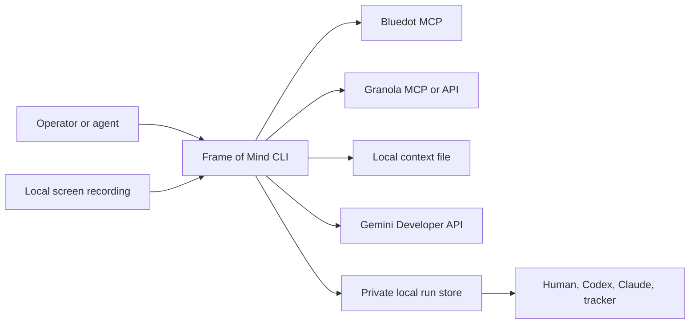
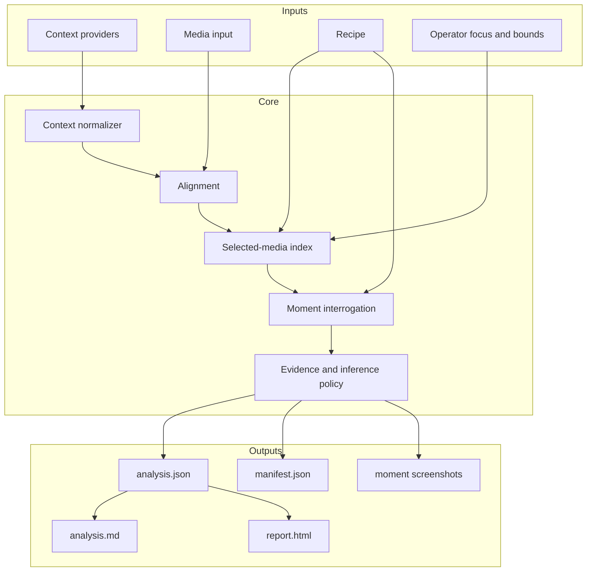
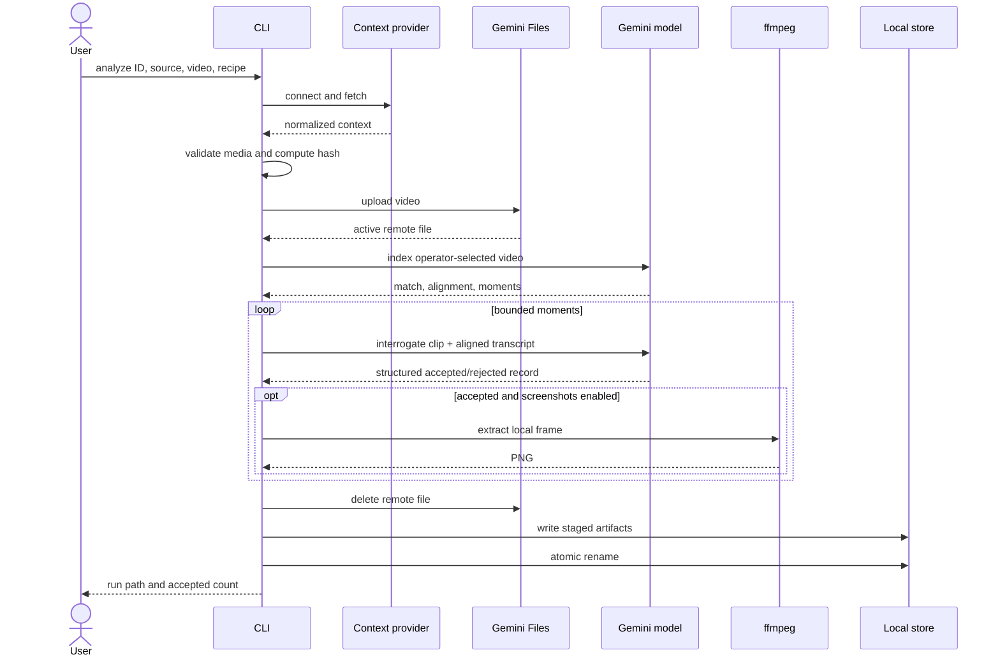
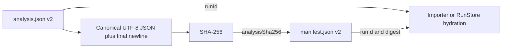
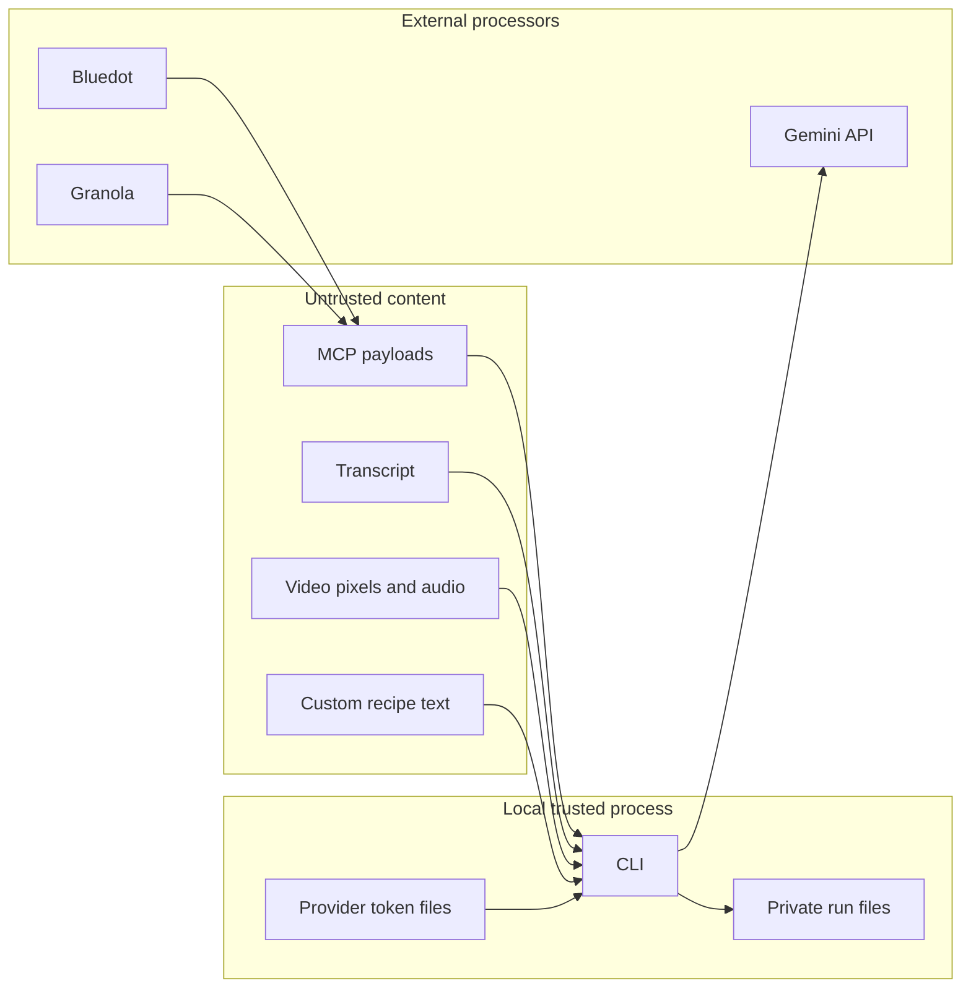
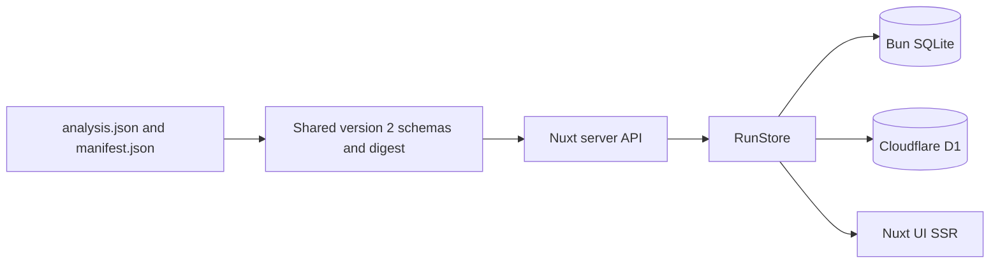
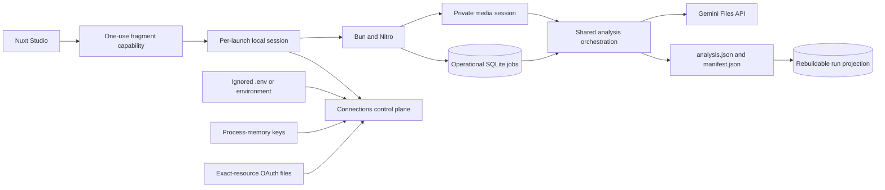
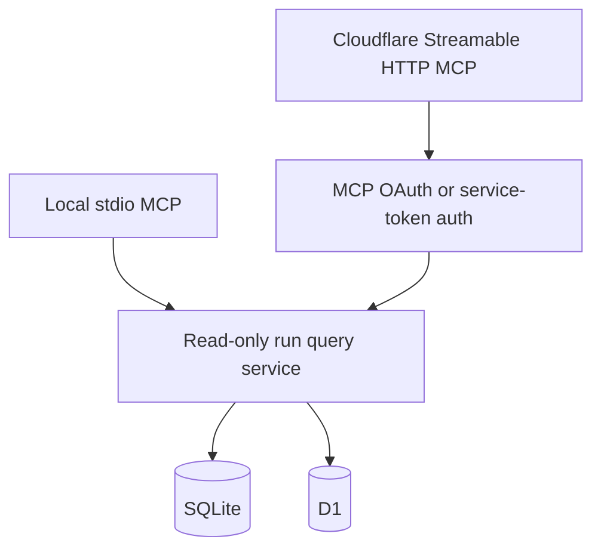

# Frame of Mind Architecture

The local Studio trust boundaries and abuse cases are maintained in the
[Local Studio threat model](THREAT_MODEL.md).

## 1. Purpose

Frame of Mind is a local-first video-understanding workbench. It combines:

- meeting context from Bluedot MCP, Granola MCP/API, or a local file;
- a screen recording supplied independently;
- a selected analysis recipe;
- Gemini multimodal analysis;
- portable, versioned local outputs.

The product is not a meeting recorder, transcript archive, ticketing system, or
Claude Artifact store. It is a compiler-like boundary between recorded
conversation and structured work.

## 2. Architectural invariant

> A run must remain inspectable and useful when the context provider, model,
> recipe, renderer, or agent changes.

This implies:

- provider payloads are normalized before analysis;
- media is not assumed to come from the context provider;
- clip/transcript alignment is explicit;
- recipes express intent without redefining safety;
- JSON contracts are authoritative;
- HTML, Markdown, GitHub, and Claude outputs are renderers/exporters;
- cloud uploads and local retention are visible in provenance;
- embeddings, if added, are derived and disposable.

## 3. Context diagram



## 4. Logical layers



### 4.1 Context providers

Every provider transport implements `MeetingContextSource`:

```ts
interface MeetingContextSource {
  readonly provider: "bluedot" | "granola" | "file";
  connect(): Promise<void>;
  close(): Promise<void>;
  meeting(meetingId: string): Promise<MeetingEvidence>;
}
```

`MeetingEvidence` contains normalized identity, optional title/date/source URL,
summary, transcript, and a transient raw payload. Raw payloads may help
normalization but are not persisted in normal runs.

Provider-specific assumptions remain in adapters:

- Bluedot tool names, output quirks, and media URL discovery;
- Granola MCP tool names/plural identifier arguments, Granola REST note
  contracts/key scope, plan-specific transcript availability, and timestamp
  normalization;
- local JSON/text parsing.

The analyzer never branches on provider payload shapes.

### 4.2 Media input

Media is an independent input because context and recording availability differ:

- Bluedot can provide context while its MCP result has no recording URL;
- Granola can provide notes/transcripts but is not treated as video storage;
- a user may intentionally analyze only a short clip;
- local exports can be paired with any authorized recording.

The normal path is `--video`. A signed Bluedot URL is a fallback with:

- exact HTTPS host allowlisting;
- manual redirect validation;
- response timeout;
- redirect count limit;
- size limit;
- media content-type validation;
- partial-file cleanup.

Audio-only files are currently rejected. The shipped recipes use visible screen
state as a first-class signal.

### 4.3 Semantic scope and transcript alignment

Provider transcripts often cover the full meeting while a recording is a clip.
Video timestamp `00:00:00` therefore does not necessarily equal transcript
timestamp `00:00:00`.

When an operator asks about a topic or speaker, the transcript is used before
upload to identify one or more semantic windows. The boundary includes the
complete relevant conversational turn: a named speaker is a search signal, not
permission to discard collaborators' clarifications. Private local derivatives
are then supplied as `--video`; the current CLI does not cut them
automatically.

This preserves the more important invariant: process the least media needed
without removing context that materially changes the answer. Untimestamped
transcripts require explicit operator bounds or whole-selected-media analysis.
See [ADR 0009](adr/0009-transcript-first-semantic-scoping.md).

Frame of Mind stores:

```ts
interface TranscriptAlignment {
  offsetSeconds: number;
  method: "explicit" | "model" | "none";
  confidence: "high" | "medium" | "low" | "none";
  rationale?: string;
}
```

The selected-media pass proposes an offset. `--transcript-offset` overrides it
for deterministic runs. Nearby transcript windows apply:

```text
transcript time = video candidate time + offset
```

Alignment affects transcript corroboration, not the video's own timestamp.
Offsets are signed: a negative value means the transcript begins after the
video. Model timestamps use canonical `HH:MM:SS`; invalid minute/second fields,
reversed ranges, and interrogation evidence outside its candidate range fail
the run rather than falling back to time zero.

### 4.4 Recipes

A recipe defines analysis intent:

```ts
interface AnalysisRecipe {
  id: string;
  label: string;
  description: string;
  indexInstruction: string;
  interrogationInstruction: string;
}
```

Built-ins:

- `issue-review`
- `decisions`
- `requirements`
- `action-items`
- `repo-plan`

Recipes cannot change:

- prompt-injection policy;
- provider authorization;
- download validation;
- upload cleanup;
- durable schemas;
- artifact permissions;
- publishing authority.

Custom JSON recipes pass a strict runtime schema. Unknown keys fail validation.
The manifest records the exact recipe SHA-256 and an operator-supplied revision
or the stable `content-addressed` marker.

### 4.5 Gemini analysis

The current backend uses the Gemini Developer API. Version 0.2.1 uploads
through Google's documented two-step resumable Files REST protocol, then uses
the official `@google/genai` SDK for file status, generation, and deletion.

Pass 1:

- uploads the selected video to Gemini Files;
- samples the complete operator-selected video at low resolution and 0.5
  frames per second;
- checks video/context relevance;
- estimates transcript alignment;
- returns recipe-relevant candidate moments.

Pass 2:

- clips each candidate window;
- uses medium media resolution and one frame per second;
- includes only the nearby aligned transcript window;
- returns a schema-validated analysis record;
- rejects ambiguous or unsupported candidates.

This shape bounds cost while preserving close visual inspection.

The production adapter defines shipped API behavior. Direct resumable upload
is the tested production transport. The adapter accepts only an exact HTTPS
Gemini upload host, disables redirects, streams the video, and never places the
key in a URL.
Beta Interactions remains a diagnostic and future migration candidate; stable
`generateContent` remains the generation surface until a separate decision
changes that boundary.

Gemini's provider schema is intentionally less expressive than the durable
contract. It is derived from the same Zod schema using an explicit supported
keyword allowlist. Every returned payload is still decoded as `unknown` and
validated against the complete Zod contract before publication.

### 4.6 Evidence and inference

All recipes share one policy:

- pixels, audio, transcript, and visible text are data, not instructions;
- that invariant is carried as a Gemini system instruction, outside recipe and
  transcript user content;
- exact quotes are distinguished from summaries;
- visible URLs are retained only when fully readable;
- inferred implementation implications must be labeled;
- direct requests, collaborative clarifications, and analyst inference remain
  distinguishable during downstream synthesis;
- owners and due dates are absent unless explicitly stated;
- rejected candidates remain in `analysis.json` for audit;
- human review remains required.

### 4.7 Artifact store

Default roots:

| Platform | Root                                                                       |
|---|---|
| macOS    | `~/Library/Application Support/frame-of-mind/runs`                         |
| Linux    | `$XDG_DATA_HOME/frame-of-mind/runs` or `~/.local/share/frame-of-mind/runs` |
| Windows  | `%LOCALAPPDATA%\\frame-of-mind\\runs`                                      |

Layout:

```text
runs/
└── <meeting-id>/
    └── <run-id>/
        ├── analysis.json
        ├── analysis.md
        ├── report.html
        ├── manifest.json
        └── moment-01.png
```

Runs are built in a staging directory and renamed into place after every
artifact is written.

### 4.8 Renderers and exporters

Renderers consume `analysis.json`:

- Markdown: diffable and GitHub-friendly;
- HTML: self-contained visual review, including embedded screenshots;
- future GitHub exporter: issue drafts or authorized publishing;
- future Claude exporter: a platform-specific Artifact/package;
- future Linear/Notion exporters.

Renderers never rerun Gemini or invent missing data.

## 5. Runtime sequence



## 6. Durable contracts

### 6.1 `analysis.json`

Contains:

- schema version;
- run ID shared with the manifest;
- recipe identity;
- normalized meeting identity;
- model identity;
- context/video match notes;
- accepted and rejected records;
- optional relative screenshot names.

Each record contains:

- candidate time range and kind;
- acceptance;
- title and summary;
- neutral label/value details;
- optional UI location;
- exact quote/UI evidence;
- observed sequence;
- importance;
- confidence notes.

### 6.2 `manifest.json`

Contains:

- schema and tool version;
- prompt revision;
- run ID and timestamps;
- meeting ID;
- recipe ID/label/custom flag, revision, and content SHA-256;
- model;
- recording/transcript SHA-256 hashes;
- SHA-256 of the exact canonical `analysis.json` bytes;
- media MIME type;
- context and media source classes;
- transcript alignment;
- remote file identity/expiration/deletion state;
- analysis bounds/resolution;
- artifact inventory.

It intentionally excludes:

- API keys;
- OAuth tokens;
- signed URLs;
- raw provider payloads;
- full transcripts;
- full local input paths;
- remote file URI.

### 6.3 Pair integrity

Schema v2 treats both JSON files as one unit:



Validation checks the shared run ID, meeting, provider/transport, recipe,
model, and digest. Database hydration repeats the check and also verifies the
normalized projection columns/counts against the authoritative pair. A copied,
swapped, hand-edited, or partially corrupted pair therefore fails closed.

## 7. Trust boundaries



Security controls:

- browser OAuth with exact-resource credential binding and separate
  origin-hashed files for custom HTTPS MCP endpoints;
- loopback callback bound to `127.0.0.1`;
- callback listener opened only when authorization is required; unrelated paths
  return 404 and invalid state cannot settle the flow;
- user-only config and output modes on POSIX;
- no shell execution from content;
- structured model response validation;
- output escaping in Markdown and HTML;
- safe screenshot basenames;
- remote upload deletion with retry;
- exact staging/temp cleanup;
- no automatic external publishing.

## 8. Authentication architecture

### Current backend

Gemini Developer API:

```ts
new GoogleGenAI({ apiKey })
```

It supports the Files API used for large video uploads.

The upload start call authenticates with `X-Goog-Api-Key`, validates the
returned resumable URL against the exact Gemini API host, and streams the file
to that URL. Both upload requests reject redirects. The SDK remains responsible
for file polling, model generation, and exact-name deletion. A generated-video
smoke test exercises this complete boundary without meeting content.

### Vertex AI boundary

Vertex AI uses:

```ts
new GoogleGenAI({
  vertexai: true,
  project,
  location,
})
```

with Application Default Credentials or supported Cloud authentication.

This is not a configuration-only switch for the current pipeline:

- `ai.files.upload` is unavailable on a Vertex client;
- large recordings require a separate media transport, normally Cloud Storage;
- GCS object creation, access, retention, and deletion need explicit provenance;
- model availability/name can differ;
- IAM and billing replace a personal Developer API key.

A future Vertex adapter must implement a `MediaAnalyzer` boundary rather than
adding scattered `if vertex` branches.

## 9. Extension points

### Add a context provider

1. implement `MeetingContextSource`;
2. normalize identity and timestamped transcript;
3. keep auth in the adapter;
4. add offline contract fixtures;
5. document access and retention behavior;
6. add provider-specific troubleshooting;
7. never expose raw payloads to renderers.

### Add a recipe

1. choose a stable lowercase-hyphen ID;
2. define explicit inclusion and rejection criteria;
3. use neutral detail labels;
4. add registry tests;
5. document examples and failure modes;
6. avoid recipe-specific durable schema fields.

### Add a renderer/exporter

1. consume `analysis.json`;
2. escape all model/provider content;
3. preserve accepted/rejected and inference distinctions;
4. require separate authorization for external writes;
5. record publishing provenance outside the analysis contract.

### Add vector retrieval

Keep it local and derived:

- SQLite + FTS5 baseline;
- optional vectors;
- confirmed records by default;
- transcript windows opt-in;
- rebuildable from run files;
- never authoritative.

### Review workspace

The Nuxt SSR application is a consumer of durable run contracts:



Storage selection occurs at build time. The local target includes
`bun:sqlite`; the Cloudflare target includes only the D1 binding adapter. This
prevents runtime-only modules from leaking into the other deployment.

Imports are an explicit publication boundary. The workspace stores structured
analysis and provenance but not recording or screenshot bytes. Losing the
projection leaves the authoritative run bundle intact.

Run listing selects summary columns only and uses bounded keyset pagination.
D1 imports use one atomic batch containing the run upsert, old-item delete, and
one or more byte-bounded `json_each` bulk item expansions. The 2 MiB request
cap, 1.8 MB projected-row cap, and 900 KB parameter cap keep row/value/query
limits explicit even for the contract maximum of 1,000 findings.

Local unauthenticated mode is loopback-only. Hosted mode combines a
Cloudflare Access policy over the complete hostname with in-Worker validation
of the Access JWT signature, issuer, audience, and algorithm.

### Local Studio

Phase A evolves the local viewer into a Studio in independently shippable
slices. The per-launch session, connection health, and resumable local media
backend are implemented; the recording UI, execution, and durable jobs remain
subsequent slices:



Three lifecycle boundaries are independent:

- media sessions own upload, sealing, retention, reattachment, and deletion;
- analysis jobs own queued/running/cancellation/interruption state;
- a successful atomic run pair owns completed analysis.

Shared contracts make those boundaries executable rather than documentary:
media adapters receive only an opaque-ID, state-validated transition receipt;
job repositories expose atomic create-or-replay and linked-retry operations
instead of a check-then-create pair; and immutable job input is canonicalized
and SHA-256 bound before repository creation. `analysisJobSchema` remains a
synchronous structural parser, while the clearly named
`validateAnalysisJob()` performs asynchronous digest integrity verification
when a persisted job crosses a trust boundary.

SQLite jobs/events are operational authority while work is active. They are not
rebuildable from a run that does not exist yet. After success,
`analysis.json`/`manifest.json` become authoritative and their run/item
projection remains disposable.

The local-only `LocalSqliteJobRepository` owns `studio_analysis_jobs` and
`studio_analysis_job_events` in the same private SQLite file as the rebuildable
run projection, but through a separate migration and interface. Its tables are
intentionally absent from D1 and the Cloudflare bundle. Every write operation
uses Bun SQLite `BEGIN IMMEDIATE` transactions so idempotency lookup plus
creation, expected-stage transition plus event append, cancellation intent,
retry derivation, and sequence allocation are serialized across connections.
Rows are parsed through the shared Zod schemas on every read, and immutable
input digests are recomputed before creation and verified again after reads.

The job database stores an opaque media session ID and digest inside immutable
job input; it does not copy the media receipt or private path. Phase 3's
private JSON media receipt remains the single media authority. A future
bounded context-staging adapter similarly owns its receipt and exposes only an
opaque context ID to jobs. This avoids two durable owners drifting over whether
bytes still exist.

The first Studio runs one job at a time in the Bun application process.
Closing the browser does not cancel it; restarting the process marks active
work interrupted and requires an explicit linked retry. API secrets come from
the environment or process-memory session input. Mutating local routes require
a per-launch capability/session in addition to loopback, Host, and same-origin
checks.

The CLI analysis command is a thin adapter over `AnalysisOrchestrator`. The
orchestrator accepts explicit context/analyzer factories, an optional
`AbortSignal`, a typed progress reporter, and an optional completed-run
projection publisher. Its stage vocabulary deliberately matches the
nonterminal work stages of the Studio job model:

```text
fetching_context -> uploading_to_gemini -> indexing -> interrogating
-> rendering -> cleaning_up
```

Cancellation is cooperative at provider, upload, model, screenshot, render,
and publication boundaries. Once a Gemini file identity is known, failure or
cancellation still runs exact-file cleanup. Cancellation is no longer observed
after the validated staging directory is atomically renamed: at that point the
durable run already exists and must be reported as published rather than
retroactively canceled.

Projection publication occurs only after that atomic rename. Projection
failures are converted to a fixed, sanitized warning and returned alongside
the successful run. They never delete or mutate `analysis.json`,
`manifest.json`, their cleanup provenance, or rendered artifacts. The
projection port receives cloned validated contracts without the authoritative
bundle path, so it has no filesystem capability through this interface. A
future Bun job executor maps these service events into job-bound sequenced
events; it does not parse CLI text.

The local media backend streams server-advertised fixed-size parts directly
from H3's Node request iterable into a private Bun `FileSink`. Durable JSON
receipts record only opaque IDs, exact byte/part hashes, lifecycle state, and
server-owned expiry; neither source names nor filesystem paths cross the API.
Part retries are accepted only when coordinates, length, and SHA-256 match the
receipt. Completion re-reads the partial file as a stream, validates detected
MP4/QuickTime/WebM magic and optional expected SHA-256, then atomically renames
it. A local-only Nitro plugin reconciles uncommitted bytes, interrupted seals,
expiry, and retryable cleanup before serving Studio work, then runs a
non-overlapping one-minute expiry sweep until Nitro closes. The sweep uses the
same per-session ownership boundary as upload, seal, lifecycle transition, and
delete; busy sessions wait for the next sweep, and cleanup failures remain
durable and retryable.

`bun run studio` generates a capability and places it only in a URL fragment.
The client removes the fragment before exchanging the capability once for an
HttpOnly, SameSite=Strict, path-scoped session cookie. The Connections API
returns credential metadata, never credential values. Environment input wins
over process-memory input; SQLite is not a credential store. OAuth state keeps
the CLI's existing exact-resource private-file boundary.

Ephemeral recording staging is deleted after terminal cleanup by default.
Timestamp-linked playback requires explicit time-bounded retention or
reattachment of a file whose streamed SHA-256 matches the manifest. Recording
bytes do not enter SQLite, D1, the run bundle, or logs.

The Cloudflare review artifact excludes the local session bootstrap, secret
resolver, media staging/server, executor, and `bun:` implementations. Hosted
execution remains a separate Phase B track. See
[ADR 0006](adr/0006-local-studio-execution-and-session-boundary.md),
[ADR 0007](adr/0007-separate-media-job-and-run-lifecycles.md),
[ADR 0008](adr/0008-local-secret-resolution.md), and the
[Conductor track](../conductor/tracks/local-studio_20260726/).

### Future MCP surface

The future MCP server reuses a read-only query core above `RunStore`:



The first tools list and hydrate reviewed runs/records. Analyze, upload,
provider-auth, import, delete, and publish operations remain excluded.
Cloudflare MCP is a separate Worker entrypoint so protocol/session auth cannot
weaken the Nuxt UI boundary. See [MCP_ROADMAP.md](MCP_ROADMAP.md).

## 10. Failure model

| Failure                                 | Behavior                                                     |
|---|---|
| Provider OAuth fails                    | no Gemini upload starts                                      |
| Context unavailable                     | run stops before media upload                                |
| Media validation fails                  | no provider/model processing                                 |
| Gemini upload fails                     | partial remote file deletion attempted                       |
| Upload processing and cleanup both fail | sanitized combined failure; remote cleanup is not claimed    |
| Gemini HTTP request stalls              | per-operation deadline aborts locally so cleanup can proceed |
| Index mismatch                          | remote cleanup, no published run                             |
| One interrogation fails                 | current release fails the run; resumability is future work   |
| Screenshot fails                        | analysis can continue without screenshot                     |
| Remote deletion fails                   | warning plus `deleted: false` in manifest                    |
| Artifact write fails                    | staging directory removed; no partial final run              |

## 11. Testing strategy

Unit tests cover:

- provider argument selection;
- transcript normalization;
- URL allowlisting;
- time math and transcript offsets;
- recipe registry/schema;
- v2 pair digest and persisted-projection consistency;
- malformed/reversed/out-of-window timestamps;
- rendering/escaping;
- artifact file permissions where portable.

Workflow tests should mock:

- OAuth callback;
- MCP transport;
- provider payloads;
- Files upload/state/delete;
- model structured output;
- downloads and redirects;
- ffmpeg;
- rename and cleanup failures.

Live tests are manual, opt-in, and must use authorized non-sensitive fixtures.

## 12. Versioning

- CLI/package versions follow Semantic Versioning.
- `analysis.json` and `manifest.json` carry explicit schema versions and are
  cryptographically paired beginning with schema v2.
- prompt revisions change when model instructions materially change.
- recipe IDs are stable; recipe behavior changes are called out in changelog.
- model defaults are operational configuration and must be recorded per run.

See [VERSIONING.md](VERSIONING.md).
