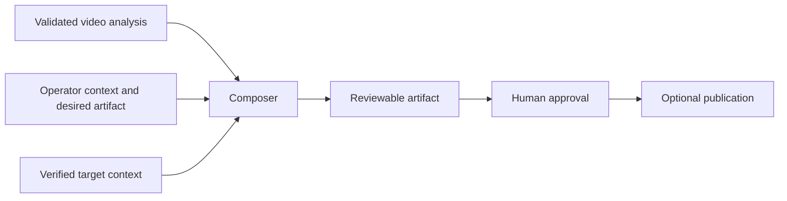

# Artifact Composition Guide

Frame of Mind extracts evidence from video. A high-quality deliverable usually
requires a second phase that combines that evidence with the intended audience,
verified target context, and an artifact-specific structure.

## Invariant

Composition may organize, connect, and explain validated evidence. It may not
silently invent source evidence or target-system facts.

## Pipeline

Target context can include a repository, approved engineering reference,
workflow definition, audience goal, or organization-specific template. It is
retrieved separately and remains distinguishable from recording evidence.

## Evidence roles

Every composed claim should be classifiable as one of:

| Role | Meaning |
|---|---|
| Direct observation | visible or audible in the recording |
| Explicit statement | spoken or visibly written by a participant |
| Collaborative clarification | another participant narrows, corrects, or completes the point |
| Interpreted intent | likely purpose inferred from behavior and context |
| Analyst inference | implication derived from evidence and labeled as such |
| Target fact | independently verified in repository/docs/data |
| Recommendation | proposed response, not a fact about the source |
| Unknown | unresolved or unsupported |

Interpreted intent is useful. It must cite observed support and include a
plausible alternative when consequential. It is not an observed fact.

## Implementation-ready issue or product brief

Use this family for UX findings, product discovery, reporting requirements, and
repository planning.

Recommended structure:

1. Executive summary and requested outcome.
2. Origin, bounded evidence windows, and attribution caveats.
3. Product invariant: the principle the implementation must preserve.
4. Problem statement and user/operational questions.
5. Current architecture or workflow verified in the target system.
6. Proposed information architecture and user flow.
7. UX proposal with plain-text wireframes where useful.
8. Functional requirements with explicit definitions.
9. Data or domain model, including grain, identities, joins, time boundaries,
   attribution, and partial-data semantics.
10. Security, privacy, authorization, and retention constraints.
11. Observability and diagnostics without sensitive payloads.
12. Edge cases and ambiguous states.
13. Delivery slices with hard discovery/contract gates where necessary.
14. Acceptance criteria that reconcile examples numerically or behaviorally.
15. Unit, contract, integration, frontend, and end-to-end test strategy.
16. Agent implementation instructions and questions that must be answered.
17. Open decisions, recommended defaults, non-goals, and definition of done.

The composer should inspect the target repository before naming files, APIs,
tables, framework conventions, or implementation slices. When live data/schema
access is required, document the discovery gate instead of inventing columns.

### Quality check

- Does the issue explain the real management or user decision, not merely quote
  the meeting?
- Are observations, requests, collaborative clarification, and implementation
  inference distinguishable?
- Are proposed UX and data semantics internally reconciled?
- Are missing attribution and partial telemetry visible rather than filled in?
- Can an implementation agent act without treating unverified suggestions as
  current architecture?

## Standard operating procedure

Use this family when a person demonstrates a repeatable process.

Recommended structure:

1. Purpose and intended outcome.
2. Scope and explicit non-scope.
3. Intended operator and required authorization/skill.
4. Prerequisites, inputs, tools, materials, and safety conditions.
5. Definitions and system/component orientation.
6. Ordered procedure with one observable action per step.
7. Decision points and branches.
8. Exceptions, failure modes, and recovery/escalation.
9. Verification after critical steps and final completion checks.
10. Evidence or records to retain.
11. Known unknowns and steps requiring authoritative review.
12. Revision owner and review cadence.

The video demonstrates what one person did. The composer must distinguish:

- demonstrated action;
- speaker-stated required action;
- inferred rationale;
- recommended standardized procedure.

A shortcut shown once is not automatically a required SOP step. High-stakes
electrical, construction, medical, legal, or safety instructions require
current authoritative validation.

## Technical explanation

Use this family when a subject-matter expert explains a component, system, or
relationship.

Recommended structure:

1. Audience and learning objective.
2. Plain-language summary.
3. Glossary.
4. Components and responsibilities.
5. Spatial, electrical, data, or causal relationships.
6. Sequence or flow.
7. Inputs, outputs, constraints, and boundaries.
8. Worked examples grounded in the recording.
9. Common confusions, failure modes, and counterexamples.
10. Safety/code/standards caveats and required external references.
11. Unknowns and questions for the expert.

Use diagrams when relationships or sequences are materially clearer visually.
Do not convert uncertain terminology into a confident definition.

## Communication or self-review report

Use this family for meeting participation, facilitation, teaching, presentation,
or explanation coaching.

Recommended structure:

1. Review scope and the speaker's stated goal.
2. Audience and situational context.
3. Concise overall assessment limited to this recording.
4. Strengths with evidence.
5. Patterns with representative and counterexample moments.
6. Intent-versus-impact analysis:
   - stated goal;
   - observed behavior;
   - interpreted intent;
   - observable audience response;
   - plausible alternative reading.
7. Missed cues, unanswered questions, objections, or openings.
8. Prioritized guidance tied to the speaker's goal.
9. Concrete next-time phrases, behaviors, or practice exercises.
10. Limitations and what another recording or participant perspective would
    help verify.

Analyze interaction, not identity. Do not diagnose personality, aptitude,
mental health, or protected or sensitive traits. Avoid global statements such
as “you always”; use “in this recording” and evidence-bounded frequency.

## Video Q&A

Use this family when the operator supplies explicit questions.

For each question record:

- status: answered, partial, or unanswerable;
- concise answer;
- evidence windows;
- assumptions;
- conflicting evidence;
- unanswered portions;
- suggested next evidence or question.

Do not force an answer because the question exists. “The recording does not
establish this” is a useful result.

## Synthetic golden artifacts

Public evaluation fixtures should be synthetic or properly licensed. A useful
golden set includes:

- a UI walkthrough that supports an implementation-ready issue;
- a process demonstration with a branch and recovery path;
- a technical explanation with one explicit uncertainty;
- a self-review with stated intent, a missed audience cue, and a counterexample;
- a Q&A recording with one answerable and one unanswerable question;
- one malformed detail response among valid candidates.

Evaluate evidence grounding, completeness, contradiction handling, timestamp
accuracy, abstention, privacy, and downstream artifact structure. Never commit
private exemplar videos, transcripts, URLs, screenshots, or derived artifacts.

## Publication

Composition does not authorize publication. Review the artifact, minimize
screenshots and quotes, verify repository or destination access, and obtain
separate authorization before creating or editing an external issue, document,
message, or knowledge-base entry.
