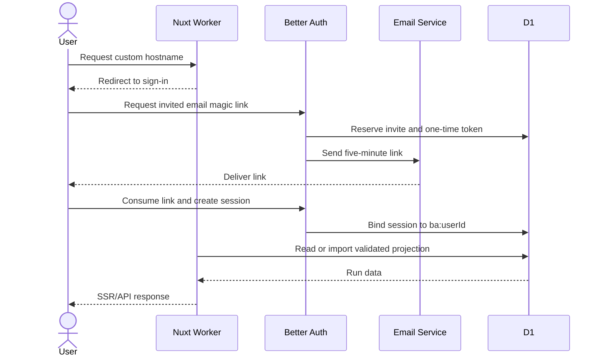

# Cloudflare Hosted Studio Deployment Runbook

## Outcome

This runbook deploys the Nuxt SSR workspace to Cloudflare Workers with:

- D1 bound as `DB`;
- a custom hostname;
- Better Auth sessions bound to one `ba:<userId>` principal;
- invite-gated email magic links sent through Cloudflare Email Service;
- no public meeting-data route;
- no provider credential returned to browser code; and
- `GEMINI_API_KEY` installed on both the public session-minting Worker and
  internal Workflows Worker;
- `NUXT_BETTER_AUTH_SECRET` installed only on the public Worker; and
- optional GitHub and HTTP-mailer secrets installed only when those fallback
  sign-in transports are enabled.

The repository does not auto-deploy. Deployment is an operator action.

Status as of 2026-08-24: the reference instance deployed hosted creation on
2026-08-23, retired its Cloudflare Access application, enabled Better Auth and
email magic links, and completed its first production analysis. The exact
implementation and release checklist lives in the
[Hosted Studio plan](../conductor/tracks/hosted-studio_20260822/plan.md), and
the data handled by any deployment is classified in
[DATA_CLASSIFICATION.md](DATA_CLASSIFICATION.md).

## Hosted Studio topology

The [Hosted Studio track](../conductor/tracks/hosted-studio_20260822/)
extends the public hostname and authentication boundary with principal-scoped creation,
D1 job state, Cloudflare Workflows, and direct browser-to-Gemini uploads. The
reference instance runs this artifact with hosted routes enabled. A generic new
deployment begins with those routes disabled until its release checks pass.
`GEMINI_API_KEY` is installed on both Workers; provider connections and their
separate encryption KEK remain outside this release shape.

Task 3.0 selected a sibling, internal-only Workflows Worker because pinned
Nitro 2.13.4 has no supported `WorkflowEntrypoint` export seam. The Nuxt Worker
calls it through a service binding while remaining the only public Worker
on the application hostname. The target Workflows Worker deploys first; the Nuxt
caller binding deploys second. Authentication context does not propagate over the
binding, so the sibling must revalidate a bounded principal-scoped job receipt.
The passing local/dry-run proof is recorded in
[`docs/spikes/hosted-workflows-spike-2026-08-22.md`](spikes/hosted-workflows-spike-2026-08-22.md).

Tasks 2.1–4 implement that topology behind build and runtime flags. The
production Nuxt artifact contains the hosted implementation. The generic
example starts with its runtime flag false; the reference instance sets it
true. The generated
`hosted-entry.mjs` is a deterministic delegating main; it has no upload
interception or recording-byte logic. Before enabling another deployment, run:

```bash
bun run test:hosted-workflows-http
bun run test:hosted-media-http
```

The receipts must include `HOSTED_SPEND_CONTRACT PASSED`,
`HOSTED_MEDIA_CONTRACT PASSED`, and end with
`HOSTED_WORKFLOW_CONTRACT PASSED`, and show principal isolation, one provider
invocation across the simulated success-without-receipt crash, terminal
cleanup, linked retry deduplication, cap exhaustion before Workflow creation,
provider-usage reconciliation, and codes/structure-only telemetry rejection.
The media receipt must also contain `HOSTED_RETENTION_CONTRACT PASSED` and
`HOSTED_EVIDENCE_CONTRACT PASSED` with digest mismatch, expiry, delete,
orphan, principal-isolation, and capture-provenance refusals.

### Workflows Worker configuration shape

Copy `apps/workflows/wrangler.jsonc.example` to an ignored operator-owned
`wrangler.jsonc`, then replace only the placeholders with exact infrastructure
values. Never place a secret in either config. Install the same
`GEMINI_API_KEY` value on the public Worker (to mint/query/delete Files
sessions) and sibling Worker (for analysis):

```bash
node apps/web/node_modules/wrangler/bin/wrangler.js secret put GEMINI_API_KEY \
  --config apps/workflows/wrangler.jsonc
bunx wrangler secret put GEMINI_API_KEY --cwd apps/web --config wrangler.jsonc
```

The Workflows Worker shape is:

```json
{
  "name": "<INTERNAL_WORKFLOWS_WORKER>",
  "main": "src/index.ts",
  "workers_dev": false,
  "d1_databases": [{
    "binding": "DB",
    "database_name": "<D1_DATABASE_NAME>",
    "database_id": "<D1_DATABASE_ID>"
  }],
  "workflows": [{
    "binding": "HOSTED_WORKFLOW",
    "name": "<WORKFLOW_NAME>",
    "class_name": "HostedAnalysisWorkflow"
  }]
}
```

`workers_dev` must stay `false`: Wrangler defaults it to `true` when a Worker has
no routes, which would publish the Workflows Worker on `*.workers.dev`. The
Workflows Worker has no Access check of its own and must only be reachable
through the Nuxt Worker's `HOSTED_WORKFLOWS` service binding. The release
rehearsal fails if either committed example config drops this setting.

The committed `apps/web/wrangler.jsonc.example` remains the predeployment base
shape, including module entry, Workers Assets, D1, and the service binding:

```json
{
  "main": ".output/server/hosted-entry.mjs",
  "assets": {
    "directory": ".output/public",
    "binding": "ASSETS"
  },
  "d1_databases": [{
    "binding": "DB",
    "database_name": "<D1_DATABASE_NAME>",
    "database_id": "<D1_DATABASE_ID>"
  }],
  "services": [{
    "binding": "HOSTED_WORKFLOWS",
    "service": "<INTERNAL_WORKFLOWS_WORKER>"
  }],
  "vars": {
    "NUXT_HOSTED_WORKFLOWS_ENABLED": "false"
  }
}
```

The public Worker accepts these non-secret media policy variables. Omit them
to use the defaults:

| Variable | Default | Purpose |
|---|---:|---|
| `NUXT_HOSTED_MEDIA_OPEN_SESSION_CAP` | `2` | maximum unsealed sessions per principal |
| `NUXT_HOSTED_MEDIA_MAX_BYTES` | `2147483648` | declared per-recording ceiling (2 GiB) |
| `NUXT_HOSTED_MEDIA_SESSION_TTL_SECONDS` | `3600` | pending capability lifetime; cannot exceed seven days |
| `NUXT_HOSTED_MEDIA_RETENTION_DAYS` | `30` | visible retained-media lifetime; maximum 365 days |

### Private retained-media R2 shape

Task 5.1 adds one private R2 binding to the public Nuxt Worker. Keep the bucket
without a public custom domain or `r2.dev` exposure. The operator-owned config
uses placeholders only:

```json
{
  "r2_buckets": [{
    "binding": "RETAINED_MEDIA",
    "bucket_name": "<PRIVATE_RETAINED_MEDIA_BUCKET>"
  }]
}
```

Configure the bucket lifecycle outside Git with a deletion rule matching the
application `NUXT_HOSTED_MEDIA_RETENTION_DAYS` value (30 days by default) and
an incomplete-multipart abort rule no longer than seven days. R2 lifecycle is
a storage backstop and may apply asynchronously; the application janitor and
explicit owner delete route remain the user-visible deletion mechanism. Verify
the rules with `wrangler r2 bucket lifecycle list <bucket>` without pasting the
bucket identifier into repository receipts.

The browser never receives R2 account credentials. For retained mode the
Worker creates a multipart upload through the binding and returns a random,
principal-authenticated capability whose SHA-256—not plaintext—is stored in
D1. Each request is fixed-length streamed to R2, and completion consumes the
capability. Before R2 reads a part, one conditional D1 update reserves its
`Content-Length` against both the session's cumulative uploaded bytes and the
declared/configured ceilings; concurrent parts therefore cannot overshoot.
A failed R2 write releases that reservation. Seal then reads the completed
object and requires its complete size and SHA-256 to match the browser
declaration and Gemini file. Object keys use a hashed principal prefix plus a
random UUID and are never returned by a public API. Evidence PNGs use the same
private bucket and a separate random key; D1 stores only the evidence digest
and manifest/recording/timestamp provenance.

The browser receives no key. It receives one provider-scoped capability only
after the D1 cap reservation commits. D1 stores that URL as principal/media-
bound AES-GCM ciphertext.

Deploy order is deliberate: apply migrations through
`0011_admin_access.sql`,
deploy the sibling Workflows Worker, verify its bindings, then deploy the Nuxt
caller with the service binding. Keep hosted routes disabled for a new
deployment until the reviewed release checks in this runbook pass.

Hosted telemetry remains disabled on the reference instance. Enabling
`SENTRY_DSN` requires a separate review, and the secret belongs only on the
internal Workflows Worker. Spend-policy runtime values and their safe defaults
are documented in
[RUNBOOK.md](RUNBOOK.md#hosted-spend-and-telemetry-controls).

The Cloudflare build uses Nitro's module-format `cloudflare_module` preset.
The legacy `cloudflare-worker` service-worker preset is incompatible with
module-bound D1 and produced Wrangler deploy error 100329. Verified Wrangler
output for this deployment shape identifies the module entrypoint, Workers
Assets, and the D1 `DB` binding; hosted implementation must additionally show
the Nuxt service binding and the sibling Workflows binding in separate dry-run
receipts before release. Neither may report 100329.

Run the complete local release rehearsal before any operator action:

```bash
bun run rehearse:hosted-release
```

It builds the previous review-only and current hosted artifacts, applies D1
migrations `0001` through `0010` to an isolated local clone and replays them as
an idempotent no-op, validates both Worker binding graphs, scans the boundary,
runs the local byte-stability import regression, and dry-runs both the current
and previous artifacts. Success ends with `HOSTED_RELEASE_REHEARSAL PASSED`.
The 2026-08-22 baseline completes in under 60 seconds on the maintainer
workstation, so it is part of `bun run check:sharded`.

### Direct-upload ceiling

The recording request body goes browser → Gemini, so the Cloudflare zone
request-body ceiling does not bound recordings. Record and review the
application `NUXT_HOSTED_MEDIA_MAX_BYTES` value instead. Stop if it exceeds
the current provider Files API limit or the product policy approved for the
tenant.

## Security model



Better Auth is the reference identity boundary. The Worker validates the
session, binds one opaque principal, and authorizes every D1 read or mutation
against that principal. Access-only and stacked adapters retain their own JWT
validation for compatibility deployments.

References:

- [Nuxt on Workers](https://developers.cloudflare.com/workers/framework-guides/web-apps/more-web-frameworks/nuxt/)
- [D1 bindings](https://developers.cloudflare.com/d1/worker-api/)
- [D1 migrations](https://developers.cloudflare.com/d1/reference/migrations/)
- [Cloudflare Email Service bindings](https://developers.cloudflare.com/email-routing/email-workers/send-email-workers/)

## Prerequisites

- Bun 1.3.14 or newer;
- a Cloudflare account with Workers and D1;
- a domain in the same account or a routable custom hostname;
- a sender domain onboarded to Cloudflare Email Service;
- Wrangler authentication for the intended account;
- authority to create a D1 database, Worker, DNS route, and Email Service binding.

Do not reuse an unrelated account token. Confirm the active account before
creating resources.

## 1. Verify the source tree

From the repository root:

```bash
bun install --frozen-lockfile
bun run test:web
bun run typecheck:web
bun run build:web:cloudflare
```

The expected Worker entrypoint is:

```text
apps/web/.output/server/hosted-entry.mjs
```

The expected static assets are:

```text
apps/web/.output/public
```

## 2. Authenticate Wrangler

```bash
bunx wrangler whoami
```

If necessary:

```bash
bunx wrangler login
```

Verify the account name and ID before continuing.

## 3. Create the D1 database

```bash
bunx wrangler d1 create frame-of-mind
```

Record the returned database ID. It is infrastructure metadata, not an API
secret, but do not invent or truncate it.

## 4. Create the local Wrangler configuration

```bash
cp apps/web/wrangler.jsonc.example apps/web/wrangler.jsonc
```

`apps/web/wrangler.jsonc` is ignored so each operator can use a separate account
and hostname.

Edit these values:

| Field | Value |
|---|---|
| `routes[0].pattern` | dedicated custom hostname |
| `database_id` | exact ID returned by D1 create |
| `NUXT_AUTH_MODE` | `better-auth` for the reference topology |
| `NUXT_BETTER_AUTH_URL` | exact HTTPS custom origin |
| `NUXT_BETTER_AUTH_MAILER_FROM` | onboarded sender, for example `sign-in@<domain>` |
| `NUXT_ACCESS_REQUEST_NOTIFY` | optional maintainer address for access-request notifications |
| `NUXT_ACCESS_REQUEST_PENDING_CAP` | maximum pending self-serve access requests; defaults to `200` |
| `NUXT_MAINTAINER_EMAILS` | comma-separated maintainer emails; empty keeps `/admin/access` dark |
| `services[0].service` | exact internal Workflows Worker name |

Set:

```json
"NUXT_AUTH_MODE": "better-auth",
"NUXT_HOSTED_WORKFLOWS_ENABLED": "false"
```

The committed example remains an Access compatibility starting point; the
operator-owned reference configuration makes the explicit change above.
Better Auth is the reference topology; Access-only and stacked modes remain
compatibility adapters. Better Auth requires:

- migrations `0006_better_auth.sql`, `0009_magic_link_cooldown.sql`,
  `0010_access_requests.sql`, and `0011_admin_access.sql` on the
  public Worker's D1 database;
- `NUXT_BETTER_AUTH_URL` set to the exact HTTPS custom origin;
- a magic-link sender and optional fallback HTTPS mailer origin as Worker
  variables;
- `NUXT_BETTER_AUTH_SECRET` set with `wrangler secret put` on the public Nuxt
  Worker only; and
- a GitHub client ID/secret only when GitHub login is enabled, plus
  `NUXT_BETTER_AUTH_MAILER_KEY` only when the HTTP mailer fallback is enabled.

Use at least 32 random bytes for the Better Auth secret. Never put these
secrets in Wrangler JSON, the browser, or the internal Workflows Worker.
Access-only and stacked modes remain compatibility options and retain the
Access domain, audience, and policy in addition to their mode-specific
settings. The release rehearsal rejects unset and unknown hosted auth modes.

## 5. Apply the D1 migration

Migration `0003_principal_scope.sql` is a fail-closed table rebuild. It adds
`principal_sub` and display-only `principal_email` to both run tables, both
item tables, and the registry, then installs composite ownership keys and
indexes. Wrangler supplies the migration transaction; D1 does not allow an
explicit `BEGIN`/`COMMIT` inside the migration file.

Before applying it, confirm the projection tables are empty. If any legacy row
exists, the migration intentionally stops with:

```text
CHECK constraint failed: principal_scope_requires_empty_legacy_tables
```

That message means ownership must be reviewed by an operator. Do not delete
rows, substitute email for `sub`, or bypass the guard. Restore the pre-migration
state if needed, produce a reviewed old-sub/new-sub ownership receipt, and only
then prepare a separate assignment migration. Production is expected to be
empty for Slice 1, but the migration never assumes that fact.

Test against Wrangler's local D1 first:

```bash
bunx wrangler d1 migrations apply frame-of-mind \
  --local \
  --config apps/web/wrangler.jsonc
```

Inspect migration status:

```bash
bunx wrangler d1 migrations list frame-of-mind \
  --local \
  --config apps/web/wrangler.jsonc
```

Apply to the remote database only after the local command succeeds:

```bash
bunx wrangler d1 migrations apply frame-of-mind \
  --remote \
  --config apps/web/wrangler.jsonc
```

Wrangler defaults have changed historically. Always spell out `--local` or
`--remote`.

Run the built-Worker two-principal stop/go before the remote apply:

```bash
bun run test:hosted-access-http
bun run test:hosted-access-http:better-auth
```

Each receipt must include `HOSTED_ACCESS_CONTRACT PASSED`, isolated list
and 404 detail lines for both principals, a 409 `run_principal_conflict`, and
403 denials for both a service principal and a missing assertion. The contract
also applies all migrations twice against an empty local D1 and proves the
explicit disabled-hosted fixture remains 404.

After migration, verify no sentinel survived:

```bash
bunx wrangler d1 execute frame-of-mind \
  --remote \
  --config apps/web/wrangler.jsonc \
  --command "SELECT (SELECT count(*) FROM analysis_runs WHERE principal_sub = '__legacy_unclaimed__') + (SELECT count(*) FROM analysis_items WHERE principal_sub = '__legacy_unclaimed__') + (SELECT count(*) FROM analysis_run_registry WHERE principal_sub = '__legacy_unclaimed__') + (SELECT count(*) FROM video_analysis_runs WHERE principal_sub = '__legacy_unclaimed__') + (SELECT count(*) FROM video_analysis_items WHERE principal_sub = '__legacy_unclaimed__') AS sentinel_rows"
```

Stop unless `sentinel_rows` is exactly `0`. Then verify with two real allowlisted
user sessions: each list contains only its own imported run, foreign detail is
404, a reused foreign run ID is 409 `run_principal_conflict`, and
`GET /api/session` exposes display email but no `sub` or principal.

## 6. Configure Better Auth sign-in

1. Set `NUXT_BETTER_AUTH_URL` to the exact HTTPS custom origin.
2. Create a random Better Auth secret of at least 32 bytes and install it with
   `wrangler secret put NUXT_BETTER_AUTH_SECRET` on the public Worker.
3. Onboard the sender domain to Cloudflare Email Service.
4. Bind Email Service as `EMAIL` and set
   `NUXT_BETTER_AUTH_MAILER_FROM` to the exact onboarded sender.
5. Add only reviewed addresses to the D1 invite table with
   `bun scripts/studio-users.ts --mode better-auth add "<email-address>"`.
6. Keep GitHub OAuth disabled unless its client ID and secret are separately
   configured and reviewed.

An invite admits an email address but does not become row ownership. Better
Auth binds ownership to the opaque `ba:<userId>` principal after sign-in.

## 7. Build and deploy

Build from the repository root:

```bash
bun run build:web:cloudflare
```

That command sets `NITRO_PRESET=cloudflare_module`; do not substitute the
legacy `cloudflare-worker` preset. It also emits `hosted-entry.mjs`
deterministically and runs the AD-11 artifact gate.

Before a deploy, produce both module dry-run receipts without contacting the
deployment API:

```bash
bunx wrangler deploy --dry-run --outdir "<PRIVATE_TEMP_DIRECTORY>/fom-public-bundle" \
  --cwd apps/web --config wrangler.jsonc
node apps/web/node_modules/wrangler/bin/wrangler.js deploy \
  --dry-run --outdir "<PRIVATE_TEMP_DIRECTORY>/fom-workflow-bundle" \
  --config apps/workflows/wrangler.jsonc
```

The public receipt must name `hosted-entry.mjs`, `ASSETS`, `DB`, and
`HOSTED_WORKFLOWS`; the sibling receipt must name `DB` and `HOSTED_WORKFLOW`.
Stop if either includes error `100329`.

Deploy from `apps/web` so Wrangler paths match the configuration:

```bash
bunx wrangler deploy --cwd apps/web --config wrangler.jsonc
```

Neither Worker bundle contains a secret literal. The public and internal
Workers each receive the same `GEMINI_API_KEY` through Wrangler's secret store;
Granola, Bluedot, Asana, and telemetry secrets remain absent in Tier A.

## 8. Verify fail-closed behavior

### Direct unauthenticated request

```bash
curl -i "https://<hostname>/api/health"
```

Expect a redirect to `/sign-in` for HTML or a fail-closed JSON denial for API
requests, never run data.

### Browser identity

1. Open the custom hostname in a private browser window.
2. Request and consume an invite-gated email magic link.
3. Verify the header shows the authenticated email.
4. Open Runs and Import.
5. Import a non-sensitive test fixture.
6. Verify the run list and detail page.

### Missing or invalid session

Request a protected API without a Better Auth cookie in a non-production test
deployment. It must receive 403 `better_auth_session_missing`.

### Direct Worker route

If a `workers.dev` route exists, request it directly. The in-application
session gate must still return 403 without a valid Better Auth session.

## 9. Import production data deliberately

Use the browser import page after authentication. Import only reviewed bundles
that are approved for the hosted workspace.

Do not bulk-upload a local runs directory. The absence of automatic sync is a
privacy feature in the current release.

## 10. Operations

### Logs

Worker logs may include route, status, and sanitized errors. Do not add request
body logging, JWT logging, analysis logging, or D1 row logging.

### Key rotation

Rotate `NUXT_BETTER_AUTH_SECRET` only through a reviewed session-invalidation
window. Existing sessions become invalid; verify invite-gated sign-in and
principal isolation again before calling rotation complete.

### Database backup

Before a migration:

```bash
bunx wrangler d1 export frame-of-mind \
  --remote \
  --output "/private/backup/frame-of-mind.sql" \
  --config apps/web/wrangler.jsonc
```

Treat the export as sensitive meeting-derived data. Store it outside the
repository.

### Hosted retention and exact-run purge

D1 stores the complete validated `analysis.json` projection, including accepted
and rejected summaries, UI excerpts, and meeting quotes. It does not store the
recording, transcript, screenshots, provider payload, or credentials.

Imports enforce the v2 analysis/manifest digest and same-origin JSON mutation
policy before touching D1. Item rows use one or more byte-bounded
`json_each(?)` parameters, so the atomic batch uses a bounded number of
statements rather than one query per finding. The projected run row is capped
at 1.8 MB and each expansion parameter at 900 KB. Run browsing selects summary
columns and uses a maximum page size of 100 with a stable keyset cursor; it
never scans every JSON blob into Worker memory.

Before deploying, the workspace owner must choose and document a retention
period. Thirty days is the recommended starting point for a review workspace
unless policy or an active work item requires less or more. The current
release does not automate completed-projection expiry.

To purge one reviewed run, first copy its exact route-safe run ID from the UI
and resolve the owning `principal_sub` privately from D1. Display email may
help select the candidate but is never ownership authority. Validate and
preview the composite key before deletion:

```bash
FOM_PRINCIPAL_SUB="<EXACT_PRINCIPAL_SUB>"
FOM_RUN_ID="<EXACT_RUN_ID>"
case "$FOM_PRINCIPAL_SUB" in
  ""|*[!a-zA-Z0-9._:@/-]*)
    echo "Refusing an empty or unsafe principal" >&2
    exit 1
    ;;
esac
case "$FOM_RUN_ID" in
  ""|*[!a-zA-Z0-9._:-]*)
    echo "Refusing an empty or unsafe run ID" >&2
    exit 1
    ;;
esac

bunx wrangler d1 execute frame-of-mind \
  --remote \
  --config apps/web/wrangler.jsonc \
  --command "SELECT principal_sub, run_id, schema_version FROM analysis_run_registry WHERE principal_sub = '$FOM_PRINCIPAL_SUB' AND run_id = '$FOM_RUN_ID';"
```

Stop if the preview does not identify exactly the intended run. Export a backup
when policy requires recovery, then delete both possible child families, the
registry row, and both possible parent families for that composite key:

```bash
bunx wrangler d1 execute frame-of-mind \
  --remote \
  --config apps/web/wrangler.jsonc \
  --command "DELETE FROM analysis_items WHERE principal_sub = '$FOM_PRINCIPAL_SUB' AND run_id = '$FOM_RUN_ID'; DELETE FROM video_analysis_items WHERE principal_sub = '$FOM_PRINCIPAL_SUB' AND run_id = '$FOM_RUN_ID'; DELETE FROM analysis_run_registry WHERE principal_sub = '$FOM_PRINCIPAL_SUB' AND run_id = '$FOM_RUN_ID'; DELETE FROM analysis_runs WHERE principal_sub = '$FOM_PRINCIPAL_SUB' AND run_id = '$FOM_RUN_ID'; DELETE FROM video_analysis_runs WHERE principal_sub = '$FOM_PRINCIPAL_SUB' AND run_id = '$FOM_RUN_ID';"
```

Verify that all five counts sum to zero:

```bash
bunx wrangler d1 execute frame-of-mind \
  --remote \
  --config apps/web/wrangler.jsonc \
  --command "SELECT (SELECT COUNT(*) FROM analysis_runs WHERE principal_sub = '$FOM_PRINCIPAL_SUB' AND run_id = '$FOM_RUN_ID') + (SELECT COUNT(*) FROM video_analysis_runs WHERE principal_sub = '$FOM_PRINCIPAL_SUB' AND run_id = '$FOM_RUN_ID') + (SELECT COUNT(*) FROM analysis_items WHERE principal_sub = '$FOM_PRINCIPAL_SUB' AND run_id = '$FOM_RUN_ID') + (SELECT COUNT(*) FROM video_analysis_items WHERE principal_sub = '$FOM_PRINCIPAL_SUB' AND run_id = '$FOM_RUN_ID') + (SELECT COUNT(*) FROM analysis_run_registry WHERE principal_sub = '$FOM_PRINCIPAL_SUB' AND run_id = '$FOM_RUN_ID') AS remaining_rows;"
```

Do not interpolate meeting titles, email addresses, or arbitrary strings into
these commands. D1 Time Travel or a reviewed export is the recovery path.

### Dependency updates

Before upgrading Nuxt, Nuxt UI, Wrangler, `jose`, Bun, or Workers types:

1. read current official documentation;
2. run local tests and typechecks;
3. build both Nitro targets;
4. verify Better Auth denial and success paths;
5. run a local D1 migration;
6. inspect the generated Worker entrypoint and asset paths.

## Rollback

Application rollback:

1. identify the last known-good Git tag or commit and recover its previous
   known-good artifact from the release receipt;
2. dry-run that exact artifact with its matching configuration;
3. deploy that exact output only after the dry-run names the expected module
   entry, Assets, D1, and service bindings without `100329`;
4. verify authentication and API denial before importing data.

Database rollback:

- D1 has no down migrations; prefer a reviewed forward repair migration;
- before every remote migration, create a sensitive backup with
  `wrangler d1 export` as shown above and record its checksum outside the
  repository;
- when a schema rollback is unavoidable, create a replacement D1 database,
  restore the reviewed export into that empty database with
  `wrangler d1 execute <REPLACEMENT_DATABASE> --remote --file <EXPORT.sql>`,
  verify sentinel and row counts, then repoint both Worker `DB` bindings in one
  reviewed release; D1 Time Travel is the alternative when its recovery window
  covers the incident;
- never delete the D1 database as an application rollback;
- preserve the portable run bundles independently.

## Common failures

### Every request returns 403 after Better Auth sign-in

Check:

- exact `NUXT_BETTER_AUTH_URL`, including `https://`;
- `NUXT_BETTER_AUTH_SECRET` is installed on the public Worker;
- migrations through `0009_magic_link_cooldown.sql` are applied;
- the email invite is claimed by the expected Better Auth user;
- the session cookie is current and valid.

### D1 binding is missing

Confirm the binding name is exactly `DB` and the Cloudflare build command was
used. The hosted adapter fails with 503 instead of silently creating local
storage.

### Tables do not exist

Apply all pending migrations through `0011_admin_access.sql` to the
same database ID bound to both Workers.
Check `wrangler d1 migrations list ... --remote`.

### Import is rejected

422 means contract or cross-file identity validation failed. 413 means the
payload exceeded 2 MiB. Do not raise limits until the retention and abuse model
is reviewed.

### Assets load but data routes fail

Static Workers Assets do not contain meeting data. Inspect Worker logs and the
D1 binding. Confirm the request reached the Worker and carried a validated
Better Auth session.

## Managing who can sign in

The Better Auth reference instance keeps membership as a stateful D1 row.
Sign-in establishes identity; only an `approved` membership binds the
downstream principal. It is membership authority, not row ownership.

Access-only and stacked compatibility deployments keep their outer membership
in one Access **group** ("Frame of Mind testers") that the application policy
points at. Adding or removing a tester never edits the policy. Use the
compatibility CLI or the mode-aware CLI instead of the dashboard:

```bash
export FRAME_OF_MIND_ACCESS_ENV=<PRIVATE_SECRETS_DIR>/access.env   # token, account id, group id — never committed
bun scripts/access-users.ts list
bun scripts/access-users.ts add someone@example.com
bun scripts/access-users.ts remove someone@example.com
bun scripts/studio-users.ts --mode cloudflare-access list
```

The token needs `Access: Organizations, Identity Providers, and Groups: Edit`.
The CLI refuses to remove the last member. Login methods (Google, One-time PIN,
GitHub) are configured once as identity providers; membership is by email,
which works for any provider that returns a verified email.

Manage the Better Auth reference membership and access-request queue through
D1:

```bash
export FRAME_OF_MIND_WRANGLER_CONFIG=apps/web/wrangler.jsonc
export FRAME_OF_MIND_D1_DATABASE=frame-of-mind
bun scripts/studio-users.ts --mode better-auth list
bun scripts/studio-users.ts --mode better-auth list-requests
bun scripts/studio-users.ts --mode better-auth add "<email-address>"
bun run approve "<email-address>"
bun scripts/studio-users.ts --mode better-auth deny "<email-address>"
bun scripts/studio-users.ts --mode better-auth remove "<email-address>"
```

These commands target remote D1 by default. `add` is the pre-approval command;
`approve`, `deny`, and `remove` record `decided_by` and preserve the row.
Set `FRAME_OF_MIND_ACCESS_DECIDED_BY` to an operator label or accept the
`maintainer-cli` default. Set `NUXT_ACCESS_REQUEST_NOTIFY` to send one
command-only notification to the maintainer; when it is absent, requests are
still recorded. In stacked mode, a person must be present in both the Access
group and the D1 membership list. Revocation does not reassign or delete
existing `ba:<userId>` rows; the global middleware observes the state before
binding that principal.

For browser-based review, set `NUXT_MAINTAINER_EMAILS` in the operator-owned
public Worker configuration and redeploy. An approved listed session can open
`/admin/access`; every other identity sees an unknown-route 404 and no
navigation link. The variable is the only maintainer authority and the web
surface cannot change it. Empty configuration deliberately leaves the surface
dark. Browser actions record the maintainer email and time, use the same state
machine and last-member refusal as the CLI, and send no requester email. CLI
actions record `actioned_by='cli'` and remain the recovery path.

### Enable magic-link email

The reference instance uses the public Worker's Cloudflare Email Service
binding for magic-link sign-in. GitHub login, when separately configured, does
not require email sending.
The HTTPS mailer remains a compatibility fallback only when the binding is
absent. To enable the binding path:

1. Onboard the sender domain to Cloudflare Email Service.
2. Add `"send_email": [{ "name": "EMAIL" }]` to the public Worker's Wrangler
   configuration.
3. Set `NUXT_BETTER_AUTH_MAILER_FROM=sign-in@<onboarded-domain>`. An empty
   value with a present binding fails closed as `E_MAILER_FROM_UNSET`; it never
   enables the HTTP fallback.
4. Optionally set `NUXT_ACCESS_REQUEST_NOTIFY=<maintainer-email>`. That address
   must be allowed by any destination-restricted binding.
5. Redeploy, request a link for an approved email, and verify the five-minute
   one-time link arrives with both plain-text and HTML parts.

For the first canary, restrict the binding to exact approved addresses plus the
maintainer notification address. Keep this operator-managed list synchronized
with D1 membership and `NUXT_ACCESS_REQUEST_NOTIFY`:

```jsonc
"send_email": [{
  "name": "EMAIL",
  "allowed_destination_addresses": [
    "<approved-email-address>",
    "<maintainer-email-address>"
  ]
}]
```

Do not copy that restriction into the generic example because every deployment
has a different invite list. Never set `remote: true` in test or example
configuration: Wrangler's local simulator must capture messages without
sending real email.

All binding failures return the public `MAILER_UNAVAILABLE` error. Hosted
telemetry records only the provider code, never the recipient, link, token, or
message ID:

| Email Service code | Operator action |
|---|---|
| `E_MAILER_FROM_UNSET` | Set `NUXT_BETTER_AUTH_MAILER_FROM` to the exact onboarded sender and redeploy. |
| `E_VALIDATION_ERROR`, `E_FIELD_MISSING`, `E_TOO_MANY_RECIPIENTS`, `E_CONTENT_TOO_LARGE` | Correct the composed request or limits. |
| `E_SENDER_NOT_VERIFIED`, `E_SENDER_DOMAIN_NOT_AVAILABLE` | Complete sender-domain onboarding and verify `NUXT_BETTER_AUTH_MAILER_FROM`. |
| `E_RECIPIENT_NOT_ALLOWED` | Add the invited address to the canary binding allowlist. |
| `E_RECIPIENT_SUPPRESSED` | Review the Email Service suppression state before retrying. |
| `E_RATE_LIMIT_EXCEEDED`, `E_DAILY_LIMIT_EXCEEDED` | Wait for the applicable limit or request a reviewed limit change. |
| any other binding failure | Use the code-only `E_EMAIL_SEND_FAILED` receipt and inspect Cloudflare operational state. |

Every row above maps to `MAILER_UNAVAILABLE`; GitHub sign-in remains available.
Production limits `/sign-in/magic-link` to three requests per 15 minutes and
also reserves each approved email for 60 seconds before delivery. A second
request in that window returns `MAGIC_LINK_COOLDOWN` and does not call either
mailer transport.

## Better Auth deployment from zero

> [!NOTE]
> Hosted mode is optional. Local Studio and the synthetic `hosted:local`
> topology need neither a Cloudflare account nor a GitHub account.

1. [Create the D1 database](#3-create-the-d1-database).
2. [Copy the operator-owned `wrangler.jsonc` from the committed example](#4-create-the-local-wrangler-configuration).
3. [Apply the D1 migrations](#5-apply-the-d1-migration).
4. [Create one GitHub login application](#optional-github-login-application).
5. [Configure Better Auth sign-in](#6-configure-better-auth-sign-in).
6. [Configure Better Auth access approval](#managing-who-can-sign-in).
7. [Build and deploy](#7-build-and-deploy) with hosted creation disabled.
8. [Verify fail-closed behavior](#8-verify-fail-closed-behavior).
9. Add only the hosted capabilities you need: [Email Service for magic
   links](#enable-magic-link-email), [private R2 retained
   media](#private-retained-media-r2-shape), and the [internal Workflows
   Worker](#workflows-worker-configuration-shape).
10. Run `bun run check:sharded` through `gate-lock`, then enable hosted creation
    and submit one generated, non-sensitive canary recording.

### Optional GitHub login application

Choose one GitHub application type. Both use Homepage
`https://<YOUR_HOSTNAME>` and callback
`https://<YOUR_HOSTNAME>/api/auth/callback/github`:

- **GitHub OAuth App:** create it under GitHub Settings → Developer settings →
  OAuth Apps. Better Auth requests the `user:email` scope automatically.
- **GitHub App:** create it under GitHub Settings → Developer settings →
  GitHub Apps. A GitHub App **must** grant the Account permission **Email
  addresses: Read-only**. GitHub Apps ignore the `user:email` OAuth scope, so
  omitting that permission makes the callback fail with `email_not_found`.
  See the [hosted deployment and auth gotcha](project_notes/gotchas.md#hosted-deployment-and-auth-2026-08-23).

Put the resulting values in an uncommitted file, for example
`<PRIVATE_SECRETS_DIR>/github-oauth.env`, as `GITHUB_CLIENT_ID=…` and
`GITHUB_CLIENT_SECRET=…`.

Before deployment, apply migrations through `0011_admin_access.sql`, install the
`NUXT_BETTER_AUTH_SECRET` Worker secret, and optionally pre-approve accounts with
`bun scripts/studio-users.ts --mode better-auth add "<email-address>"`.

1. **Create the GitHub login application** using one of the two options above.
2. **Secrets + vars** (operator): `wrangler secret put
   NUXT_BETTER_AUTH_GITHUB_CLIENT_SECRET`; in `wrangler.jsonc` vars set
   `NUXT_BETTER_AUTH_GITHUB_CLIENT_ID`, `NUXT_BETTER_AUTH_URL=https://<YOUR_HOSTNAME>`,
   and `NUXT_AUTH_MODE=better-auth`. GitHub is an additional sign-in method,
   not a different principal or perimeter.
3. **Optional email sign-in**: onboard the sending domain, add the `EMAIL`
   binding, set `NUXT_BETTER_AUTH_MAILER_FROM`, and redeploy. Use the restricted
   canary binding above until every approved address has been exercised.
4. **Deploy and verify** with hosted creation disabled: an approved GitHub
   identity lands on the viewer with `GET /api/session` showing a `ba:`
   principal; an unapproved identity lands on `/request-access` and receives
   403 from run, hosted, media, and composer APIs.
5. Run the locked sharded gate, enable hosted creation, and submit one
   generated, non-sensitive canary recording.
