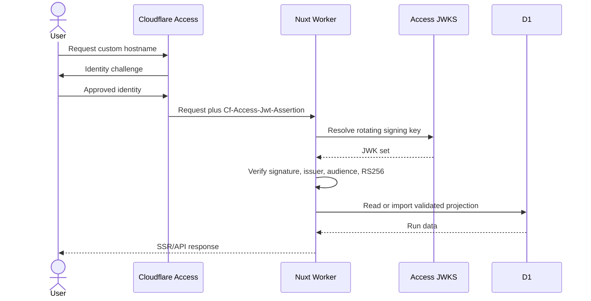

# Cloudflare Deployment and Access Runbook

## Outcome

This runbook deploys the Nuxt SSR workspace to Cloudflare Workers with:

- D1 bound as `DB`;
- a custom hostname;
- Cloudflare Access protecting the whole hostname;
- application-level validation of `Cf-Access-Jwt-Assertion`;
- no public meeting-data route;
- no Gemini or meeting-provider credentials in the current review-only Worker.

The repository does not auto-deploy. Deployment is an operator action.

## Hosted Studio (planned)

The proposed [Hosted Studio track](../conductor/tracks/hosted-studio_20260822/)
extends this same hostname and Access boundary with principal-scoped creation,
D1 job state, Cloudflare Workflows, and Worker-proxied Gemini uploads. It is a
plan, not a deployed capability. Tier A would add `GEMINI_API_KEY` as the only
Worker secret; provider connections and their separate encryption KEK remain
Tier B.

The Cloudflare build uses Nitro's module-format `cloudflare_module` preset.
The legacy `cloudflare-worker` service-worker preset is incompatible with
module-bound D1 and produced Wrangler deploy error 100329. Verified Wrangler
output for this deployment shape identifies the module entrypoint, Workers
Assets, and the D1 `DB` binding; hosted implementation must additionally show
its Workflow binding before release. It must not report 100329.

## Security model



Access is the identity-aware proxy. The Worker still validates the JWT.
Cloudflare explicitly recommends validating the header because a Worker may
also be reachable through another route.

References:

- [Nuxt on Workers](https://developers.cloudflare.com/workers/framework-guides/web-apps/more-web-frameworks/nuxt/)
- [D1 bindings](https://developers.cloudflare.com/d1/worker-api/)
- [D1 migrations](https://developers.cloudflare.com/d1/reference/migrations/)
- [Cloudflare Access applications](https://developers.cloudflare.com/cloudflare-one/access-controls/applications/http-apps/)
- [Validate Access JWTs](https://developers.cloudflare.com/cloudflare-one/access-controls/applications/http-apps/authorization-cookie/validating-json/)

## Prerequisites

- Bun 1.3.14 or newer;
- a Cloudflare account with Workers and D1;
- a domain in the same account or a routable custom hostname;
- a Cloudflare Zero Trust organization;
- an identity provider configured in Zero Trust;
- Wrangler authentication for the intended account;
- authority to create a D1 database, Worker, DNS route, and Access application.

Do not reuse an unrelated account token. Confirm the active account before
creating resources.

## 1. Verify the source tree

From the repository root:

```bash
bun install --frozen-lockfile
bun run test:web
bun run typecheck:web
bun run build:web:cloudflare
```

The expected Worker entrypoint is:

```text
apps/web/.output/server/index.mjs
```

The expected static assets are:

```text
apps/web/.output/public
```

## 2. Authenticate Wrangler

```bash
bunx wrangler whoami
```

If necessary:

```bash
bunx wrangler login
```

Verify the account name and ID before continuing.

## 3. Create the D1 database

```bash
bunx wrangler d1 create frame-of-mind
```

Record the returned database ID. It is infrastructure metadata, not an API
secret, but do not invent or truncate it.

## 4. Create the local Wrangler configuration

```bash
cp apps/web/wrangler.jsonc.example apps/web/wrangler.jsonc
```

`apps/web/wrangler.jsonc` is ignored so each operator can use a separate account
and hostname.

Edit these values:

| Field | Value |
|---|---|
| `routes[0].pattern` | dedicated custom hostname |
| `database_id` | exact ID returned by D1 create |
| `NUXT_CLOUDFLARE_ACCESS_TEAM_DOMAIN` | `https://<team>.cloudflareaccess.com` |
| `NUXT_CLOUDFLARE_ACCESS_AUD` | Access application audience from step 6 |

Keep:

```json
"NUXT_AUTH_MODE": "cloudflare-access"
```

If the audience or team domain is missing, the application fails closed.

## 5. Apply the D1 migration

Test against Wrangler's local D1 first:

```bash
bunx wrangler d1 migrations apply frame-of-mind \
  --local \
  --config apps/web/wrangler.jsonc
```

Inspect migration status:

```bash
bunx wrangler d1 migrations list frame-of-mind \
  --local \
  --config apps/web/wrangler.jsonc
```

Apply to the remote database only after the local command succeeds:

```bash
bunx wrangler d1 migrations apply frame-of-mind \
  --remote \
  --config apps/web/wrangler.jsonc
```

Wrangler defaults have changed historically. Always spell out `--local` or
`--remote`.

## 6. Create the Access application

In Cloudflare Zero Trust:

1. Open **Access controls → Applications**.
2. Create a **Self-hosted** application.
3. Enter the exact custom hostname from Wrangler.
4. Protect the root path so every page and API route is covered.
5. Add a narrow **Allow** policy:
   - specific email addresses, or
   - a controlled identity-provider group.
6. Add Require rules such as device posture when appropriate.
7. Do not add an Everyone Bypass policy.
8. Save the application.
9. Open its additional settings.
10. Copy the exact Application Audience (AUD) tag into the local
    `wrangler.jsonc`.

An email-domain Allow rule is broader than a named group. Choose the smallest
population that needs meeting-derived analyses.

## 7. Build and deploy

Build from the repository root:

```bash
bun run build:web:cloudflare
```

That command sets `NITRO_PRESET=cloudflare_module`; do not substitute the
legacy `cloudflare-worker` preset.

Deploy from `apps/web` so Wrangler paths match the configuration:

```bash
bunx wrangler deploy --cwd apps/web --config wrangler.jsonc
```

The current review-only Worker bundle contains no Gemini, Granola, Bluedot, or
Asana secret. The review app only imports completed JSON contracts. The
planned Hosted Studio secret boundary is specified separately above.

## 8. Verify fail-closed behavior

### Direct unauthenticated request

```bash
curl -i "https://frame-of-mind.example.com/api/health"
```

Expect an Access redirect or denial, not JSON run data.

### Browser identity

1. Open the custom hostname in a private browser window.
2. Complete the configured identity challenge.
3. Verify the header shows the authenticated email.
4. Open Runs and Import.
5. Import a non-sensitive test fixture.
6. Verify the run list and detail page.

### Wrong audience

Temporarily use an invalid audience in a non-production test deployment. An
otherwise valid Access token must receive 403 from the application.

### Direct Worker route

If a `workers.dev` route exists, request it directly. The in-application JWT
gate must return 403 because Access did not add a valid assertion.

## 9. Import production data deliberately

Use the browser import page after authentication. Import only reviewed bundles
that are approved for the hosted workspace.

Do not bulk-upload a local runs directory. The absence of automatic sync is a
privacy feature in v0.2.0.

## 10. Operations

### Logs

Worker logs may include route, status, and sanitized errors. Do not add request
body logging, JWT logging, analysis logging, or D1 row logging.

### Key rotation

The application uses the Access JWKS endpoint through `jose`; it does not pin a
single certificate. Cloudflare rotates signing keys, so remote JWKS resolution
prevents manual certificate drift.

### Database backup

Before a migration:

```bash
bunx wrangler d1 export frame-of-mind \
  --remote \
  --output "/private/backup/frame-of-mind.sql" \
  --config apps/web/wrangler.jsonc
```

Treat the export as sensitive meeting-derived data. Store it outside the
repository.

### Hosted retention and exact-run purge

D1 stores the complete validated `analysis.json` projection, including accepted
and rejected summaries, UI excerpts, and meeting quotes. It does not store the
recording, transcript, screenshots, provider payload, or credentials.

Imports enforce the v2 analysis/manifest digest and same-origin JSON mutation
policy before touching D1. Item rows use one or more byte-bounded
`json_each(?)` parameters, so the atomic batch uses a bounded number of
statements rather than one query per finding. The projected run row is capped
at 1.8 MB and each expansion parameter at 900 KB. Run browsing selects summary
columns and uses a maximum page size of 100 with a stable keyset cursor; it
never scans every JSON blob into Worker memory.

Before deploying, the workspace owner must choose and document a retention
period. Thirty days is the recommended starting point for a review workspace
unless policy or an active work item requires less or more. Version 0.2.0 does
not automate expiry.

To purge one reviewed run, first copy its exact route-safe run ID from the UI.
Validate and preview it before deletion:

```bash
RUN_ID="2026-07-25T12-00-00-000Z-example"
case "$RUN_ID" in
  ""|*[!a-zA-Z0-9._:-]*)
    echo "Refusing an empty or unsafe run ID" >&2
    exit 1
    ;;
esac

bunx wrangler d1 execute frame-of-mind \
  --remote \
  --config apps/web/wrangler.jsonc \
  --command "SELECT run_id, meeting_id, completed_at FROM analysis_runs WHERE run_id = '$RUN_ID';"
```

Stop if the preview does not identify exactly the intended run. Export a backup
when policy requires recovery, then delete the child projection and run row:

```bash
bunx wrangler d1 execute frame-of-mind \
  --remote \
  --config apps/web/wrangler.jsonc \
  --command "DELETE FROM analysis_items WHERE run_id = '$RUN_ID'; DELETE FROM analysis_runs WHERE run_id = '$RUN_ID';"
```

Verify that both counts are zero:

```bash
bunx wrangler d1 execute frame-of-mind \
  --remote \
  --config apps/web/wrangler.jsonc \
  --command "SELECT (SELECT COUNT(*) FROM analysis_runs WHERE run_id = '$RUN_ID') AS runs, (SELECT COUNT(*) FROM analysis_items WHERE run_id = '$RUN_ID') AS items;"
```

Do not interpolate meeting titles, email addresses, or arbitrary strings into
these commands. D1 Time Travel or a reviewed export is the recovery path.

### Dependency updates

Before upgrading Nuxt, Nuxt UI, Wrangler, `jose`, Bun, or Workers types:

1. read current official documentation;
2. run local tests and typechecks;
3. build both Nitro targets;
4. verify JWT denial and success paths;
5. run a local D1 migration;
6. inspect the generated Worker entrypoint and asset paths.

## Rollback

Application rollback:

1. identify the last known-good Git tag or commit;
2. build its Cloudflare target;
3. deploy that exact output;
4. verify Access and API denial before importing data.

Database rollback:

- prefer a forward migration;
- use D1 Time Travel or a reviewed export restoration when necessary;
- never delete the D1 database as an application rollback;
- preserve the portable run bundles independently.

## Common failures

### Every request returns 403 after Access login

Check:

- exact team-domain origin, including `https://`;
- exact application AUD;
- custom hostname is attached to the same Access application;
- Worker variables use the `NUXT_` names in the template;
- system clock and Access session are valid.

### D1 binding is missing

Confirm the binding name is exactly `DB` and the Cloudflare build command was
used. The hosted adapter fails with 503 instead of silently creating local
storage.

### Tables do not exist

Apply migration `0001_initial.sql` to the same database ID bound to the Worker.
Check `wrangler d1 migrations list ... --remote`.

### Import is rejected

422 means contract or cross-file identity validation failed. 413 means the
payload exceeded 2 MiB. Do not raise limits until the retention and abuse model
is reviewed.

### Assets load but data routes fail

Static Workers Assets do not contain meeting data. Inspect Worker logs and the
D1 binding. Confirm the request reached the Worker and carried a validated
Access assertion.
