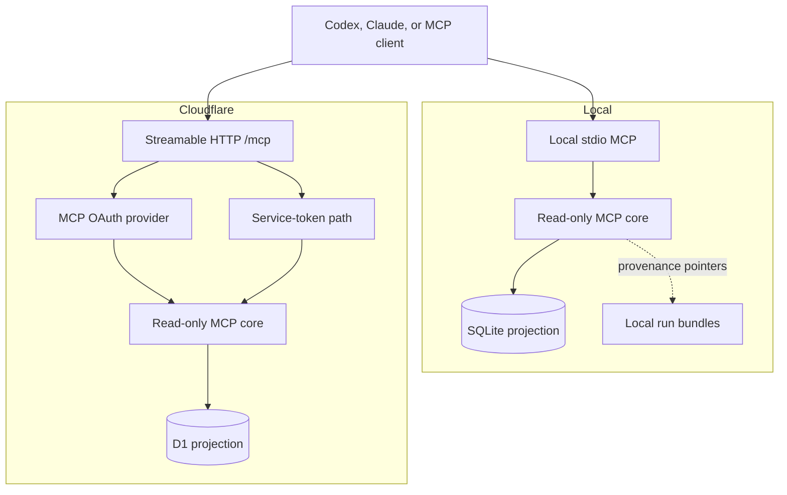

# Local and Cloudflare MCP Architecture

## Status

Design target for the next iteration. No MCP server is shipped in v0.1.0.

This is deliberate. The CLI, durable contracts, review workspace, database
projection, and authentication boundary need real usage before agent access is
made another public interface.

## Invariant

> MCP may expose reviewed analysis, but it must not become a credential proxy,
> recording server, or hidden publishing authority.

The existing `RunStore` is the reusable core. Transport-specific code should
adapt MCP requests to that read-only core.

## Reusable pattern

The NEC Knowledge Base demonstrates a useful shape:

- a shared domain/retrieval core;
- REST and MCP as peer front doors;
- a manifest tool for orientation;
- narrow, schema-described tools;
- browser OAuth and non-browser token paths;
- remote Streamable HTTP with explicit health and verification;
- no mutation through the retrieval service.

Frame of Mind should copy the pattern, not NEC-specific Vectorize, licensing, or
retrieval behavior.

## Target topology



Local and hosted servers share tool schemas and response DTOs. They do not share
transport state or credentials.

## Initial tool set

Tool names should be stable and product-prefixed:

### `frame_of_mind_manifest`

Returns:

- server version;
- supported schema versions;
- available recipe IDs;
- provider and kind facets;
- run and item counts;
- capabilities such as screenshot availability;
- retention statement.

It returns orientation metadata, not meeting content.

### `frame_of_mind_list_runs`

Inputs:

- optional provider;
- optional recipe ID;
- optional completed-after/completed-before;
- bounded limit and cursor.

Returns run summaries only. No full analysis JSON.

### `frame_of_mind_get_run`

Input:

- exact run ID;
- optional `includeRejected`, default false.

Returns reviewed structured analysis and sanitized provenance.

### `frame_of_mind_list_records`

Inputs:

- exact run ID;
- optional accepted, kind, or importance filter;
- bounded limit and cursor.

Returns normalized item rows.

### `frame_of_mind_get_manifest`

Input:

- exact run ID.

Returns the versioned run manifest. Signed URLs and remote credentials are
already absent from the durable contract.

## Explicit non-tools in the first MCP release

Do not expose:

- analyze a recording;
- upload or download video;
- return screenshot bytes;
- fetch raw transcripts;
- fetch raw Bluedot or Granola payloads;
- authenticate to Bluedot or Granola;
- delete runs;
- import runs;
- create GitHub, Asana, Linear, or other tickets;
- send messages;
- execute custom recipes.

Those actions have different authority, retention, cost, and prompt-injection
risks. Read-only access must mature first.

## Local stdio server

The local process should:

- use the existing Bun runtime;
- open the configured SQLite projection read-only;
- communicate over stdio;
- log only to stderr;
- never print analysis content in logs;
- inherit filesystem authority from the launching user;
- fail if the database path is missing rather than scanning the machine;
- expose the same tool schemas as hosted MCP.

Suggested future command:

```text
frameofmind mcp --database /path/to/frame-of-mind.sqlite
```

Suggested client configuration should pass the database path as an argument or
environment variable, not embed provider credentials.

## Cloudflare Streamable HTTP server

The hosted server should be a separate Worker entrypoint from the Nuxt app even
when both bind the same D1 database.

Reasons:

- independent authentication and rollout;
- MCP session state does not complicate SSR;
- a connector outage does not take down the review UI;
- least-privilege bindings;
- independent observability and rate limits.

Target endpoint:

```text
https://<mcp-host>/mcp
```

Use Streamable HTTP. SSE may be retained only for client compatibility.

## Hosted authentication

The UI and MCP have related but different clients.

### Human web UI

Keep Cloudflare Access on the UI hostname. Continue verifying
`Cf-Access-Jwt-Assertion` in the Nuxt Worker.

### Browser-based MCP connectors

Claude.ai-style custom connectors require a standards-compliant MCP OAuth flow,
including authorization metadata and dynamic client registration. A Cloudflare
Access login page alone is not the MCP OAuth protocol.

The hosted MCP Worker can use Cloudflare's OAuth-provider pattern with an
approved upstream identity provider. Gate authorization to an explicit email
domain or group.

Do not place the OAuth discovery, registration, callback, or token endpoints
behind a second Access challenge that the MCP client cannot complete.

### Non-browser clients

Prefer one of:

- OAuth device/browser flow supported by the client;
- Cloudflare Access service-token policy with client ID/secret headers;
- a dedicated rotatable bearer secret accepted only on `/mcp`.

If a static bearer is supported:

- store it as a Worker secret;
- compare without logging;
- scope it read-only;
- rotate it independently;
- do not honor it on OAuth endpoints;
- document client-side secret storage.

## Authorization

Authentication proves identity. Authorization still needs policy.

The first remote MCP version may allow every authenticated workspace user to
read every imported D1 run only if that matches the product's intended tenant
boundary. Otherwise add an ownership/membership table before launch.

Do not infer per-run authorization from `imported_by` alone. That field is audit
metadata, not an ACL.

## Session state

The initial read-only tools do not require durable conversational state. Start
stateless if the MCP SDK and clients permit it.

If the chosen Cloudflare MCP framework requires Durable Objects for sessions:

- keep only protocol/session state there;
- keep analysis data in D1;
- version Durable Object migrations;
- do not duplicate run content into session storage.

## Search and embeddings

Cross-run semantic search is not part of the first MCP release.

When added:

1. derive embeddings from accepted structured records, not raw transcripts;
2. keep the embedding index disposable;
3. preserve run ID and item index as hydration keys;
4. return D1/JSON records as the source, not vector metadata alone;
5. record model, dimensions, and index version;
6. add lexical/exact filters before semantic search;
7. never require embeddings for `get_run` or `list_records`.

This follows the existing ADR that embeddings are optional and downstream.

## Images and screenshots

Local MCP may return a screenshot only from a validated filename inside the
exact run directory. It must reject traversal and symlinks that escape the run.

Hosted screenshots require:

- explicit import consent;
- private R2 storage;
- an authorized MCP image tool;
- object keys derived from run ID and artifact manifest;
- retention and deletion policy;
- no public bucket or guessable unauthenticated URL.

Until that design is implemented, MCP returns the screenshot filename and says
the bytes are unavailable.

## Verification matrix

Before enabling MCP:

| Check | Local stdio | Cloudflare |
|---|---|---|
| tools/list contract | required | required |
| no-auth rejection | process boundary | HTTP 401/403 |
| list/get parity | SQLite fixture | D1 fixture |
| rejected items default hidden | required | required |
| traversal resistance | required | n/a until R2 |
| logs contain no content/token | required | required |
| pagination limits | required | required |
| unknown schema rejection | required | required |
| Codex connection | required | required |
| Claude Code connection | required | required |
| browser connector OAuth | n/a | required before advertising |

## Delivery sequence

1. Extract a read-only query service from `RunStore`.
2. Add local stdio MCP and offline contract tests.
3. Dogfood with Codex and Claude Code.
4. Freeze tool names and response schemas.
5. Add a separate Cloudflare Worker with D1 read-only binding.
6. Add OAuth/service-token auth and rate limits.
7. Verify connector interoperability.
8. Add hosted deployment runbook.
9. Consider semantic search only after query usage is understood.

This sequence keeps v0.1.0 useful without pretending an untested MCP auth
surface is production-ready.
