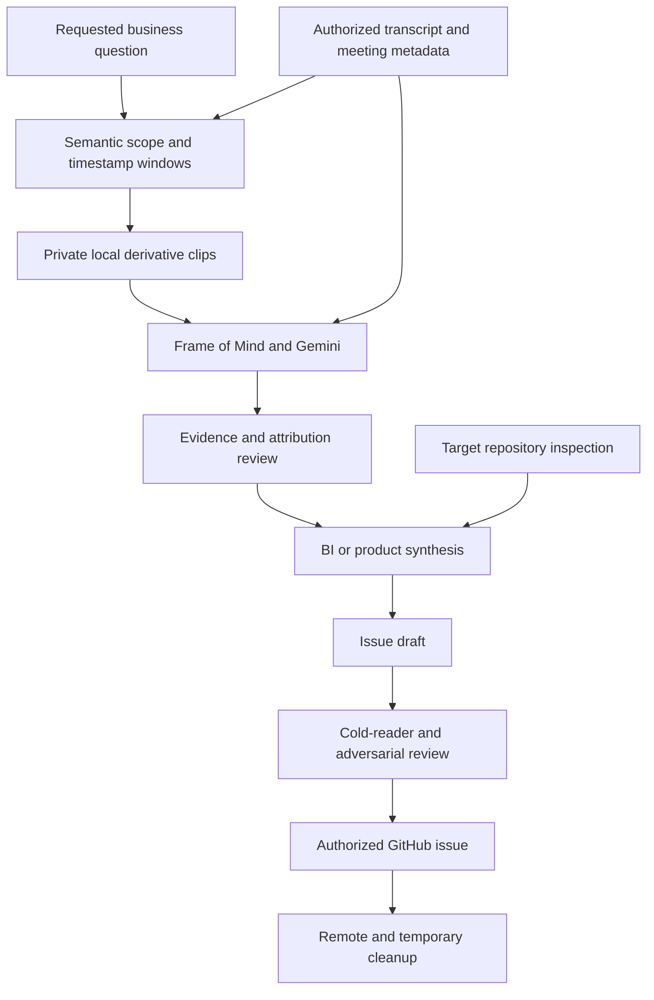
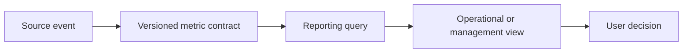

# Meeting-to-Issue Runbook

Use this runbook to turn an authorized meeting recording into a reviewed,
implementation-ready GitHub issue. It covers the operator workflow around
Frame of Mind: semantic scoping, local clip creation, Gemini analysis,
repository grounding, issue authoring, evidence attachment, review, and
cleanup.

It does not authorize access to a meeting or publication to a repository.
Those are separate operator decisions.

## Operating invariant

Process the least media needed to understand the requested problem, but preserve
enough surrounding conversation to represent the problem faithfully.

That means:

- scope by the requested topic, not merely by a named speaker;
- use the transcript to locate one or more bounded media windows before upload;
- include collaborators' clarifications when they change the requirement;
- distinguish direct requests, corroboration, and analyst inference;
- ground the resulting issue in the target repository before prescribing code;
- retain only the artifacts needed for review.

## Inputs and outputs

### Required inputs

- an authorized Bluedot, Granola, or local transcript/context source;
- an authorized local video recording;
- a plain-language question or topic;
- the target repository;
- explicit authority before creating or editing a GitHub issue.

### Expected outputs

- one or more private local derivative clips;
- a versioned Frame of Mind run bundle for each analyzed clip;
- a reviewed synthesis that separates evidence from inference;
- optional timestamped screenshots;
- an implementation-ready GitHub issue;
- a cleanup record for temporary local and remote media.

Do not place recordings, full transcripts, raw model responses, signed URLs,
tokens, or private run bundles in the repository.

## End-to-end flow



## 1. Preflight

Confirm all of the following before touching media:

- the operator can access the meeting with the intended provider identity;
- the recording may be sent to the configured Gemini project;
- the requested topic is clear enough to define a review boundary;
- the target repository and issue tracker are correct;
- screenshots are permitted in that tracker;
- the local run-retention location is appropriate;
- a Gemini key is available without displaying or copying it into chat.

Run:

```bash
frameofmind doctor
ffmpeg -version
gh auth status
```

If provider authorization used the wrong browser account, remove only the
provider-specific Frame of Mind token and reauthorize. Do not delete unrelated
credentials or copy token files between MCP endpoints.

## 2. Fetch and normalize context before media upload

Fetch the transcript and meeting metadata first. This is both a cost boundary
and a privacy boundary: no video should leave the machine until the requested
topic has been localized.

The current CLI has no context-preview command. Do not run `analyze` merely to
fetch a transcript because it continues to media upload. Use one of these
authorized surfaces:

- Bluedot's meeting transcript UI or the `get_meeting` tool in an MCP client;
- Granola's meeting UI/export or plan-eligible `get_meeting_transcript` tool;
- an existing local transcript/export for `--source file`.

Keep the fetched context in memory or an approved private temporary location.
Do not copy a complete transcript into the repository.

For Bluedot transcripts, the `speakerTag` owns the text that follows it:

```text
[timestamp] Speaker A: following text
```

Do not attach a segment to the speaker above it. Preserve the provider's raw
attribution in working notes even if it appears wrong.

Normalize each usable transcript segment to:

```text
start time | end time if known | raw speaker tag | text
```

If the transcript has no reliable timestamps, do not invent them. Ask for
explicit media bounds or analyze the operator-selected video as a whole.

## 3. Define semantic scope

Translate the request into three evidence classes:

| Class | Meaning | Example treatment |
|---|---|---|
| Direct request | The requester explicitly asks for an outcome | Quote or closely paraphrase with timestamp |
| Collaborative clarification | Another participant changes, narrows, or expands the requirement | Include and attribute separately |
| Analyst inference | A product, BI, or implementation implication derived from the evidence | Label as inference or recommendation |

Search the transcript for:

- the named person or topic;
- feature and metric vocabulary;
- references back to earlier context;
- objections, corrections, examples, and acceptance language;
- the end of the conversational turn, not just the last matching keyword.

Create one or more windows. Add a small lead-in and tail so the video includes
the setup and the point where the topic resolves. Prefer multiple small windows
over one large span containing unrelated discussion.

Record the selection as:

```text
Window 1: full-meeting 00:12:40–00:18:10
Reason: direct request plus collaborator clarification

Window 2: full-meeting 00:41:05–00:42:30
Reason: later correction to the requested metric
```

The named person's airtime is not the semantic boundary. If another speaker
finishes the requirement, that content remains in scope.

Current production analysis sends the full normalized meeting transcript
during every clip's index pass, even when the video is bounded. Multiple clips
therefore resend that transcript. If transcript minimization is also required,
create an authorized bounded local transcript/context file and use
`--source file --context-file <bounded-context>`; review its timestamps and
attribution before analysis.

## 4. Create private local derivative clips

Keep the original recording unchanged. Create derivatives outside the
repository and name them without participant, customer, or meeting identifiers.

Calculate `<duration>` as `<end> - <start>`. Re-encode the uploadable derivative
so the requested start is not widened to an earlier stream-copy keyframe. Copy
only the first video and optional first audio stream; remove subtitle, data,
attachment, chapter, and metadata streams:

```bash
ffmpeg \
  -ss "<start>" \
  -i "<recording.mp4>" \
  -t "<duration>" \
  -map 0:v:0 \
  -map "0:a:0?" \
  -sn \
  -dn \
  -map_metadata -1 \
  -map_chapters -1 \
  -c:v libx264 \
  -preset fast \
  -crf 20 \
  -c:a aac \
  -movflags +faststart \
  "<private-temp-directory>/window-01.mp4"
```

Validate duration, stream types, metadata removal, and decodability:

```bash
ffprobe -v error \
  -show_entries stream=codec_type,start_time:stream_tags:format=duration,start_time:format_tags \
  -of json \
  "<private-temp-directory>/window-01.mp4"
```

Container-generated technical tags such as codec handler, encoder, and brand
may remain. Confirm that source-authored names, comments, locations, chapters,
attachments, subtitle streams, and data streams do not.

Preview the first and last seconds locally before upload. If the visible or
spoken boundary does not match the intended full-meeting timestamp, recut it
and use the verified actual start—not the requested start—as the transcript
offset.

For each clip, calculate:

```text
transcript offset = full-meeting timestamp at clip start - clip timestamp zero
```

For a clip that begins at full-meeting `00:12:40`, pass
`--transcript-offset "00:12:40"`.

## 5. Run bounded analysis

> **Compatibility stop — 2026-07-27:** the released v0.2 analysis path is not
> currently safe to use with private media on Bun. The shipped SDK upload
> reproduced an empty 404, and Gemini rejected the shipped full Zod-derived
> provider schema. Do not run the command below on sensitive media until the
> adapter fix lands and a synthetic upload/generate/delete smoke test passes.
> The command documents the intended operator path after that gate is restored.

Choose the recipe based on the desired artifact:

- product or BI requirements: `requirements`;
- implementation-ready issue evidence: `issue-review`;
- repository execution plan: `repo-plan`;
- decisions or actions: use their matching recipes.

Example:

```bash
frameofmind analyze "<meeting-id>" \
  --source bluedot \
  --video "<private-temp-directory>/window-01.mp4" \
  --recipe requirements \
  --focus "Identify the requested reporting outcome, collaborative clarifications, metric definitions, and unresolved decisions. Separate direct requests from BI inference." \
  --transcript-offset "00:12:40" \
  --max-moments 3
```

Analyze separate windows independently when their offsets differ. Reconcile the
accepted records during synthesis; do not concatenate arbitrary clips and then
pretend they share one continuous timeline.

Current production behavior uses the repository's Gemini adapter. Diagnostic
scripts that exercise a direct resumable upload or the Beta Interactions API
are not a substitute for the production CLI and must not be described as a
shipped fallback until implemented and tested in the adapter.

## 6. Review the run before synthesis

Open, in order:

1. `manifest.json`;
2. `analysis.md` or `report.html`;
3. `moment-*.png`;
4. `analysis.json`, including rejected records.

Verify:

- meeting, provider, media source, model, and recipe;
- transcript offset and confidence;
- every video timestamp against the derivative clip;
- every meeting timestamp by adding the recorded offset;
- accepted and rejected records;
- exact wording versus paraphrase;
- visible state versus transcript-only claims;
- remote Gemini deletion status;
- whether a screenshot contains unrelated private information.

### Speaker attribution ladder

Speaker labels can be wrong in either the transcript or model output. Use this
order of evidence:

1. preserve the raw provider `speakerTag`;
2. listen to the audio around the boundary;
3. inspect visible active-speaker or participant labels;
4. follow continuous turns across adjacent transcript segments;
5. use direct address and grammar only as supporting evidence;
6. if still uncertain, write “speaker attribution requires verification.”

Do not silently rewrite the raw transcript. Keep the correction local to the
derived finding and state why it is more likely.

### Evidence ledger

Before writing requirements, make a small ledger:

| Finding | Evidence class | Meeting time | Confidence | Notes |
|---|---|---:|---|---|
| Desired outcome | Direct request | `HH:MM:SS` | high | Explicitly stated |
| Workflow detail | Collaborative clarification | `HH:MM:SS` | medium | Accepted without objection |
| Data contract | Analyst inference | n/a | medium | Needed to make metric reproducible |

This prevents useful extrapolation from being mistaken for a verbatim request.

## 7. Ground the work in the target repository

Do not jump from a meeting sentence to a generic issue. Inspect the repository
first:

```bash
gh repo view "<owner/repository>"
gh issue list --repo "<owner/repository>" --state open --limit 100
gh pr list --repo "<owner/repository>" --state open --limit 50
```

In a local clone, read:

- root and scoped `AGENTS.md`;
- README and architecture docs;
- current routes/pages/components;
- data models and migrations;
- report/query/metric code;
- tests and fixtures;
- open plans, ADRs, and related issues.

Identify exact seams:

```text
User-visible change
  -> page/component
  -> API/query
  -> metric or data contract
  -> storage/source data
  -> tests and observability
```

If the requested business meaning conflicts with the existing implementation,
state the conflict. Do not bend the request to match current code.

## 8. Synthesize with a BI and product lens

For reporting work, answer these questions before proposing UI:

- What decision should the report help someone make?
- What is the grain: project, person, day, stage transition, or event?
- What dimensions can be filtered, grouped, and compared?
- What is the numerator?
- What is the denominator?
- What event starts and ends a duration?
- What timezone and business calendar apply?
- How are missing, reopened, canceled, and duplicate records handled?
- Can a metric be reproduced from stored facts?
- Which view is operational and which is managerial?
- What does “done” look like to the requester?

Separate:

```text
Observed request
Collaborative detail
BI interpretation
Implementation recommendation
Open decision
```

The analysis may legitimately extrapolate. The discipline is to show the
reasoning boundary, not to suppress useful product thinking.

## 9. Draft an implementation-ready issue

A strong issue normally contains:

1. problem and intended decision;
2. source scope and evidence classification;
3. current behavior;
4. target experience;
5. user flow;
6. requirements;
7. metric contracts;
8. conceptual data model;
9. exact repository seams;
10. phased delivery;
11. acceptance criteria;
12. test plan;
13. observability and rollout;
14. non-goals;
15. open decisions;
16. provenance and privacy notes.

Use diagrams only when they make a relationship clearer.



For a page layout, compact ASCII is often easier for an implementation agent:

```text
+-----------------------------------------------------------+
| Filters: date | team | owner | status | compare           |
+----------------------+------------------------------------+
| Project flow         | Stage timing and exceptions        |
| one row per project  | drill-down evidence                |
+----------------------+------------------------------------+
```

Keep the issue below GitHub's body limit. Link to canonical docs instead of
copying entire documents. Do not paste full transcripts.

## 10. Attach screenshots safely

Prefer a small crop or one representative frame. Redact or omit:

- unrelated participants;
- customer or candidate data;
- browser account details;
- signed URLs;
- local paths;
- notifications and private sidebars.

Preferred order:

1. normal GitHub issue attachment;
2. an existing approved private artifact store;
3. only when explicitly authorized, a dedicated non-default evidence branch in
   the private target repository.

An evidence branch is a last-resort publishing mechanism, not the default. If
used:

- never use it for a public repository with private meeting evidence;
- use a clearly named path under `.github/issue-assets/<issue-number>/`;
- validate the local file exists and has nonzero size;
- enable shell `pipefail` when a pipeline produces upload content;
- validate the remote object size and rendered issue after upload;
- state that the branch must not be merged;
- delete the branch when the issue no longer needs the asset.

Do not extract browser cookies or use undocumented upload endpoints to work
around an automated file chooser.

## 11. Cold-reader and adversarial review

Give the draft to a reviewer with no meeting context. Ask them to identify:

- terms that are undefined;
- contradictions between summary, metrics, and acceptance criteria;
- implied data that the repository does not store;
- direct requests presented as inference or inference presented as fact;
- missing edge cases;
- ambiguous ownership or phase boundaries;
- screenshots that do not prove the adjacent claim;
- acceptance criteria that cannot be tested.

Then run an adversarial pass:

- Can two engineers implement different metric definitions and both claim
  compliance?
- Can filters change a numerator without changing its denominator?
- Can a reopened or canceled record corrupt the measure?
- Does any screenshot or quote expose unnecessary data?
- Does the issue require an unapproved migration or trust-boundary change?
- Is the first slice independently valuable and reversible?

Resolve substantive findings before publication.

## 12. Publish and verify

Search for duplicates first. Then create the issue only with explicit
authorization:

```bash
gh issue create \
  --repo "<owner/repository>" \
  --title "<clear outcome-oriented title>" \
  --label "<existing-label>" \
  --body-file "<reviewed-draft.md>"
```

Verify after publication:

```bash
gh issue view "<number>" \
  --repo "<owner/repository>" \
  --json number,title,state,labels,body,url
```

Check:

- title, repository, labels, and issue state;
- Mermaid rendering;
- image rendering and access;
- checkbox count and structure;
- links;
- no local paths, meeting IDs, secrets, or transcript dumps;
- no unsupported claim that the issue is the meeting's verbatim specification.

## 13. Cleanup and retention

Confirm the manifest accurately reports remote Gemini cleanup. Then:

- delete temporary derivative clips;
- delete temporary issue drafts that contain private context;
- preserve the original user-supplied recording;
- retain the run bundle only as long as its review value and policy justify;
- remove obsolete evidence branches or artifacts;
- do not delete any broad application-data or home directory.

Record only sanitized operational facts in `docs/project_notes/`.

## Sanitized validation replay

This workflow was built from a real authorized meeting-to-issue pass. The
meeting identity, transcript, participant names, recording path, target-private
details, and generated analysis remain outside this public repository.

### What happened

1. Provider OAuth completed, but earlier authorization attempts had shown that
   browser identity and workspace must be verified independently from a
   successful callback.
2. Bluedot supplied meeting metadata and a timestamped transcript. Its MCP
   response did not supply a stable recording download field, so an authorized
   local video was used.
3. The first interpretation treated too much available media as in scope. The
   operator clarified that only one reporting discussion mattered.
4. The transcript localized that discussion near the beginning and found a
   later correction. Two bounded derivatives were cut instead of uploading the
   complete recording.
   The retained runs contain nine timestamped screenshots produced by the
   shipped ffmpeg-backed extractor.
5. A speaker-only interpretation was also too narrow: other participants'
   comments materially clarified the reporting request. The semantic boundary
   was expanded to the complete relevant turns.
6. `@google/genai` `files.upload()` returned an empty 404 under Bun. A
   non-sensitive direct resumable upload succeeded with the same account,
   media type, and endpoint family, isolating the problem to the wrapper/runtime
   seam rather than credentials or billing.
7. A strict Zod-derived provider schema then produced an uninformative
   `400 INVALID_ARGUMENT`. Minimization showed that Gemini rejected valid JSON
   Schema keywords outside its supported subset, including a generated
   `maxItems` constraint.
8. The diagnostic used a provider-safe schema while retaining full local Zod
   validation. One response exceeded a local field bound, so a single
   corrective retry was used instead of truncating or weakening the contract.
9. Model speaker attribution conflicted with raw transcript ownership and
   conversational continuity. Audio/video and adjacent turns were reviewed;
   the raw provider tag remained preserved and uncertainty was not hidden.
10. The target repository's current UI, data shapes, open work, and test seams
    were inspected before writing the issue.
11. The synthesis deliberately went beyond transcript extraction. It converted
    the conversation into reproducible BI definitions, user flows, phased
    implementation, acceptance criteria, tests, and open decisions while
    labeling those additions as interpretation.
12. A cold-reader pass caught contradictions that sheer issue length had not
    prevented.
13. Browser automation could not attach local screenshots. An explicitly
    authorized private evidence branch was used as a last resort. One pipeline
    briefly created a zero-byte object because its upstream command failed
    without `pipefail`; the object was replaced and remote sizes were verified.
14. The published issue was re-read from GitHub to verify its body, diagrams,
    labels, links, and images.
15. Gemini uploads and temporary derivatives were cleaned up. The original
    user-supplied recording and reviewed run bundles were preserved.

### Durable lessons

- A successful OAuth callback proves authorization flow completion, not that
  the browser used the intended provider identity.
- Context providers and video storage remain independent concerns.
- Semantic scope must be narrower than all available media but broader than a
  single person's literal airtime.
- ffmpeg is part of the verified evidence path for timestamped screenshots;
  transient derivative clips should still be removed after review.
- Transcript ownership, diarization, model attribution, and visible participant
  tiles are separate signals that need reconciliation.
- Provider-accepted structured output is not durable until strict local Zod
  validation succeeds.
- A successful diagnostic is not shipped production behavior.
- Repository inspection turns a meeting summary into an executable issue.
- BI extrapolation is valuable when its evidence boundary is explicit.
- Screenshot publication has its own privacy, integrity, and retention
  lifecycle.
- Long documentation still needs a reader test for contradictions.

## Failure matrix

| Symptom | Likely cause | Safe response |
|---|---|---|
| Provider auth completes but the meeting is unavailable | wrong browser identity or workspace | remove only that provider token and reauthorize |
| Transcript appears to swap speakers | speaker-before-text parsing or diarization error | preserve raw tag; verify with the attribution ladder |
| Analysis includes irrelevant meeting content | available media was mistaken for requested scope | reselect transcript windows and cut derivatives |
| Useful collaborator detail was omitted | scope was reduced to a person's airtime | expand to the full relevant conversational turn |
| Clip quotes come from meeting start | missing transcript offset | calculate and pass the full-meeting clip start |
| Gemini SDK upload returns empty 404 | SDK wrapper/runtime seam | run a non-sensitive resumable-upload diagnostic; do not call it an auth failure |
| Structured output returns `400 INVALID_ARGUMENT` | unsupported JSON Schema keyword | minimize provider schema and retain strict local Zod validation |
| Provider-valid JSON fails local validation | provider subset omitted local bounds | fail closed; an adapter change may add at most one corrective retry, never a cast or truncation |
| Automated screenshot upload fails | browser security or tool boundary | use the UI manually or an authorized artifact path |
| Uploaded evidence is zero bytes | source/path or shell pipeline failed | stop, replace it, and verify remote size before linking |
| Issue reads well but cannot be implemented | target repository was not inspected | ground requirements in current code/data/test seams |
| Two metric definitions conflict | synthesis mixed request and inference | add a canonical metric contract and open decision |

## Operator close-out checklist

- [ ] Provider identity and meeting access verified.
- [ ] Requested semantic scope written down.
- [ ] All relevant speakers included, with evidence classes separated.
- [ ] Only bounded local derivatives uploaded.
- [ ] Original recording preserved.
- [ ] Transcript offsets recorded and reviewed.
- [ ] Run manifests and remote cleanup reviewed.
- [ ] Target repository and duplicate issues inspected.
- [ ] Metric and data contracts made explicit.
- [ ] Direct request, clarification, and inference distinguished.
- [ ] Screenshots minimized and reviewed for privacy.
- [ ] Cold-reader and adversarial findings resolved.
- [ ] External issue creation explicitly authorized.
- [ ] Published issue rendered and links/assets verified.
- [ ] Temporary media and private drafts removed.
