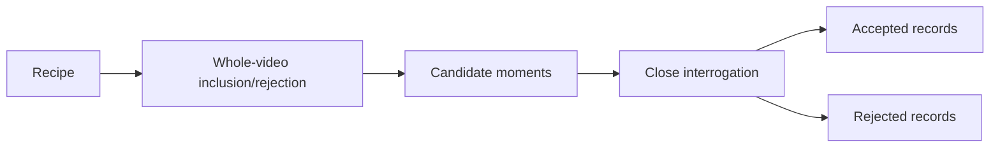

# Analysis Recipes

Recipes make Frame of Mind multi-purpose. They tell the analyzer what kind of
work to extract while leaving provider access, video processing, alignment,
safety, cleanup, and durable schemas unchanged.

## Choose by desired output

| Desired output | Recipe |
|---|---|
| Bugs, visible friction, incorrect values, issue-ready observations | `issue-review` |
| Explicit choices, rationale, alternatives, revisit triggers | `decisions` |
| User needs, constraints, acceptance criteria, edge cases | `requirements` |
| Commitments, owners, dates, dependencies, done conditions | `action-items` |
| Grounded repository changes, risks, validation, open questions | `repo-plan` |

List recipes:

```bash
frameofmind recipes
```

## Recipe pipeline



Every recipe participates in both passes:

- the index instruction defines which moments are candidates;
- the interrogation instruction defines what survives close review.

## Built-in recipes

### `issue-review`

Use when a user wants:

- visible bugs;
- wrong values;
- confusing navigation;
- broken or missing controls;
- workflow friction;
- a grounded ticket draft.

It rejects:

- speculative architecture with no observed problem;
- ordinary product discussion;
- preferences presented without impact;
- URLs or reproduction steps not visible/stated;
- behavior that is normal on closer inspection.

Recommended detail labels:

- Actual
- Expected
- Impact
- Affected surface
- Workaround

### `decisions`

Use when a user wants:

- decision logs;
- architecture decisions;
- accepted/rejected alternatives;
- rationale;
- owners and revisit conditions.

It rejects:

- suggestions;
- brainstorming options;
- uncommitted preferences;
- unresolved questions framed as decisions.

Recommended detail labels:

- Decision
- Status
- Rationale
- Alternatives
- Owner
- Revisit trigger
- Dissent

### `requirements`

Use when a user wants:

- user stories;
- functional requirements;
- constraints;
- acceptance criteria;
- edge cases;
- open product questions.

It rejects:

- invented scope;
- implementation details not supported by discussion;
- inferred actors presented as explicit users;
- ambiguous comments silently resolved by the model.

Recommended detail labels:

- Requirement
- User
- Need
- Constraint
- Acceptance criteria
- Edge case
- Explicit exclusion
- Open question

### `action-items`

Use when a user wants:

- explicit follow-ups;
- accountable owners;
- due dates;
- dependencies;
- completion conditions.

It rejects:

- generic “we should” statements;
- ideas with no commitment;
- guessed owners;
- guessed dates;
- implied work that nobody accepted.

Recommended detail labels:

- Action
- Owner
- Due date
- Dependency
- Done when
- Blocker

### `repo-plan`

Use when a user wants:

- code/doc/data changes implied by a meeting;
- affected surfaces;
- validation ideas;
- risks and open questions;
- inputs to repository planning.

It rejects:

- fabricated file paths;
- invented current architecture;
- code changes unsupported by the meeting;
- assumptions presented as repository facts.

Recommended detail labels:

- Repository
- Requested change
- Affected surface
- Implementation implication
- Risk
- Validation
- Open question

Use `--focus` to name the repository or subsystem. The recipe still labels
inferences and does not inspect the repository unless an agent separately does
that work.

## Custom recipe format

```json
{
  "id": "customer-objections",
  "label": "Customer objections",
  "description": "Extract explicit objections, context, responses, and unresolved risk.",
  "indexInstruction": "Find moments where a participant expresses concern, blocks adoption, questions value, or names a risk. Reject neutral questions.",
  "interrogationInstruction": "Accept only a clearly stated objection. Preserve the exact quote, context, response, whether it was resolved, and any follow-up."
}
```

Run it:

```bash
frameofmind analyze "<meeting-id>" \
  --source granola \
  --video "<recording.mp4>" \
  --recipe-file "./customer-objections.json"
```

## Custom recipe schema

| Field | Rule |
|---|---|
| `id` | lowercase letters/numbers/hyphens, 2–64 characters |
| `label` | human label, 1–100 characters |
| `description` | purpose, 1–500 characters |
| `indexInstruction` | candidate inclusion/rejection, maximum 8,000 characters |
| `interrogationInstruction` | close-review acceptance/rejection, maximum 8,000 characters |

Unknown/missing fields fail validation.

## Recipe-writing method

### 1. Start from the decision

Write what a human will do with the output:

- “file a product issue”;
- “update an ADR”;
- “plan a sprint”;
- “follow up with an owner”;
- “identify customer objections.”

If there is no clear consumer/action, the recipe is probably too vague.

### 2. Define inclusion

State observable conditions:

- explicit decision language;
- a visible UI failure;
- a speaker accepts an action;
- a participant gives a testable constraint.

Avoid “find anything interesting.”

### 3. Define rejection

Name the nearest false positives:

- proposal versus decision;
- idea versus assignment;
- preference versus requirement;
- discussion versus issue;
- implementation inference versus repository fact.

### 4. Define neutral details

Use label/value pairs. Do not require a new durable schema field for each
recipe.

### 5. Preserve ambiguity

Tell the model to mark uncertainty, missing ownership, unresolved dates, and
conflicting statements.

### 6. Bound the run

Start with:

```bash
--max-moments 3
```

Review accepted and rejected records before expanding.

## Prompt-injection resistance

Recipe text, transcript text, and video text are all untrusted. A recipe cannot
instruct the system to:

- reveal credentials;
- call external tools;
- execute commands;
- ignore content safety;
- retain uploads;
- publish results;
- alter provider access;
- skip schema validation.

The fixed system guard takes precedence.

## Versioning recipes

Built-in recipe IDs remain stable. Material behavior changes require:

- changelog entry;
- prompt revision bump;
- tests;
- updated examples;
- release version evaluation.

Custom recipes are embedded by identity, not full text, in the current manifest.
For long-lived compliance use, keep the recipe file in a versioned authorized
repository and record its hash in a future manifest revision.

## Review checklist

- [ ] Desired downstream action is clear.
- [ ] Inclusion criteria are observable.
- [ ] Nearest false positives are named.
- [ ] Exact quotes remain exact.
- [ ] Inferences are labeled.
- [ ] Missing owner/date is not guessed.
- [ ] Details use neutral labels.
- [ ] Bounded test includes rejected candidates.
- [ ] Output remains useful without HTML.
