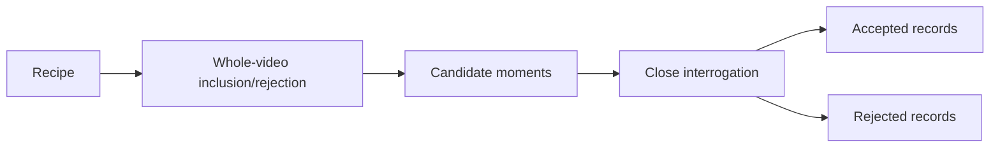

# Analysis Recipes

Recipes make Frame of Mind multi-purpose. They tell the analyzer what kind of
work to extract while leaving provider access, video processing, alignment,
safety, cleanup, and durable schemas unchanged.

## Choose by desired output

| Desired output | Recipe |
|---|---|
| Bugs, visible friction, incorrect values, issue-ready observations | `issue-review` |
| Explicit choices, rationale, alternatives, revisit triggers | `decisions` |
| User needs, constraints, acceptance criteria, edge cases | `requirements` |
| Commitments, owners, dates, dependencies, done conditions | `action-items` |
| Grounded repository changes, risks, validation, open questions | `repo-plan` |
| Communication/self-review, intent versus impact, missed cues | `communication-coaching` |

List recipes:

```bash
frameofmind recipes
```

## Recipe pipeline



Every recipe participates in both passes:

- the index instruction defines which moments are candidates;
- the interrogation instruction defines what survives close review.

## Built-in recipes

### `issue-review`

Use when a user wants:

- visible bugs;
- wrong values;
- confusing navigation;
- broken or missing controls;
- workflow friction;
- a grounded ticket draft.

It rejects:

- speculative architecture with no observed problem;
- ordinary product discussion;
- preferences presented without impact;
- URLs or reproduction steps not visible/stated;
- behavior that is normal on closer inspection.

Recommended detail labels:

- Actual
- Expected
- Impact
- Affected surface
- Workaround

### `decisions`

Use when a user wants:

- decision logs;
- architecture decisions;
- accepted/rejected alternatives;
- rationale;
- owners and revisit conditions.

It rejects:

- suggestions;
- brainstorming options;
- uncommitted preferences;
- unresolved questions framed as decisions.

Recommended detail labels:

- Decision
- Status
- Rationale
- Alternatives
- Owner
- Revisit trigger
- Dissent

### `requirements`

Use when a user wants:

- user stories;
- functional requirements;
- constraints;
- acceptance criteria;
- edge cases;
- open product questions.

It rejects:

- invented scope;
- implementation details not supported by discussion;
- inferred actors presented as explicit users;
- ambiguous comments silently resolved by the model.

Recommended detail labels:

- Requirement
- User
- Need
- Constraint
- Acceptance criteria
- Edge case
- Explicit exclusion
- Open question

### `action-items`

Use when a user wants:

- explicit follow-ups;
- accountable owners;
- due dates;
- dependencies;
- completion conditions.

It rejects:

- generic “we should” statements;
- ideas with no commitment;
- guessed owners;
- guessed dates;
- implied work that nobody accepted.

Recommended detail labels:

- Action
- Owner
- Due date
- Dependency
- Done when
- Blocker

### `repo-plan`

Use when a user wants:

- code/doc/data changes implied by a meeting;
- affected surfaces;
- validation ideas;
- risks and open questions;
- inputs to repository planning.

It rejects:

- fabricated file paths;
- invented current architecture;
- code changes unsupported by the meeting;
- assumptions presented as repository facts.

Recommended detail labels:

- Repository
- Requested change
- Affected surface
- Implementation implication
- Risk
- Validation
- Open question

Use `--focus` to name the repository or subsystem. The recipe still labels
inferences and does not inspect the repository unless an agent separately does
that work.

### `communication-coaching`

Use when a user wants:

- feedback on their own meeting participation;
- teaching, facilitation, or explanation review;
- strengths and growth opportunities;
- interpreted intent versus observable audience impact;
- questions, objections, or openings they may have missed;
- concrete next-time language or practice.

It rejects:

- personality diagnoses;
- unsupported claims about aptitude, mental state, or sensitive traits;
- a single recording generalized into a stable judgment about a person;
- hidden intent presented as fact.

Recommended detail labels:

- Stated goal
- Observation
- Interpreted intent
- Likely effect
- Missed cue
- Alternative interpretation
- Strength
- Guidance
- Suggested practice

Intent is a legitimate analysis target. Label inferred intent as interpretation,
cite its observed basis, and include a plausible alternative. Optional context
should state the speaker's goal, audience, role, and desired feedback so the
analysis can compare intent with observable response.

## Recipes versus artifact families

The current v2/v3 contract stores recipe-neutral label/value details. A recipe
therefore selects what to find and how to interrogate it, while an agent or
renderer composes the final artifact.

Recipes can ultimately target different artifact families:

| Family | Examples |
|---|---|
| Findings/brief | UX review, issue, requirement, decision |
| Procedure | process walkthrough converted into an SOP |
| Technical explanation | construction or electrical component walkthrough |
| Coaching report | self-review, facilitation, teaching |
| Q&A | targeted or exploratory questions about a video |

These families are proposed in ADR 0014 and do not yet change the durable
schema. They will share a versioned evidence/claim spine rather than adding
every possible field to one object or giving every recipe unrelated evidence
semantics.

## Standard and deep review

Depth is independent of the subject of a recipe:

```bash
frameofmind analyze \
  --source none \
  --video "<recording.mp4>" \
  --recipe communication-coaching \
  --depth deep \
  --model gemini-pro-latest
```

`standard` indexes at 0.5 FPS. `deep` indexes at 1 FPS and adds layered
observation, intent, implication, alternative, uncertainty, and verification
instructions. It still uses the current two-pass v2/v3 schema and one selected
model across both passes. Higher FPS is denser visual sampling, not proof of
better reasoning. Until analysis profiles receive their own manifest contract,
the deep instructions are content-addressed as the effective recipe and the
bounded revision records `deep-understanding-v1` plus the base recipe digest
prefix; this is explicit compatibility provenance, not the proposed long-term
separation of recipe and profile.

See [Video Understanding](VIDEO_UNDERSTANDING.md) for current behavior and the
proposed role-separated deep pipeline.

## Custom recipe format

```json
{
  "id": "customer-objections",
  "label": "Customer objections",
  "description": "Extract explicit objections, context, responses, and unresolved risk.",
  "revision": "2026-07-27.1",
  "indexInstruction": "Find moments where a participant expresses concern, blocks adoption, questions value, or names a risk. Reject neutral questions.",
  "interrogationInstruction": "Accept only a clearly stated objection. Preserve the exact quote, context, response, whether it was resolved, and any follow-up."
}
```

Run it:

```bash
frameofmind analyze "<meeting-id>" \
  --source granola \
  --video "<recording.mp4>" \
  --recipe-file "./customer-objections.json"
```

## Custom recipe schema

| Field | Rule |
|---|---|
| `id` | lowercase letters/numbers/hyphens, 2–64 characters |
| `label` | human label, 1–100 characters |
| `description` | purpose, 1–500 characters |
| `indexInstruction` | candidate inclusion/rejection, maximum 8,000 characters |
| `interrogationInstruction` | close-review acceptance/rejection, maximum 8,000 characters |
| `revision` | optional operator revision, 1–120 characters |

Unknown/missing fields fail validation.

## Charter recipe format

A recipe may replace the two instruction strings with a structured charter
(ADR 0016). The executor renders charter slots deterministically —
positive-before-negative, after the media and context blocks, under the
untrusted-data guard — so charter content selects intent but can never occupy
a policy position in the prompt. The built-in `issue-review` recipe ships as a
charter.

```json
{
  "id": "customer-objections",
  "label": "Customer objections",
  "description": "Extract explicit objections, context, responses, and unresolved risk.",
  "charter": {
    "stance": "You listen for explicit customer objections a team must answer.",
    "allowedQuestions": [
      "What objection did a participant state?",
      "How was the objection answered, if at all?",
      "What objection remains unresolved?"
    ],
    "acceptance": "A moment qualifies only when a participant clearly states a concern, blocker, value question, or named risk.",
    "labelVocabulary": ["Objection", "Context", "Response", "Resolved"],
    "exemplars": [
      {
        "verdict": "accepted",
        "candidate": "A participant says the rollout cannot start until pricing questions are answered.",
        "reason": "An explicit stated blocker with an owner-facing consequence."
      }
    ],
    "rejection": "Reject neutral questions, brainstorming, and concerns nobody voiced.",
    "boundaries": "Never attribute an objection to someone who did not state it."
  }
}
```

| Charter slot | Rule |
|---|---|
| `stance` | analyst perspective, 1–500 characters |
| `allowedQuestions` | 1–4 questions, 300 characters each |
| `acceptance` | what qualifies, 1–1,000 characters |
| `labelVocabulary` | 1–12 detail labels, 80 characters each |
| `exemplars` | 1–2 worked examples, `verdict` `accepted`/`rejected`, `candidate` and `reason` 500 characters each |
| `rejection` | what must be rejected, 1–1,000 characters |
| `boundaries` | unconditional prohibitions, 1–1,000 characters |
| `phaseFocus` | optional `index`/`interrogation` emphasis, 1,500 characters each |

Charter slots bind the passes asymmetrically: acceptance is applied loosely
while indexing (candidate-worthy) and strictly at interrogation; rejection
binds strictly only at interrogation; boundaries bind both passes. A charter
whose rendered instructions exceed 8,000 characters fails validation.

The manifest stores both the resolved revision and a SHA-256 of the validated
recipe object. Built-ins use a release-controlled revision. Custom recipes
without `revision` use `content-addressed`; their hash is still exact. This
lets a reviewer distinguish two files that reused the same recipe ID.

## Recipe-writing method

### 1. Start from the decision

Write what a human will do with the output:

- “file a product issue”;
- “update an ADR”;
- “plan a sprint”;
- “follow up with an owner”;
- “identify customer objections.”

If there is no clear consumer/action, the recipe is probably too vague.

### 2. Define inclusion

State observable conditions:

- explicit decision language;
- a visible UI failure;
- a speaker accepts an action;
- a participant gives a testable constraint.

Avoid “find anything interesting.”

### 3. Define rejection

Name the nearest false positives:

- proposal versus decision;
- idea versus assignment;
- preference versus requirement;
- discussion versus issue;
- implementation inference versus repository fact.

### 4. Define current neutral details

Use label/value pairs in v2/v3. Do not add ad hoc top-level fields for one
recipe. Long-term typed automation belongs in a versioned artifact family and
bounded recipe extension under ADR 0014.

### 5. Preserve ambiguity

Tell the model to mark uncertainty, missing ownership, unresolved dates, and
conflicting statements.

### 6. Bound the run

Start with:

```bash
--max-moments 3
```

Review accepted and rejected records before expanding.

## Prompt-injection resistance

Recipe text, transcript text, and video text are all untrusted. A recipe cannot
instruct the system to:

- reveal credentials;
- call external tools;
- execute commands;
- ignore content safety;
- retain uploads;
- publish results;
- alter provider access;
- skip schema validation.

The fixed system guard takes precedence.

## Versioning recipes

Built-in recipe IDs remain stable. Material behavior changes require:

- changelog entry;
- prompt revision bump;
- tests;
- updated examples;
- release version evaluation.

Custom recipes are embedded by identity, not full text, in the current manifest.
For long-lived compliance use, keep the recipe file in a versioned authorized
repository and record its hash in a future manifest revision.

## Review checklist

- [ ] Desired downstream action is clear.
- [ ] Inclusion criteria are observable.
- [ ] Nearest false positives are named.
- [ ] Exact quotes remain exact.
- [ ] Inferences are labeled.
- [ ] Missing owner/date is not guessed.
- [ ] Details use neutral labels.
- [ ] Bounded test includes rejected candidates.
- [ ] Output remains useful without HTML.
- [ ] Inferred intent is labeled and has evidence plus an alternative.
- [ ] High-stakes technical guidance names required external verification.
- [ ] SOP steps distinguish demonstrated behavior from recommended procedure.
