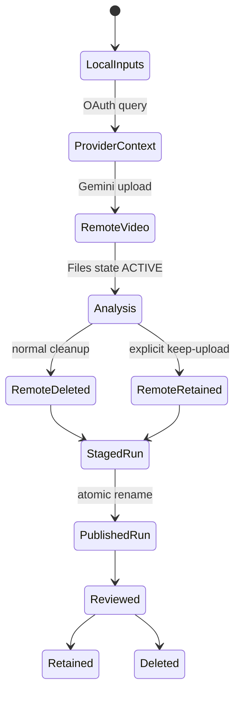

# Frame of Mind Operations Runbook

This runbook covers installation, provider authorization, recipe-driven video
analysis, validation, troubleshooting, incident response, upgrades, and
removal.

For the complete workflow that turns a bounded meeting topic into a grounded,
reviewed GitHub issue, use
[MEETING_TO_ISSUE_RUNBOOK.md](MEETING_TO_ISSUE_RUNBOOK.md).

## Runbook metadata

| Field             | Value                                       |
|---|---|
| Repository        | `jchu96/frame-of-mind`                      |
| CLI               | `frameofmind`                               |
| Skill             | `/frame-of-mind`                            |
| Current version   | `0.2.1`                                     |
| Default model     | `gemini-3.6-flash`                          |
| Gemini backend    | Developer API Files API                     |
| Context providers | Bluedot MCP, Granola MCP/API, local file    |
| Durable outputs   | local `analysis.json` and `manifest.json`   |
| Optional review   | Nuxt SSR with local SQLite or Cloudflare D1 |

## Operating invariant

Context and video are sensitive inputs. The operator controls authorization,
retention, review, and publishing. Frame of Mind produces drafts with
provenance; it does not make product, personnel, or engineering decisions.

Current release status: the v0.2.1 production adapter bypasses the failing SDK
upload wrapper with Google's documented resumable protocol and derives a
provider-safe response schema from the authoritative local Zod contract. Run
the synthetic canary in section 1.5 before the first sensitive analysis and
after model, SDK, runtime, or upload changes.

## Responsibility matrix

| Role               | Responsibility                                                                             |
|---|---|
| Operator           | choose authorized inputs/recipe, protect credentials, review output, delete stale runs     |
| Provider admin     | control Bluedot/Granola workspace access and policy                                        |
| Google Cloud owner | approve project, billing, key/IAM policy, quota                                            |
| Maintainer         | preserve contracts, cleanup, tests, docs, and safe defaults                                |
| Reviewing agent    | distinguish observed facts, quotes, and inference; avoid external writes without authority |

## Data lifecycle



Normal durable local data:

- analysis records and selected excerpts;
- run provenance and input hashes;
- optional screenshots;
- self-contained HTML;
- OAuth token files.

Normal non-durable data:

- temporary remote downloads;
- staging directories;
- raw provider responses;
- full transcript copies;
- Gemini uploaded video.

## 1. First-time setup

### 1.1 Confirm authorization

Before cloning or running:

- confirm the recording may be processed by Gemini;
- confirm the intended Bluedot/Granola account may access the meeting;
- confirm the output location is appropriate for the content;
- confirm the chosen Google project/billing owner;
- do not use production-sensitive material as a first test.

### 1.2 Install Bun

Require Bun 1.3.14 or newer:

```bash
bun --version
node --version
git --version
```

Require Node.js 22+ for the linked CLI executable and Git for cloning. The
repository's install, test, web, and release workflow uses Bun. GitHub CLI is
optional but used by the shortest clone and issue-publishing examples.

### 1.3 Install ffmpeg

macOS with Homebrew:

```bash
brew install ffmpeg
ffmpeg -version
```

Debian/Ubuntu:

```bash
sudo apt-get update
sudo apt-get install ffmpeg
ffmpeg -version
```

Windows:

1. install ffmpeg through an approved package manager or official build;
2. add its `bin` directory to user `PATH`;
3. open a new terminal;
4. run `ffmpeg -version`.

ffmpeg is optional. Use `--no-screenshots` when it is unavailable.

### 1.4 Clone and install

```bash
gh repo clone jchu96/frame-of-mind
cd frame-of-mind
bun install --frozen-lockfile
bun run check
bun run build
bun link
```

Without GitHub CLI:

```bash
git clone https://github.com/jchu96/frame-of-mind.git
cd frame-of-mind
```

Verify:

```bash
frameofmind --version
frameofmind recipes
```

Expected version:

```text
0.2.1
```

### 1.5 Configure Gemini

Follow [CREDENTIALS.md](CREDENTIALS.md).

Minimum current shell:

```bash
export GEMINI_API_KEY="your-key"
```

Rules:

- do not paste the key into chat;
- do not commit it;
- do not echo it;
- do not scrape a dotenv file with `grep | cut`;
- prefer a new AI Studio authorization key;
- verify project and billing ownership.

Verify the complete live Gemini boundary with generated media:

```bash
bun run smoke:gemini
```

This explicit maintainer smoke is not part of CI. It creates a temporary
synthetic video, exercises upload, index, detail interrogation, and exact
remote deletion, then removes the local temporary directory. It prints no
provider payload, remote file name, signed URL, or key.

### 1.6 Run preflight

```bash
frameofmind doctor
```

Expected:

```text
ok Node >=22
ok GEMINI_API_KEY
ok ffmpeg (optional screenshots)
Bluedot MCP: https://app.bluedothq.com/api/v1/mcp
Granola MCP: https://mcp.granola.ai/mcp
Artifact root: <platform-specific path>
```

`--` next to ffmpeg is acceptable if screenshots are not required.

### 1.7 Install the agent skill

Both Codex and Claude:

```bash
bun run install:skill -- --target all
```

Restart agent sessions. See [SKILL_INSTALLATION.md](SKILL_INSTALLATION.md).

## 2. Provider authorization

### 2.1 Bluedot

```bash
frameofmind auth bluedot
```

Flow:

1. local callback binds `127.0.0.1:8765`;
2. the default browser opens;
3. operator signs into Bluedot;
4. provider redirects to loopback;
5. tokens are stored under the per-user config directory.

### 2.2 Granola

Before auth, select the intended active workspace in Granola.

```bash
frameofmind auth granola
```

Granola callback uses `127.0.0.1:8766`.

Granola transcript tools may depend on:

- subscription plan;
- workspace settings;
- administrator policy;
- active workspace;
- meeting age/access.

### 2.3 Granola API key

For eligible plans, set the official key locally:

```bash
export GRANOLA_API_KEY="your-key"
```

Use it only with:

```text
--source granola --granola-transport api
```

The API transport requires a documented `not_` note ID. It does not fall back
to MCP and the key is never written to a run.

### 2.4 Local context

No OAuth:

```text
--source file --context-file <path>
```

Accepted text-oriented formats include JSON, Markdown, text, SRT, and VTT. A
JSON file should expose recognizable transcript/title/date keys.

## 3. Standard analysis procedure

### 3.1 Identify the desired output

```bash
frameofmind recipes
```

Choose:

- issue filing → `issue-review`;
- decision log → `decisions`;
- product/spec input → `requirements`;
- follow-ups → `action-items`;
- implementation planning → `repo-plan`.

Read [RECIPES.md](RECIPES.md) when uncertain.

### 3.2 Choose context

The CLI has no fetch-only or transcript-preview command in v0.2. Use the
authorized provider UI, the provider's MCP tools in a compatible client, or an
existing local export to inspect timestamps before a scoped run. Calling
`frameofmind analyze` proceeds from context fetch to upload.

Bluedot meeting/preview ID:

```text
--source bluedot
```

Granola meeting ID:

```text
--source granola
```

Exported/local transcript:

```text
--source file --context-file <path>
```

### 3.3 Choose video

Preferred:

```text
--video /absolute/path/to/recording.mp4
```

The CLI preserves this file.

Bluedot signed URL fallback:

```text
--recording-url <fresh-signed-url>
```

Only use a signed URL in a local shell where history and screen sharing are
controlled. Prefer a local download.

### 3.4 Bound the first run

```text
--max-moments 3
```

This limits the close interrogation pass. The full video is still indexed.
“Full video” means the exact operator-selected `--video`, not every recording
available for the meeting.

For a topic- or speaker-scoped request, fetch the timestamped transcript first,
identify every relevant conversational window, and create private derivative
clips before running the CLI. Include collaborators who clarify or complete the
request; do not reduce semantic scope to the named person's airtime. Follow
[ADR 0009](adr/0009-transcript-first-semantic-scoping.md).

Video clipping does not currently clip provider transcript transfer: each
index pass receives the full normalized meeting transcript. Use a bounded local
context file when transcript minimization is also required.

### 3.5 Run by provider

Bluedot issue review:

```bash
frameofmind analyze "<meeting-id>" \
  --source bluedot \
  --video "<recording.mp4>" \
  --recipe issue-review \
  --max-moments 3
```

Granola decisions:

```bash
frameofmind analyze "<meeting-id>" \
  --source granola \
  --granola-transport mcp \
  --video "<recording.mp4>" \
  --recipe decisions \
  --max-moments 3
```

Granola API decisions:

```bash
frameofmind analyze "not_XXXXXXXXXXXXXX" \
  --source granola \
  --granola-transport api \
  --video "<recording.mp4>" \
  --recipe decisions \
  --max-moments 3
```

Local context requirements:

```bash
frameofmind analyze "<stable-local-id>" \
  --source file \
  --context-file "<transcript.vtt>" \
  --video "<recording.mp4>" \
  --recipe requirements \
  --max-moments 3
```

Repository planning:

```bash
frameofmind analyze "<meeting-id>" \
  --source bluedot \
  --video "<recording.mp4>" \
  --recipe repo-plan \
  --focus "Repository example-repo; distinguish requested UX from inferred implementation"
```

The core orchestrator and Studio job/projection boundaries support explicit
video-only schema-v3 runs. The current public CLI still creates meeting-backed
v2 runs, and the Studio composer does not expose its final Run action until the
Intent/readiness slice is complete. Do not supply an invalid meeting or
disconnect a provider to force video-only behavior: a selected context source
that fails must fail the run. See
[ADR 0012](adr/0012-explicit-video-only-run-provenance.md).

### 3.6 Align clips

If the video is a clip from the middle of a meeting:

```bash
frameofmind analyze "<meeting-id>" \
  --source bluedot \
  --video "<clip.mp4>" \
  --recipe issue-review \
  --transcript-offset "01:02:47"
```

Offset means: full transcript time corresponding to clip time `00:00`.

If omitted, Gemini estimates it. Review manifest confidence before trusting
nearby transcript excerpts.

Analyze separate windows independently when they use different offsets. Keep
the original recording unchanged and delete only the derived temporary clips
after review.

### 3.7 Observe progress

Normal messages:

```text
Uploading recording to Gemini Files API…
Pass 1/2: indexing the whole recording…
Pass 2/2 [1/3] at 00:00:08
Analysis: <run-directory>
2 accepted record(s).
```

`Ctrl-C` requests cooperative cancellation. Frame of Mind finishes the active
provider boundary so it can retain an exact Gemini file identity, then checks
the cancellation signal before continuing. If an upload identity is known, it
attempts exact remote cleanup before returning `Analysis was canceled.` It
also removes its staging directory and any downloaded temporary recording;
the operator-supplied source video remains untouched.

If cancellation arrives after the validated bundle has been atomically
published, the run remains a success: a durable bundle is never relabeled or
removed because a later projection was canceled or failed.

The local Studio executor consumes typed progress events from this same
orchestrator. It must never invoke the CLI and scrape these display strings.

If a later Studio run reports:

```text
Published run could not be added to the review projection.
```

the analysis itself succeeded. Open the returned run directory, validate its
`analysis.json` and `manifest.json`, then retry the explicit projection import.
Do not rerun Gemini merely to repair SQLite or D1.

### 3.8 Inspect local job persistence

The Studio job repository and executor are local-only. Their protected API is
available under `/api/studio/jobs`; job activity and composer pages are still
future UI work. Operational tables live in the configured local SQLite file:

```text
studio_job_schema_migrations
studio_analysis_jobs
studio_analysis_job_events
```

These tables contain immutable job configuration, opaque media/context IDs,
digests, state, retry lineage, sanitized messages, and resulting run IDs. They
must not contain media bytes, transcripts, provider payloads, signed URLs,
filesystem paths, or credentials.

Do not copy these tables to D1 or rebuild an active job from `analysis_runs`.
For backup or troubleshooting, stop Studio before copying the SQLite file so
the operational job/event pair is consistent. Media availability must still
be checked against its separate private receipt.

On local worker startup, any attempt left in
`fetching_context` through `cleaning_up` is marked `interrupted`; it is never
silently resumed against an indeterminate provider operation. Queued jobs are
claimed oldest-first and execute one at a time. Normal process shutdown aborts
the active signal and waits for cooperative Gemini cleanup before recording
`interrupted`. A browser close or refresh does not stop the worker.

An `interrupted` attempt requires an explicit linked retry. Do not edit it back
to `queued`, and do not run two local Studio processes against the same job
database. Cancellation and retry use the protected job routes: cancellation
is durable before provider abort, and a new
retry requires the exact retained receipt both at creation and immediately
before execution. Execution atomically leases that receipt as `in_use`, which
keeps the expiry janitor from deleting it, and returns it to `retained` in
cleanup. A release failure gets one immediate retry and emits only the
sanitized `media_lease_release_failed` code; startup media reconciliation is
the final repair path for an abandoned retained lease. An idempotent replay of
an already-created retry does not depend on later media availability. If
cancellation races an indeterminate publication receipt, the attempt remains
`interrupted`; verify whether the run exists before retrying.

### 3.8 Restart recovery

Treat a process restart as a recovery event, not as an automatic retry. The
startup worker applies this matrix before it drains the queue:

| State found in SQLite | Expected recovery |
|---|---|
| `queued` | remains queued and executes oldest-first |
| `fetching_context` through `cleaning_up` | becomes `interrupted` with code `executor_restart` |
| active with cancellation already requested | becomes `interrupted`; the cancellation event and timestamp remain |
| any terminal state | remains unchanged at the job/event contract level |

For every interrupted attempt:

1. inspect the run output root for an already-published bundle;
2. inspect the attempt's sanitized events and terminal code;
3. confirm the retained media receipt still identifies the exact SHA-256;
4. reconnect the provider if authorization expired;
5. use the protected retry action to create a linked attempt;
6. never edit the original row back to `queued`.

The retry gets a new job ID, attempt number, and idempotency key while
preserving the root job ID and immutable input digest. Reusing the retry
idempotency key replays that attempt; it does not create a third execution.

Run the deterministic hard-restart drill after changing job state,
reconciliation, retry lineage, or SQLite lifecycle:

```bash
bun test apps/web/test/studio-job-restart-process.test.ts
```

The drill uses only synthetic metadata. One Bun child commits queued, active,
cancellation-in-flight, and terminal rows, then exits without closing SQLite.
A second child opens the same file, reconciles it, drains the queue, and
creates one explicit linked retry. The parent verifies exact event histories,
no duplicate claims, preserved terminal results, and retry lineage.

The authenticated `/api/studio/jobs` route contracts are registered, bounded,
and configured only after the repository/control/worker singleton starts. A
startup failure prevents Studio from advertising a dead queue. Do not insert
queued rows manually.
Initial execution must own the sealed recording as `in_use`; terminal cleanup
deletes ephemeral staging and returns retained staging to `retained`.
External media deletion returns conflict while that lease is active. The
executor rechecks the current recording SHA-256 before Gemini upload and uses
a separate local-only capability to release ephemeral leased media.
The CLI remains the supported user-facing execution entry point until the
composer UI lands.

## 4. Review procedure

### 4.1 Open manifest first

For every run, verify:

- schema version and context mode;
- recipe ID, custom flag, revision, and SHA-256;
- model and media source;
- recording hash;
- analysis SHA-256 and shared run ID;
- remote deletion state;
- artifact inventory.

For a meeting-backed schema-v2 run, also verify the meeting ID, context
provider and transport, transcript hash, and transcript alignment. For an
explicit video-only schema-v3 run, verify `context.mode` is `none` and that no
meeting, provider, transcript, or alignment provenance appears.

### 4.2 Review analysis

Open:

1. `analysis.md` for concise review;
2. `report.html` for visual review;
3. `moment-*.png` for frame evidence;
4. `analysis.json` for accepted and rejected records.

### 4.3 Human checks

- Is this the intended recording and, for v2, the intended meeting?
- Does the recipe match the desired output?
- For v2, is the transcript offset plausible?
- Is the timestamp supported by video?
- Is every timestamp canonical `HH:MM:SS` and inside the indexed candidate?
- For v2, is the quote exact and owned by the correct speaker?
- Is a URL actually visible?
- Are owner/date/decision status explicit?
- Are implementation implications labeled as inference?
- Was an ambiguous candidate correctly rejected?
- Is private participant information necessary?
- Does a raw provider speaker tag own the text that follows it?
- If attribution was corrected, is the audio/video evidence recorded?
- Does the synthesis distinguish direct request, collaborative clarification,
  and analyst inference?

### 4.4 Publish minimally

Frame of Mind does not publish automatically.

If authorized:

- copy only the necessary record;
- use a source meeting link and timestamp where appropriate;
- remove irrelevant participant data;
- attach one screenshot instead of a whole report when sufficient;
- do not expose local absolute paths;
- do not attach `manifest.json` if hashes/provider metadata are unnecessary.

## 5. Output retention

Default runs live outside the repository.

Retention questions:

- Is there a ticket/spec/decision record that now owns the work?
- Does policy permit storing screenshots?
- Is the HTML report duplicated elsewhere?
- Is a rejected-candidate audit still required?
- Does the output contain participant or customer data?

Delete stale runs through a file manager or exact verified path. Never run a
broad recursive delete against home, application-data root, or repository root.

Hosted D1 projections need an explicit owner and retention period because they
can contain meeting quotes and visible UI text. Version 0.2.1 does not automate
hosted expiry. Use the ID-validated preview, delete, and verification procedure
in [CLOUDFLARE_DEPLOYMENT.md](CLOUDFLARE_DEPLOYMENT.md#hosted-retention-and-exact-run-purge);
never delete by a partial title or meeting-name search.

## 6. Troubleshooting

### 6.1 `frameofmind: Set GEMINI_API_KEY before analysis`

Cause: missing environment variable.

Actions:

1. follow [CREDENTIALS.md](CREDENTIALS.md);
2. set the key in the current shell;
3. run `frameofmind doctor`;
4. do not print the value.

### 6.2 Gemini returns 400/401 invalid API key

Checks:

- surrounding quotes are not part of the value;
- key was copied completely;
- key is active in AI Studio;
- restrictions permit Gemini Developer API;
- an older standard key is not blocked;
- project has required service access.

Create a fresh AI Studio auth key rather than repeatedly editing an unknown key.

### 6.3 Gemini returns 429

Possible causes:

- rate limit;
- daily/free quota;
- depleted prepaid credits;
- project billing state;
- model-specific allocation.

Actions:

1. read the provider error category without logging the key;
2. inspect AI Studio Usage;
3. inspect approved project billing/quota;
4. reduce candidate count only when token cost is the issue;
5. wait only for genuine rate-window limits;
6. do not retry depleted billing.

### 6.4 Gemini file remains `PROCESSING`

The CLI polls for up to 30 minutes.

The SDK also has finite request deadlines: 20 minutes for the initial upload,
10 minutes for each model generation, and 30 seconds for file status/delete.
The processing loop uses one monotonic 30-minute wall-clock budget rather than
counting polls with unbounded network waits.

Check:

- supported video/MIME type;
- file size under current Files limits;
- stable network;
- provider status;
- video decodes locally.

On timeout, the CLI attempts remote deletion. Do not use `--keep-upload` as a
troubleshooting shortcut.

Version 0.2.1 deliberately does not call `@google/genai`
`files.upload()`. The production adapter uses Google's documented two-step
resumable protocol, streams the local file, validates the exact Gemini upload
host, keeps the API key in a header, and continues to use the SDK for status,
generation, and deletion.

If an older release returns an empty upload 404, upgrade to v0.2.1 and run
`bun run smoke:gemini` with generated media before diagnosing credentials.
If v0.2.1 fails, preserve only the sanitized phase/status error and open a
maintainer follow-up.

### 6.5 Gemini model name rejected

Actions:

1. unset an obsolete `GEMINI_MODEL`;
2. verify current official model availability;
3. compare the project/tier;
4. use the documented default;
5. update SDK/model only through the upgrade procedure.

### 6.6 Structured response parse failure

The CLI prints both pass boundaries. If the error names a field that exists
only in an analysis record, such as `where.appUrl`, it occurred during
`Pass 2/2` even if an older CLI's last visible line said it was indexing.

Possible causes:

- model ignored schema;
- unsupported model behavior;
- recipe text was too broad/adversarial;
- SDK/schema conversion regression.

The adapter automatically makes one corrective generation request only when
the first JSON response reaches strict Zod validation and fails there. Its
additional repair feedback contains only sanitized schema paths and issue
codes; it never echoes the rejected value. The same full local schema validates
the second response. There is no third request, coercion, truncation, or silent
field deletion.

Actions after the bounded retry also fails:

1. retry with `--max-moments 1`;
2. use a built-in recipe;
3. remove unnecessary focus text;
4. run tests;
5. record a sanitized failure fixture;
6. do not persist raw private model output in an issue.

Gemini accepts only a subset of JSON Schema. The production adapter derives
that subset from the Zod schema, parses every response as `unknown`, and then
validates it against the complete local contract. Sanitized errors identify
only failing field paths and issue codes. The adapter fails closed; it does not
truncate, cast, expose the response, or weaken the durable schema.

On either pass's terminal failure, the orchestrator attempts exact Gemini file
deletion up to three times and removes the private staging directory. A cleanup
warning means deletion could not be confirmed. No warning means a delete call
completed, although a failed run has no manifest in which to persist that
provenance. Empty meeting containers from pre-fix releases are safe to remove
after verifying they contain no run bundles; builds containing this fix remove
them automatically when the failed attempt created no artifacts.

### 6.7 OAuth browser does not open

Copy the displayed authorization URL into the intended browser profile.

Check:

- local browser command exists;
- loopback is allowed;
- no remote/headless environment is blocking the flow;
- the terminal remains running.

### 6.8 Port 8765 or 8766 already in use

Identify the local owning process through platform tools. Stop it only if it is
your process and safe to stop. Retry provider authorization.

Do not bind OAuth callbacks to non-loopback addresses.

### 6.9 OAuth uses the wrong account

1. close the CLI;
2. remove only that provider's Frame of Mind token file;
3. use the intended browser profile;
4. re-run `frameofmind auth <provider>`.

Do not delete the whole config directory if the other provider must remain.

Custom MCP endpoints never reuse canonical credentials. They must use HTTPS
and receive an origin-hashed token file. If an endpoint changes, expect a new
authorization flow. Do not copy the canonical token JSON to make it work.

### 6.10 Bluedot meeting is unavailable

Check:

- meeting ID versus preview URL slug;
- intended Bluedot workspace/account;
- meeting access in the Bluedot UI;
- OAuth reauthorization.

### 6.11 Bluedot output-schema duration error

Observed root cause: Bluedot advertised a duration schema that rejected its own
ISO duration value when the MCP SDK used high-level per-tool validation.

The adapter intentionally calls `tools/call` through the raw client request and
validates the MCP envelope. If this error returns:

1. confirm the workaround is still present;
2. capture the advertised schema and sanitized value type;
3. check provider updates;
4. add a contract test before changing behavior.

### 6.12 Bluedot has no recording URL

This is expected for the currently observed `get_meeting` payload.

Use:

```text
--video <local-download>
```

Do not scrape undocumented browser internals or guess storage URLs.

### 6.13 Signed URL rejected

The URL must:

- use HTTPS;
- use the verified Bluedot media hostname;
- survive redirect revalidation;
- return video content;
- remain within size/time limits.

Use a fresh local download instead of weakening host validation.

### 6.14 Granola transcript tool unavailable

Possible causes:

- plan does not include transcript tool;
- enterprise admin disabled scope;
- active workspace is wrong;
- meeting is outside free-plan age/access;
- meeting was not summarized/processed.

Fallback:

1. export/copy the authorized transcript;
2. save it in a private local file;
3. use `--source file --context-file <path>`;
4. retain the Granola meeting ID as the stable local ID if appropriate.

### 6.15 Granola returns the wrong workspace

Switch active workspace in Granola, reauthenticate if needed, and retry. MCP
follows the active workspace.

### 6.16 Granola API key fails

Check:

- `GRANOLA_API_KEY` is present without printing it;
- note ID uses the documented `not_` form;
- the key scope includes the note;
- the note is summarized and transcribed;
- plan/workspace allows API access;
- HTTP 429 rate limits.

Use MCP explicitly when interactive OAuth is preferred. Do not silently swap
authentication paths.

### 6.17 Video and context mismatch

The index pass stops when it determines the video/transcript are unrelated.

Check:

- correct provider meeting ID;
- exact selected video;
- recording is not from an adjacent meeting;
- local context file is correct;
- clip alignment.

Do not override the mismatch without validating identity.

### 6.18 Transcript excerpts are unrelated

Likely cause: clip offset.

Actions:

1. compare clip start with full meeting time;
2. pass `--transcript-offset`;
3. verify manifest;
4. rerun;
5. treat prior transcript-correlated records as invalid.

Offsets are signed transcript-time minus video-time. Use `-MM:SS` or
`-HH:MM:SS` when the transcript begins after the video.

### 6.19 No accepted records

This can be correct.

Review rejected records in `analysis.json`:

- recipe may not match the meeting;
- focus may be too narrow;
- candidates may be ambiguous;
- transcript/video may lack direct support;
- max moments may exclude later items.

Do not weaken rejection criteria solely to produce output.

### 6.20 ffmpeg unavailable

```bash
frameofmind analyze "<meeting-id>" \
  --source bluedot \
  --video "<recording.mp4>" \
  --recipe issue-review \
  --no-screenshots
```

### 6.21 Cleanup warning

If manifest says:

```json
{
  "remoteFile": {
    "deleted": false
  }
}
```

The Gemini file normally expires automatically, but:

1. record the run ID and expiration time;
2. inspect only that run's private `manifest.json`;
3. retry cleanup through the exact `remoteFile.name`;
4. never list, share, or broadly delete unrelated files;
5. investigate auth/network errors;
6. do not claim cleanup succeeded.

From the repository clone, with the same `GEMINI_API_KEY` available locally:

```bash
FRAME_OF_MIND_MANIFEST="<absolute-run-directory>/manifest.json" \
bun -e '
  import { GoogleGenAI } from "@google/genai";
  const manifestPath = process.env.FRAME_OF_MIND_MANIFEST;
  if (!manifestPath) throw new Error("FRAME_OF_MIND_MANIFEST is required.");
  const manifest = await Bun.file(manifestPath).json();
  const name = manifest.remoteFile?.name;
  if (!name) throw new Error("The manifest has no exact Gemini file name.");
  const apiKey = process.env.GEMINI_API_KEY;
  if (!apiKey) throw new Error("GEMINI_API_KEY is required.");
  const ai = new GoogleGenAI({ apiKey });
  await ai.files.delete({ name });
  console.log("Deleted the exact Gemini file recorded in the manifest.");
'
```

Do not rewrite the immutable manifest from `deleted: false` to `true`; record
the later cleanup in the owning incident or work item. If analysis failed
before a manifest/file name existed, the CLI has already exhausted its
identity-scoped retries. Rely on provider expiration and escalate through the
approved account owner rather than listing and deleting by guess.

### 6.22 Staging/temp directory remains

Inspect exact owned names:

```text
frame-of-mind-*
.<run-id>.staging
```

Verify ownership, contents, and age before removal. Never run a broad temp
cleanup.

### 6.23 Skill is not discovered

1. run the installer for the exact agent;
2. verify `SKILL.md` exists;
3. restart the agent session;
4. ensure an unmanaged directory did not block installation;
5. on Windows, distinguish copied skill files from repository symlinks.

### 6.24 A v1 workspace run disappeared after upgrading to v0.2

This is fail-closed compatibility behavior. v0.2 list/detail queries hide v1
and malformed projection rows rather than attempting to render them as v2.

1. preserve the original v1 run bundle;
2. rerun the authorized source analysis with v0.2;
3. import the resulting v2 pair, which replaces the same run ID when retained;
4. verify the v2 detail page and digest;
5. back up, then purge any obsolete exact-ID projection row only when policy
   requires removal.

Never change only `schemaVersion`; that does not create the missing digest,
recipe provenance, or timestamp validation.

## 7. Security and incident response

### 7.1 Lost or reassigned device

1. revoke Bluedot and Granola sessions/tokens through provider controls;
2. rotate Gemini key;
3. remove or remotely wipe local runs;
4. revoke password-manager/device access;
5. inspect usage and billing;
6. follow organization incident policy.

### 7.2 Signed URL exposure

1. assume bearer access until expiration;
2. stop sharing/logging;
3. invalidate/regenerate through provider if possible;
4. remove it from shell history, logs, or tickets;
5. prefer local video next run.

### 7.3 API key exposure

Follow [CREDENTIALS.md](CREDENTIALS.md):

- replace;
- verify replacement;
- revoke leaked key;
- audit usage/billing;
- remove from git history;
- update every authorized secret store.

### 7.4 Analysis/report exposure

1. identify every shared copy;
2. restrict/delete at destinations;
3. notify data owner;
4. assess participant/customer content;
5. remove unnecessary screenshots and HTML;
6. retain only the incident record required by policy.

## 8. Upgrade procedure

```bash
git status --short
git pull --ff-only
bun install --frozen-lockfile
bun run check
```

Check pinned/current versions:

```bash
bun pm ls @google/genai @modelcontextprotocol/sdk
npm view @google/genai version
npm view @modelcontextprotocol/sdk version
```

Read official release notes before changing pins.

### Google Gen AI upgrade checks

- constructor/auth;
- Files upload/get/delete;
- file processing states;
- video metadata offsets/fps;
- media resolution constants;
- structured response schema;
- model default availability;
- cleanup behavior.

### MCP SDK upgrade checks

- OAuth provider contract;
- Streamable HTTP transport;
- callback completion;
- tool listing/calling;
- Bluedot envelope workaround;
- Granola argument discovery;
- transport close.

### Dependency advisory note

The pinned MCP SDK currently brings transitive Hono advisories that affect its
static-server path. Frame of Mind does not use that path. CI fails high/critical
production advisories, while moderate findings are reviewed and documented.
Do not apply forced audit fixes without reviewing breaking changes.

## 9. Maintainer validation

| Scenario                          | Required                       |
|---|---|
| Build/typecheck/unit tests        | every change                   |
| Bluedot helper contracts          | every adapter change           |
| Granola helper contracts          | every adapter change           |
| Non-zero transcript offset        | every alignment change         |
| Built-in recipe registry          | every recipe change            |
| Custom recipe rejection           | every schema change            |
| Markdown/HTML escaping            | every renderer change          |
| Gemini cleanup success/failure    | every analyzer change          |
| Skill validator                   | every skill change             |
| Installer temporary-home test     | every installer change         |
| Local SQLite import/list/get      | every web data change          |
| Local Nuxt SSR build              | every web change               |
| Synthetic Playwright Studio smoke | every Studio UI/auth change    |
| Cloudflare/D1 Nuxt build          | every web or deployment change |
| Access missing/invalid JWT denial | every auth change              |
| No tracked sensitive artifacts    | every release                  |

## 10. Release procedure

Use [VERSIONING.md](VERSIONING.md).

Pre-release:

- package/changelog/version aligned;
- README/runbook/architecture current;
- all symlinks resolve;
- skill below 500 lines and validates;
- installer works in temporary home;
- `bun run check` passes;
- audit reviewed;
- `npm pack --dry-run` contains only intended files;
- no credentials, recordings, transcripts, provider payloads, or runs tracked.

## 11. Complete removal

### CLI link

```bash
bun unlink frameofmind
```

### Skill

Remove only exact managed skill directories after confirming marker files. See
[SKILL_INSTALLATION.md](SKILL_INSTALLATION.md).

### Provider tokens

Remove only Frame of Mind's provider token files through a file manager or
exact verified path.

### Runs

Review each known application-data run root and remove only confirmed Frame of
Mind run directories.

### Clone

Delete the repository clone only after confirming it contains no uncommitted
work you need.

## 12. Review workspace

The optional Nuxt workspace is operated independently from video analysis.

Local quick start:

```bash
bun run web
bun run web:import -- "/path/to/run-directory"
```

It binds to loopback and uses `.data/frame-of-mind.sqlite`.

For data model, local backup, imports, and troubleshooting, use
[WEB_WORKSPACE.md](WEB_WORKSPACE.md).

For Cloudflare Workers, D1 migrations, a custom hostname, Access policies,
JWT audience verification, deployment, and rollback, use
[CLOUDFLARE_DEPLOYMENT.md](CLOUDFLARE_DEPLOYMENT.md).

The MCP surface is intentionally deferred. Its local stdio and hosted
Streamable HTTP design is in [MCP_ROADMAP.md](MCP_ROADMAP.md).

Removing the clone does not revoke provider OAuth or Gemini keys.

### Local Studio Home, Connections, and Recording preview

Launch the authenticated local configuration surface:

```bash
cp .env.example .env
# Populate GEMINI_API_KEY and optionally GRANOLA_API_KEY.
bun run studio
```

Operational expectations:

- Studio opens the one-time loopback URL in the default browser;
- the URL lands on an inert fragment-exchange page; every data-bearing page
  and API requires the resulting HttpOnly session;
- Home shows active jobs, five recent completed runs, and sanitized provider
  presence without introducing a dashboard-only data store;
- Studio-enabled pages share the responsive sidebar; ordinary review and
  Cloudflare builds retain the existing SSR review header;
- do not paste or share that URL while its fragment is present;
- restarting Bun invalidates the session and all temporary keys;
- environment values take precedence over keys entered in the page;
- temporary keys are process-memory only;
- OAuth tokens remain in the CLI's private exact-resource files;
- the Connections API never returns secret values;
- the Recording page stages authenticated resumable media locally;
- the local API stages optional bounded context separately from recordings;
- selecting or dropping a recording does not start local staging or contact
  Gemini;
- one local durable job runtime starts with Studio and backs the protected
  `/api/studio/jobs` routes;
- the remaining composer steps and job-detail controls are not yet exposed in
  the Studio UI.

Home refreshes its three status sources when opened and through its Refresh
action. If one source fails, its section reports that failure without
displaying credential or provider payload details. A newly imported run should
appear after returning Home; if it does not, use Refresh once, then inspect the
local server log and `GET /api/runs` before touching SQLite. The portable run
bundle remains authoritative.

If the bootstrap link fails, stop the process and run `bun run studio` again.
An invalid or replayed link shows **Launch link expired** without opening Home
or requesting run, job, or connection data.
If automatic browser opening fails, stop Studio and rerun with
`FRAME_OF_MIND_STUDIO_PRINT_URL=1`. This opt-in fallback prints a sensitive
one-time bearer URL; do not record or share it. Do not reuse an old link:
bootstrap capabilities are one-use.

If a provider status fails, verify that its custom MCP URL is a valid HTTPS URL
and use the provider's connect or verify action. **Verify OAuth** checks an
existing token; it does not switch accounts. Follow section 6.9 to change the
provider identity. Public diagnostics may include the sanitized failure code,
never the endpoint query, authorization URL, token, or key.

`bun run web` remains the unauthenticated loopback completed-run viewer.
`frameofmind analyze` remains the end-user execution path until the composer
ships. The protected job API is operational for development and automated
clients. It accepts exact unexpired local context receipts but still rejects
custom recipes until their separate staging contract is implemented.

The accepted boundaries and phased plan are in the
[ADR log](adr/README.md) and
[Conductor track](../conductor/tracks/local-studio_20260726/).

### Local Studio media staging

The default staging root is private per-user application data:

- macOS: `~/Library/Application Support/Frame of Mind/staging/media`;
- Linux: `${XDG_DATA_HOME:-~/.local/share}/frame-of-mind/staging/media`;
- Windows: `%LOCALAPPDATA%\Frame of Mind\staging\media`.

`bun run studio` also keeps its SQLite job/run database in per-user
application data by default:

- macOS: `~/Library/Application Support/frame-of-mind/studio.sqlite`;
- Linux: `${XDG_DATA_HOME:-~/.local/share}/frame-of-mind/studio.sqlite`;
- Windows: `%LOCALAPPDATA%\Frame of Mind\studio.sqlite`.

Set `NUXT_SQLITE_PATH` to override that location. A relative override is
resolved from the process working directory, so prefer an explicit absolute
private path for regular use. The database stores job receipts, sanitized
events, and completed-run projections—not recordings, paths, transcripts,
provider payloads, or credentials.

Set `FRAME_OF_MIND_OUTPUT` to an absolute private directory to override the
Studio run-bundle root. Relative Studio output roots fail startup so generated
meeting artifacts cannot silently land in the public checkout.

For isolated testing or an alternate private volume, set an absolute path
outside the checkout before launch:

```bash
FRAME_OF_MIND_MEDIA_ROOT="/private/path/frame-of-mind-media" bun run studio
```

Do not place this root in the repository, a shared synchronized folder, or a
world-readable directory. The server creates user-only session directories on
POSIX systems. It reserves the declared recording size plus a free-space
margin before creation, enforces a 2 GB maximum, and records only opaque IDs.

Browser procedure:

1. Open **Recording** from the authenticated Studio sidebar.
2. Choose or drop one authorized MP4, MOV, M4V, or WebM.
3. Review the local-storage and future Gemini-transfer disclosures. Selection
   alone performs neither transfer.
4. Choose **Ephemeral** or **Retained**. Retained media may last one hour, one
   day, or seven days and is still private local application data.
5. Select **Stage locally**. The visible byte count advances only after the
   server durably records a part receipt. Before create, the browser reads the
   file in bounded parts to bind that exact recording to the upload session.
6. Use **Pause** to stop the current request. Use **Resume** to continue from
   confirmed parts.
7. After a browser refresh, reselect the same source file. Studio verifies the
   complete file binding before sending missing parts. If it differs,
   choose the correct file or explicitly delete the old upload and restart.
8. Use **Delete staged copy** when the recording is no longer needed.

The browser stores only the opaque resumable media ID in per-tab session
storage. It does not store the recording name, path, bytes, or `File` object.
Closing the tab loses the browser receipt, but the private server session
remains subject to its server-owned expiry. Studio enforces that expiry during
startup reconciliation and once per minute while the local server remains
open.
Ephemeral media uses the upload lifetime as a sealed-media cleanup backstop;
retained media uses the explicit one-hour, one-day, or seven-day choice.
Session-storage denial does not fail a live upload, but the page warns that
refresh-resume is unavailable and should remain open until seal or deletion.

On startup, Studio reconciles each durable receipt with its partial or sealed
file. Extra bytes from an interrupted part are truncated to the last receipt;
an interrupted atomic seal is completed; expired/aborted entries are cleaned;
and retryable permission failures remain `cleanup_failed` instead of being
reported as deleted. Never edit `session.json` manually.

After startup, a lifecycle-owned janitor performs non-overlapping expiry
sweeps. A slow sweep is never stacked with another, a sanitized error code is
logged without a path or recording name, and later sweeps continue. Nitro
shutdown cancels the interval and waits for any active sweep to finish. An
expiry deletion that cannot prove byte removal remains `cleanup_failed`,
emits only a sanitized failure count/code, and is retried by the next sweep;
repeated failures require operator intervention.

| Symptom                                 | Meaning                                                   | Operator action                                                     |
|---|---|---|
| HTTP 409 on a part                      | wrong order, conflicting replay, or another active writer | refresh status; resend only the exact next part                     |
| HTTP 409 on delete                      | a part write or seal still owns the session               | wait for authoritative status, then retry deletion                  |
| HTTP 413                                | declared recording/part exceeds a bound                   | select a smaller supported recording                                |
| HTTP 422 on completion                  | incomplete bytes, digest mismatch, or MIME mismatch       | reselect/verify the source; restart rather than overriding          |
| HTTP 507                                | reservation or streaming write exhausted disk             | free private disk space, then restart or abort the session          |
| `cleanup_failed`                        | deletion was attempted but not proven                     | repair permissions and retry abort; do not claim deletion           |
| terminal `failed`                       | receipt/file corruption or irrecoverable inconsistency    | preserve sanitized diagnostics and create a new session             |
| `Reselect the same recording`           | browser refreshed and intentionally forgot the `File`     | choose the original file; Studio verifies the complete file binding |
| `The selected recording does not match` | size, MIME, or complete-file fingerprint differs          | choose the original file or explicitly delete and restart           |

### Local Studio context-file staging

Context files are not media sessions. They use one bounded request, a short
opaque receipt, and a single execution lease:

- macOS root:
  `~/Library/Application Support/Frame of Mind/staging/context`;
- Linux root:
  `${XDG_DATA_HOME:-~/.local/share}/frame-of-mind/staging/context`;
- Windows root:
  `%LOCALAPPDATA%\Frame of Mind\staging\context`;
- maximum declared and received size: 8 MiB;
- receipt lifetime before execution: one hour;
- expiry sweep: once per minute, non-overlapping;
- execution cleanup: delete in the executor `finally` path after success,
  failure, or cancellation;
- durable job storage: opaque context ID and expected SHA-256 only—never body,
  path, or receipt.

Override the root only with an absolute private path outside the checkout:

```bash
FRAME_OF_MIND_CONTEXT_ROOT="/private/path/frame-of-mind-context" bun run studio
```

Open **Context** after sealing a recording. Choose exactly one source:

- **Bluedot** uses the configured MCP OAuth identity. Use **Browse recent** or
  search when the catalog is available, or enter the exact video ID.
- **Granola MCP** uses the configured OAuth identity and exact meeting/note ID.
- **Granola API** uses the configured API key and exact `not_…` note ID.
- **Local context** accepts one bounded file and does not require provider
  credentials.

An unavailable Bluedot catalog does not block exact-ID entry for Bluedot MCP.
It also does not fall back to Granola, a different account, or another
transport. Granola catalog browsing is not implemented in this release; its
exact-ID path is deliberate.

For a local file:

1. Select **Local context**.
2. Choose or drop one JSON, text, Markdown, SRT, or VTT file no larger than
   8 MiB.
3. Review the bounded prefix preview; it is not persisted in browser storage.
4. Select **Stage context locally** and verify the format, byte count, digest
   prefix, and expiry receipt.
5. If transcript time and recording time differ, open **Advanced transcript
   alignment** and enter a signed `HH:MM:SS` value. Leave it blank to let the
   model align evidence.
6. Select **Save context step**. A refresh rechecks the opaque local receipt
   before showing the draft as saved.
7. Use **Delete staged context** before replacing it or when it is no longer
   needed.

The browser draft stores only typed identifiers/receipts and the optional
alignment value. It does not store transcript text, provider responses,
catalog results, local paths, file names, or preview content.

The protected backend contract is:

| Format header | Accepted content type | Content validation |
|---|---|---|
| `json` | `application/json` | valid UTF-8 JSON |
| `text` | `text/plain` | valid UTF-8 without NUL |
| `markdown` | `text/markdown` or `text/plain` | valid UTF-8 without NUL |
| `srt` | `application/x-subrip` or `text/plain` | at least one timed cue |
| `vtt` | `text/vtt` | at least one timed cue |

`POST /api/context-files` requires the per-launch session cookie,
same-origin headers, exact `Content-Length`, and `X-Context-Format`. It returns
only:

```json
{
  "id": "context_<opaque>",
  "format": "vtt",
  "bytes": 1234,
  "sha256": "<64 lowercase hex characters>",
  "expiresAt": "2026-07-27T13:00:00.000Z"
}
```

`GET /api/context-files/:id` refresh-verifies an exact unexpired receipt.
`DELETE /api/context-files/:id` removes an unused staged copy and is
idempotent. It returns HTTP 409 while the executor owns the receipt. Do not
retry by editing private files or copying an old receipt: stage the authorized
source again and create a new attempt.

Execution rechecks file identity, size, and digest, then passes the derived
private path only to the shared `FileContextSource`. JSON/text/Markdown/caption
normalization therefore stays identical to the CLI. The original selected file
is never deleted.

| Symptom | Meaning | Operator action |
|---|---|---|
| HTTP 401 | no valid per-launch session | stop and relaunch Studio |
| HTTP 403 | foreign-origin or cross-site mutation | use the local Studio origin; do not disable the guard |
| HTTP 411 | missing/invalid `Content-Length` | resend one exact bounded body |
| HTTP 413 | body exceeds 8 MiB or declared size | select a smaller authorized context file |
| HTTP 415 | unsupported format or MIME mismatch | use one allowlisted header/content-type pair |
| HTTP 422 | invalid UTF-8, JSON, caption cues, or byte count | repair the source; never bypass validation |
| Catalog HTTP 501 | selected provider/transport has no catalog capability | enter the exact ID for that same transport |
| Catalog HTTP 502 | provider connection or catalog call failed | reconnect that provider or enter its exact ID |
| HTTP 409 on delete | context is executing or its digest changed | let execution finish; restage if the receipt was altered |
| `context_file_not_found` | receipt is missing, expired, or already consumed | stage the source again and create a new attempt |
| `context_cleanup_failed` | deletion could not be confirmed | repair private-root permissions; expiry will retry |

Maintainers validate the production-built boundary with:

```bash
bun test apps/web/test/local-context-staging.test.ts
bun test apps/web/test/studio-context-expiry-janitor.test.ts
bun test apps/web/test/studio-job-runtime.test.ts
bun test apps/web/test/studio-media-staging.test.ts
bun test apps/web/test/studio-media-expiry-janitor.test.ts
bun test apps/web/test/studio-media-upload.test.ts
bun test apps/web/test/studio-media-controller.test.ts
bun run test:studio-http
bun run test:e2e:smoke
bun run test:e2e -- apps/web/e2e/studio-upload.spec.ts
bun run build:web:cloudflare
```

The Cloudflare gate must report that all local media classes, paths, files, and
route markers are absent.

## 13. Escalation payload

Provide only sanitized facts:

- Frame of Mind version;
- Node/OS;
- provider class, not meeting content;
- recipe ID;
- failing phase;
- error class/status with secrets removed;
- whether remote cleanup completed;
- whether a staging directory remains;
- reproducible command with IDs/paths/URLs redacted;
- relevant unit-test result.

Never include keys, tokens, signed URLs, transcripts, screenshots, recordings,
raw provider payloads, or raw model responses in a public issue.
