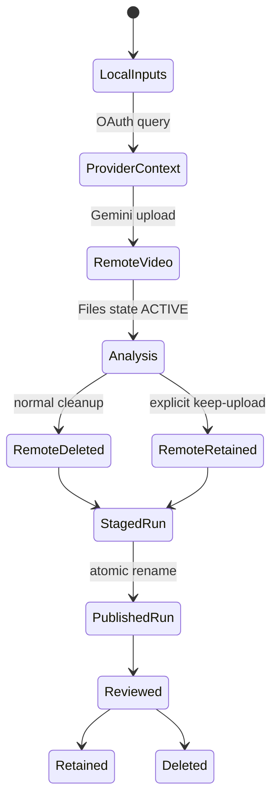

# Frame of Mind Operations Runbook

This runbook covers installation, provider authorization, recipe-driven video
analysis, validation, troubleshooting, incident response, upgrades, and
removal.

## Runbook metadata

| Field | Value |
|---|---|
| Repository | `jchu96/frame-of-mind` |
| CLI | `frameofmind` |
| Skill | `/frame-of-mind` |
| Current version | `0.2.0` |
| Default model | `gemini-3.6-flash` |
| Gemini backend | Developer API Files API |
| Context providers | Bluedot MCP, Granola MCP/API, local file |
| Durable outputs | local `analysis.json` and `manifest.json` |
| Optional review | Nuxt SSR with local SQLite or Cloudflare D1 |

## Operating invariant

Context and video are sensitive inputs. The operator controls authorization,
retention, review, and publishing. Frame of Mind produces drafts with
provenance; it does not make product, personnel, or engineering decisions.

## Responsibility matrix

| Role | Responsibility |
|---|---|
| Operator | choose authorized inputs/recipe, protect credentials, review output, delete stale runs |
| Provider admin | control Bluedot/Granola workspace access and policy |
| Google Cloud owner | approve project, billing, key/IAM policy, quota |
| Maintainer | preserve contracts, cleanup, tests, docs, and safe defaults |
| Reviewing agent | distinguish observed facts, quotes, and inference; avoid external writes without authority |

## Data lifecycle



Normal durable local data:

- analysis records and selected excerpts;
- run provenance and input hashes;
- optional screenshots;
- self-contained HTML;
- OAuth token files.

Normal non-durable data:

- temporary remote downloads;
- staging directories;
- raw provider responses;
- full transcript copies;
- Gemini uploaded video.

## 1. First-time setup

### 1.1 Confirm authorization

Before cloning or running:

- confirm the recording may be processed by Gemini;
- confirm the intended Bluedot/Granola account may access the meeting;
- confirm the output location is appropriate for the content;
- confirm the chosen Google project/billing owner;
- do not use production-sensitive material as a first test.

### 1.2 Install Bun

Require Bun 1.3.14 or newer:

```bash
bun --version
```

The compiled CLI remains compatible with Node.js 22+, but the repository's
install, test, web, and release workflow uses Bun.

### 1.3 Install ffmpeg

macOS with Homebrew:

```bash
brew install ffmpeg
ffmpeg -version
```

Debian/Ubuntu:

```bash
sudo apt-get update
sudo apt-get install ffmpeg
ffmpeg -version
```

Windows:

1. install ffmpeg through an approved package manager or official build;
2. add its `bin` directory to user `PATH`;
3. open a new terminal;
4. run `ffmpeg -version`.

ffmpeg is optional. Use `--no-screenshots` when it is unavailable.

### 1.4 Clone and install

```bash
gh repo clone jchu96/frame-of-mind
cd frame-of-mind
bun install --frozen-lockfile
bun run check
bun run build
bun link
```

Verify:

```bash
frameofmind --version
frameofmind recipes
```

Expected version:

```text
0.2.0
```

### 1.5 Configure Gemini

Follow [CREDENTIALS.md](CREDENTIALS.md).

Minimum current shell:

```bash
export GEMINI_API_KEY="your-key"
```

Rules:

- do not paste the key into chat;
- do not commit it;
- do not echo it;
- do not scrape a dotenv file with `grep | cut`;
- prefer a new AI Studio authorization key;
- verify project and billing ownership.

### 1.6 Run preflight

```bash
frameofmind doctor
```

Expected:

```text
ok Node >=22
ok GEMINI_API_KEY
ok ffmpeg (optional screenshots)
Bluedot MCP: https://app.bluedothq.com/api/v1/mcp
Granola MCP: https://mcp.granola.ai/mcp
Artifact root: <platform-specific path>
```

`--` next to ffmpeg is acceptable if screenshots are not required.

### 1.7 Install the agent skill

Both Codex and Claude:

```bash
bun run install:skill -- --target all
```

Restart agent sessions. See [SKILL_INSTALLATION.md](SKILL_INSTALLATION.md).

## 2. Provider authorization

### 2.1 Bluedot

```bash
frameofmind auth bluedot
```

Flow:

1. local callback binds `127.0.0.1:8765`;
2. the default browser opens;
3. operator signs into Bluedot;
4. provider redirects to loopback;
5. tokens are stored under the per-user config directory.

### 2.2 Granola

Before auth, select the intended active workspace in Granola.

```bash
frameofmind auth granola
```

Granola callback uses `127.0.0.1:8766`.

Granola transcript tools may depend on:

- subscription plan;
- workspace settings;
- administrator policy;
- active workspace;
- meeting age/access.

### 2.3 Granola API key

For eligible plans, set the official key locally:

```bash
export GRANOLA_API_KEY="your-key"
```

Use it only with:

```text
--source granola --granola-transport api
```

The API transport requires a documented `not_` note ID. It does not fall back
to MCP and the key is never written to a run.

### 2.4 Local context

No OAuth:

```text
--source file --context-file <path>
```

Accepted text-oriented formats include JSON, Markdown, text, SRT, and VTT. A
JSON file should expose recognizable transcript/title/date keys.

## 3. Standard analysis procedure

### 3.1 Identify the desired output

```bash
frameofmind recipes
```

Choose:

- issue filing → `issue-review`;
- decision log → `decisions`;
- product/spec input → `requirements`;
- follow-ups → `action-items`;
- implementation planning → `repo-plan`.

Read [RECIPES.md](RECIPES.md) when uncertain.

### 3.2 Choose context

Bluedot meeting/preview ID:

```text
--source bluedot
```

Granola meeting ID:

```text
--source granola
```

Exported/local transcript:

```text
--source file --context-file <path>
```

### 3.3 Choose video

Preferred:

```text
--video /absolute/path/to/recording.mp4
```

The CLI preserves this file.

Bluedot signed URL fallback:

```text
--recording-url <fresh-signed-url>
```

Only use a signed URL in a local shell where history and screen sharing are
controlled. Prefer a local download.

### 3.4 Bound the first run

```text
--max-moments 3
```

This limits the close interrogation pass. The full video is still indexed.

### 3.5 Run by provider

Bluedot issue review:

```bash
frameofmind analyze "<meeting-id>" \
  --source bluedot \
  --video "<recording.mp4>" \
  --recipe issue-review \
  --max-moments 3
```

Granola decisions:

```bash
frameofmind analyze "<meeting-id>" \
  --source granola \
  --granola-transport mcp \
  --video "<recording.mp4>" \
  --recipe decisions \
  --max-moments 3
```

Granola API decisions:

```bash
frameofmind analyze "not_XXXXXXXXXXXXXX" \
  --source granola \
  --granola-transport api \
  --video "<recording.mp4>" \
  --recipe decisions \
  --max-moments 3
```

Local context requirements:

```bash
frameofmind analyze "<stable-local-id>" \
  --source file \
  --context-file "<transcript.vtt>" \
  --video "<recording.mp4>" \
  --recipe requirements \
  --max-moments 3
```

Repository planning:

```bash
frameofmind analyze "<meeting-id>" \
  --source bluedot \
  --video "<recording.mp4>" \
  --recipe repo-plan \
  --focus "Repository example-repo; distinguish requested UX from inferred implementation"
```

### 3.6 Align clips

If the video is a clip from the middle of a meeting:

```bash
frameofmind analyze "<meeting-id>" \
  --source bluedot \
  --video "<clip.mp4>" \
  --recipe issue-review \
  --transcript-offset "01:02:47"
```

Offset means: full transcript time corresponding to clip time `00:00`.

If omitted, Gemini estimates it. Review manifest confidence before trusting
nearby transcript excerpts.

### 3.7 Observe progress

Normal messages:

```text
Uploading recording.mp4 to Gemini Files API…
Pass 1/2: indexing the whole recording…
Pass 2/2 [1/3] at 00:08
Analysis: <run-directory>
2 accepted record(s).
```

Do not interrupt during upload/cleanup unless required. On interruption, verify
temporary and remote cleanup.

## 4. Review procedure

### 4.1 Open manifest first

Verify:

- meeting ID;
- recipe ID and custom flag;
- model;
- context provider;
- media source;
- recording/transcript hashes;
- analysis SHA-256 and shared run ID;
- recipe revision and SHA-256;
- transcript alignment;
- remote deletion state;
- artifact inventory.

### 4.2 Review analysis

Open:

1. `analysis.md` for concise review;
2. `report.html` for visual review;
3. `moment-*.png` for frame evidence;
4. `analysis.json` for accepted and rejected records.

### 4.3 Human checks

- Is the recording the intended meeting?
- Does the recipe match the desired output?
- Is the transcript offset plausible?
- Is the timestamp supported by video?
- Is every timestamp canonical `HH:MM:SS` and inside the indexed candidate?
- Is the quote exact?
- Is a URL actually visible?
- Are owner/date/decision status explicit?
- Are implementation implications labeled as inference?
- Was an ambiguous candidate correctly rejected?
- Is private participant information necessary?

### 4.4 Publish minimally

Frame of Mind does not publish automatically.

If authorized:

- copy only the necessary record;
- use a source meeting link and timestamp where appropriate;
- remove irrelevant participant data;
- attach one screenshot instead of a whole report when sufficient;
- do not expose local absolute paths;
- do not attach `manifest.json` if hashes/provider metadata are unnecessary.

## 5. Output retention

Default runs live outside the repository.

Retention questions:

- Is there a ticket/spec/decision record that now owns the work?
- Does policy permit storing screenshots?
- Is the HTML report duplicated elsewhere?
- Is a rejected-candidate audit still required?
- Does the output contain participant or customer data?

Delete stale runs through a file manager or exact verified path. Never run a
broad recursive delete against home, application-data root, or repository root.

Hosted D1 projections need an explicit owner and retention period because they
can contain meeting quotes and visible UI text. Version 0.2.0 does not automate
hosted expiry. Use the ID-validated preview, delete, and verification procedure
in [CLOUDFLARE_DEPLOYMENT.md](CLOUDFLARE_DEPLOYMENT.md#hosted-retention-and-exact-run-purge);
never delete by a partial title or meeting-name search.

## 6. Troubleshooting

### 6.1 `frameofmind: Set GEMINI_API_KEY before analysis`

Cause: missing environment variable.

Actions:

1. follow [CREDENTIALS.md](CREDENTIALS.md);
2. set the key in the current shell;
3. run `frameofmind doctor`;
4. do not print the value.

### 6.2 Gemini returns 400/401 invalid API key

Checks:

- surrounding quotes are not part of the value;
- key was copied completely;
- key is active in AI Studio;
- restrictions permit Gemini Developer API;
- an older standard key is not blocked;
- project has required service access.

Create a fresh AI Studio auth key rather than repeatedly editing an unknown key.

### 6.3 Gemini returns 429

Possible causes:

- rate limit;
- daily/free quota;
- depleted prepaid credits;
- project billing state;
- model-specific allocation.

Actions:

1. read the provider error category without logging the key;
2. inspect AI Studio Usage;
3. inspect approved project billing/quota;
4. reduce candidate count only when token cost is the issue;
5. wait only for genuine rate-window limits;
6. do not retry depleted billing.

### 6.4 Gemini file remains `PROCESSING`

The CLI polls for up to 30 minutes.

The SDK also has finite request deadlines: 20 minutes for the initial upload,
10 minutes for each model generation, and 30 seconds for file status/delete.
The processing loop uses one monotonic 30-minute wall-clock budget rather than
counting polls with unbounded network waits.

Check:

- supported video/MIME type;
- file size under current Files limits;
- stable network;
- provider status;
- video decodes locally.

On timeout, the CLI attempts remote deletion. Do not use `--keep-upload` as a
troubleshooting shortcut.

### 6.5 Gemini model name rejected

Actions:

1. unset an obsolete `GEMINI_MODEL`;
2. verify current official model availability;
3. compare the project/tier;
4. use the documented default;
5. update SDK/model only through the upgrade procedure.

### 6.6 Structured response parse failure

Possible causes:

- model ignored schema;
- unsupported model behavior;
- recipe text was too broad/adversarial;
- SDK/schema conversion regression.

Actions:

1. retry with `--max-moments 1`;
2. use a built-in recipe;
3. remove unnecessary focus text;
4. run tests;
5. record a sanitized failure fixture;
6. do not persist raw private model output in an issue.

### 6.7 OAuth browser does not open

Copy the displayed authorization URL into the intended browser profile.

Check:

- local browser command exists;
- loopback is allowed;
- no remote/headless environment is blocking the flow;
- the terminal remains running.

### 6.8 Port 8765 or 8766 already in use

Identify the local owning process through platform tools. Stop it only if it is
your process and safe to stop. Retry provider authorization.

Do not bind OAuth callbacks to non-loopback addresses.

### 6.9 OAuth uses the wrong account

1. close the CLI;
2. remove only that provider's Frame of Mind token file;
3. use the intended browser profile;
4. re-run `frameofmind auth <provider>`.

Do not delete the whole config directory if the other provider must remain.

Custom MCP endpoints never reuse canonical credentials. They must use HTTPS
and receive an origin-hashed token file. If an endpoint changes, expect a new
authorization flow. Do not copy the canonical token JSON to make it work.

### 6.10 Bluedot meeting is unavailable

Check:

- meeting ID versus preview URL slug;
- intended Bluedot workspace/account;
- meeting access in the Bluedot UI;
- OAuth reauthorization.

### 6.11 Bluedot output-schema duration error

Observed root cause: Bluedot advertised a duration schema that rejected its own
ISO duration value when the MCP SDK used high-level per-tool validation.

The adapter intentionally calls `tools/call` through the raw client request and
validates the MCP envelope. If this error returns:

1. confirm the workaround is still present;
2. capture the advertised schema and sanitized value type;
3. check provider updates;
4. add a contract test before changing behavior.

### 6.12 Bluedot has no recording URL

This is expected for the currently observed `get_meeting` payload.

Use:

```text
--video <local-download>
```

Do not scrape undocumented browser internals or guess storage URLs.

### 6.13 Signed URL rejected

The URL must:

- use HTTPS;
- use the verified Bluedot media hostname;
- survive redirect revalidation;
- return video content;
- remain within size/time limits.

Use a fresh local download instead of weakening host validation.

### 6.14 Granola transcript tool unavailable

Possible causes:

- plan does not include transcript tool;
- enterprise admin disabled scope;
- active workspace is wrong;
- meeting is outside free-plan age/access;
- meeting was not summarized/processed.

Fallback:

1. export/copy the authorized transcript;
2. save it in a private local file;
3. use `--source file --context-file <path>`;
4. retain the Granola meeting ID as the stable local ID if appropriate.

### 6.15 Granola returns the wrong workspace

Switch active workspace in Granola, reauthenticate if needed, and retry. MCP
follows the active workspace.

### 6.16 Granola API key fails

Check:

- `GRANOLA_API_KEY` is present without printing it;
- note ID uses the documented `not_` form;
- the key scope includes the note;
- the note is summarized and transcribed;
- plan/workspace allows API access;
- HTTP 429 rate limits.

Use MCP explicitly when interactive OAuth is preferred. Do not silently swap
authentication paths.

### 6.17 Video and context mismatch

The index pass stops when it determines the video/transcript are unrelated.

Check:

- correct provider meeting ID;
- exact selected video;
- recording is not from an adjacent meeting;
- local context file is correct;
- clip alignment.

Do not override the mismatch without validating identity.

### 6.18 Transcript excerpts are unrelated

Likely cause: clip offset.

Actions:

1. compare clip start with full meeting time;
2. pass `--transcript-offset`;
3. verify manifest;
4. rerun;
5. treat prior transcript-correlated records as invalid.

Offsets are signed transcript-time minus video-time. Use `-MM:SS` or
`-HH:MM:SS` when the transcript begins after the video.

### 6.19 No accepted records

This can be correct.

Review rejected records in `analysis.json`:

- recipe may not match the meeting;
- focus may be too narrow;
- candidates may be ambiguous;
- transcript/video may lack direct support;
- max moments may exclude later items.

Do not weaken rejection criteria solely to produce output.

### 6.20 ffmpeg unavailable

```bash
frameofmind analyze "<meeting-id>" \
  --source bluedot \
  --video "<recording.mp4>" \
  --recipe issue-review \
  --no-screenshots
```

### 6.21 Cleanup warning

If manifest says:

```json
{
  "remoteFile": {
    "deleted": false
  }
}
```

The Gemini file normally expires automatically, but:

1. record the run ID and expiration time;
2. retry cleanup only through the exact file identity and supported API;
3. never list/share unrelated files;
4. investigate auth/network errors;
5. do not claim cleanup succeeded.

### 6.22 Staging/temp directory remains

Inspect exact owned names:

```text
frame-of-mind-*
.<run-id>.staging
```

Verify ownership, contents, and age before removal. Never run a broad temp
cleanup.

### 6.23 Skill is not discovered

1. run the installer for the exact agent;
2. verify `SKILL.md` exists;
3. restart the agent session;
4. ensure an unmanaged directory did not block installation;
5. on Windows, distinguish copied skill files from repository symlinks.

### 6.24 A v1 workspace run disappeared after upgrading to v0.2

This is fail-closed compatibility behavior. v0.2 list/detail queries hide v1
and malformed projection rows rather than attempting to render them as v2.

1. preserve the original v1 run bundle;
2. rerun the authorized source analysis with v0.2;
3. import the resulting v2 pair, which replaces the same run ID when retained;
4. verify the v2 detail page and digest;
5. back up, then purge any obsolete exact-ID projection row only when policy
   requires removal.

Never change only `schemaVersion`; that does not create the missing digest,
recipe provenance, or timestamp validation.

## 7. Security and incident response

### 7.1 Lost or reassigned device

1. revoke Bluedot and Granola sessions/tokens through provider controls;
2. rotate Gemini key;
3. remove or remotely wipe local runs;
4. revoke password-manager/device access;
5. inspect usage and billing;
6. follow organization incident policy.

### 7.2 Signed URL exposure

1. assume bearer access until expiration;
2. stop sharing/logging;
3. invalidate/regenerate through provider if possible;
4. remove it from shell history, logs, or tickets;
5. prefer local video next run.

### 7.3 API key exposure

Follow [CREDENTIALS.md](CREDENTIALS.md):

- replace;
- verify replacement;
- revoke leaked key;
- audit usage/billing;
- remove from git history;
- update every authorized secret store.

### 7.4 Analysis/report exposure

1. identify every shared copy;
2. restrict/delete at destinations;
3. notify data owner;
4. assess participant/customer content;
5. remove unnecessary screenshots and HTML;
6. retain only the incident record required by policy.

## 8. Upgrade procedure

```bash
git status --short
git pull --ff-only
bun install --frozen-lockfile
bun run check
```

Check pinned/current versions:

```bash
bun pm ls @google/genai @modelcontextprotocol/sdk
npm view @google/genai version
npm view @modelcontextprotocol/sdk version
```

Read official release notes before changing pins.

### Google Gen AI upgrade checks

- constructor/auth;
- Files upload/get/delete;
- file processing states;
- video metadata offsets/fps;
- media resolution constants;
- structured response schema;
- model default availability;
- cleanup behavior.

### MCP SDK upgrade checks

- OAuth provider contract;
- Streamable HTTP transport;
- callback completion;
- tool listing/calling;
- Bluedot envelope workaround;
- Granola argument discovery;
- transport close.

### Dependency advisory note

The pinned MCP SDK currently brings transitive Hono advisories that affect its
static-server path. Frame of Mind does not use that path. CI fails high/critical
production advisories, while moderate findings are reviewed and documented.
Do not apply forced audit fixes without reviewing breaking changes.

## 9. Maintainer validation

| Scenario | Required |
|---|---|
| Build/typecheck/unit tests | every change |
| Bluedot helper contracts | every adapter change |
| Granola helper contracts | every adapter change |
| Non-zero transcript offset | every alignment change |
| Built-in recipe registry | every recipe change |
| Custom recipe rejection | every schema change |
| Markdown/HTML escaping | every renderer change |
| Gemini cleanup success/failure | every analyzer change |
| Skill validator | every skill change |
| Installer temporary-home test | every installer change |
| Local SQLite import/list/get | every web data change |
| Local Nuxt SSR build | every web change |
| Synthetic Playwright Studio smoke | every Studio UI/auth change |
| Cloudflare/D1 Nuxt build | every web or deployment change |
| Access missing/invalid JWT denial | every auth change |
| No tracked sensitive artifacts | every release |

## 10. Release procedure

Use [VERSIONING.md](VERSIONING.md).

Pre-release:

- package/changelog/version aligned;
- README/runbook/architecture current;
- all symlinks resolve;
- skill below 500 lines and validates;
- installer works in temporary home;
- `bun run check` passes;
- audit reviewed;
- `npm pack --dry-run` contains only intended files;
- no credentials, recordings, transcripts, provider payloads, or runs tracked.

## 11. Complete removal

### CLI link

```bash
bun unlink frameofmind
```

### Skill

Remove only exact managed skill directories after confirming marker files. See
[SKILL_INSTALLATION.md](SKILL_INSTALLATION.md).

### Provider tokens

Remove only Frame of Mind's provider token files through a file manager or
exact verified path.

### Runs

Review each known application-data run root and remove only confirmed Frame of
Mind run directories.

### Clone

Delete the repository clone only after confirming it contains no uncommitted
work you need.

## 12. Review workspace

The optional Nuxt workspace is operated independently from video analysis.

Local quick start:

```bash
bun run web
bun run web:import -- "/path/to/run-directory"
```

It binds to loopback and uses `.data/frame-of-mind.sqlite`.

For data model, local backup, imports, and troubleshooting, use
[WEB_WORKSPACE.md](WEB_WORKSPACE.md).

For Cloudflare Workers, D1 migrations, a custom hostname, Access policies,
JWT audience verification, deployment, and rollback, use
[CLOUDFLARE_DEPLOYMENT.md](CLOUDFLARE_DEPLOYMENT.md).

The MCP surface is intentionally deferred. Its local stdio and hosted
Streamable HTTP design is in [MCP_ROADMAP.md](MCP_ROADMAP.md).

Removing the clone does not revoke provider OAuth or Gemini keys.

### Local Studio Connections preview

Launch the authenticated local configuration surface:

```bash
cp .env.example .env
# Populate GEMINI_API_KEY and optionally GRANOLA_API_KEY.
bun run studio
```

Operational expectations:

- Studio opens the one-time loopback URL in the default browser;
- do not paste or share that URL while its fragment is present;
- restarting Bun invalidates the session and all temporary keys;
- environment values take precedence over keys entered in the page;
- temporary keys are process-memory only;
- OAuth tokens remain in the CLI's private exact-resource files;
- the Connections API never returns secret values;
- the Studio backend accepts authenticated resumable media, but the recording
  drop zone and analysis execution are not yet exposed in the UI.

If the bootstrap link fails, stop the process and run `bun run studio` again.
If automatic browser opening fails, stop Studio and rerun with
`FRAME_OF_MIND_STUDIO_PRINT_URL=1`. This opt-in fallback prints a sensitive
one-time bearer URL; do not record or share it. Do not reuse an old link:
bootstrap capabilities are one-use.

If a provider status fails, verify that its custom MCP URL is a valid HTTPS URL
and use the provider's connect or verify action. **Verify OAuth** checks an
existing token; it does not switch accounts. Follow section 6.9 to change the
provider identity. Public diagnostics may include the sanitized failure code,
never the endpoint query, authorization URL, token, or key.

`bun run web` remains the unauthenticated loopback completed-run viewer.
`frameofmind analyze` remains the execution path until the later Studio phases
ship.

The accepted boundaries and phased plan are in the
[ADR log](adr/README.md) and
[Conductor track](../conductor/tracks/local-studio_20260726/).

### Local Studio media staging

The default staging root is private per-user application data:

- macOS: `~/Library/Application Support/Frame of Mind/staging/media`;
- Linux: `${XDG_DATA_HOME:-~/.local/share}/frame-of-mind/staging/media`;
- Windows: `%LOCALAPPDATA%\Frame of Mind\staging\media`.

For isolated testing or an alternate private volume, set an absolute path
outside the checkout before launch:

```bash
FRAME_OF_MIND_MEDIA_ROOT="/private/path/frame-of-mind-media" bun run studio
```

Do not place this root in the repository, a shared synchronized folder, or a
world-readable directory. The server creates user-only session directories on
POSIX systems. It reserves the declared recording size plus a free-space
margin before creation, enforces a 2 GB maximum, and records only opaque IDs.

On startup, Studio reconciles each durable receipt with its partial or sealed
file. Extra bytes from an interrupted part are truncated to the last receipt;
an interrupted atomic seal is completed; expired/aborted entries are cleaned;
and retryable permission failures remain `cleanup_failed` instead of being
reported as deleted. Never edit `session.json` manually.

| Symptom | Meaning | Operator action |
|---|---|---|
| HTTP 409 on a part | wrong order, conflicting replay, or another active writer | refresh status; resend only the exact next part |
| HTTP 413 | declared recording/part exceeds a bound | select a smaller supported recording |
| HTTP 422 on completion | incomplete bytes, digest mismatch, or MIME mismatch | reselect/verify the source; restart rather than overriding |
| HTTP 507 | reservation or streaming write exhausted disk | free private disk space, then restart or abort the session |
| `cleanup_failed` | deletion was attempted but not proven | repair permissions and retry abort; do not claim deletion |
| terminal `failed` | receipt/file corruption or irrecoverable inconsistency | preserve sanitized diagnostics and create a new session |

Maintainers validate the production-built boundary with:

```bash
bun test apps/web/test/studio-media-staging.test.ts
bun run test:studio-http
bun run build:web:cloudflare
```

The Cloudflare gate must report that all local media classes, paths, files, and
route markers are absent.

## 13. Escalation payload

Provide only sanitized facts:

- Frame of Mind version;
- Node/OS;
- provider class, not meeting content;
- recipe ID;
- failing phase;
- error class/status with secrets removed;
- whether remote cleanup completed;
- whether a staging directory remains;
- reproducible command with IDs/paths/URLs redacted;
- relevant unit-test result.

Never include keys, tokens, signed URLs, transcripts, screenshots, recordings,
raw provider payloads, or raw model responses in a public issue.
