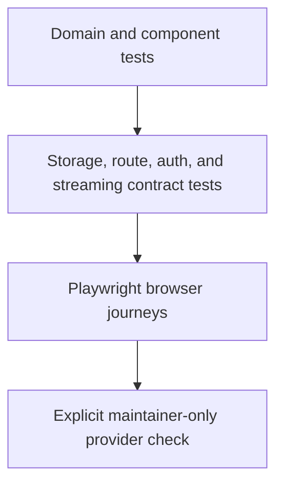

# Testing Strategy

## Invariant

> Browser tests prove that independently tested contracts work together through
> the interface a colleague actually uses.

The E2E suite is not a second copy of every schema, storage, security, or
provider test. Fast lower-level tests own exhaustive permutations. Playwright
owns the few seams that exist only in a real browser: hydration, accessible
interaction, file selection, cookie behavior, redirects, responsive layout,
and complete user journeys.



## Test Layers

| Layer | Owns | Must not own |
|---|---|---|
| Domain/unit | schemas, state transitions, recipes, normalization | browser layout |
| Adapter/contract | SQLite/D1 parity, auth denial, request limits, media state | Nuxt interaction |
| Built HTTP | production Nitro routing, session exchange, Host/Origin policy | visual behavior |
| Playwright | hydration, cookie/redirect flow, accessible controls, responsive journeys | exhaustive provider/error permutations |
| Live maintainer | current Gemini/provider compatibility with authorized data | pull-request CI |

## Current Browser Baseline

[`playwright.config.ts`](../playwright.config.ts) starts a production Nuxt build
with Bun and a disposable local environment. It runs with one worker because
the Studio intentionally has one process session and mutable process-secret
state:

| Project | Coverage |
|---|---|
| `setup` | exchanges the one-use URL fragment, verifies clean redirect and HttpOnly cookie, writes ignored storage state |
| `unauthenticated` | proves protected Studio page/API denial without a session |
| `bootstrap-replay` | proves the consumed launch capability cannot create another session |
| `chromium` | manages and clears a synthetic process key; imports and reviews a valid synthetic run |
| `mobile-chromium` | verifies the Connections surface and navigation remain usable without horizontal overflow |

The server runner:

- supplies an empty dotenv file;
- passes an explicit environment allowlist instead of inheriting shell secrets;
- uses a temporary `XDG_CONFIG_HOME` so real OAuth files are not read;
- uses a temporary SQLite database;
- binds only to `127.0.0.1`;
- deletes the complete temporary directory on shutdown;
- never calls Gemini, Bluedot, or Granola.

## Commands

Install Chromium once:

```bash
bunx playwright install chromium
```

Run the fast browser gate:

```bash
bun run test:e2e:smoke
```

Run all browser projects:

```bash
bun run test:e2e
```

Debug with a visible browser:

```bash
bun run test:e2e:smoke -- --headed
```

Inspect a failed run:

```bash
bunx playwright show-report
```

Traces, screenshots, videos, reports, the authenticated storage state, and the
temporary database are ignored by Git.

## Authoring Rules

- Use invented fixtures only.
- Prefer `getByRole`, `getByLabel`, and visible names.
- Add semantic labels before adding test IDs.
- Use Playwright web-first assertions and response/event waits; never fixed
  sleeps.
- Assert the outcome visible to the operator and one authoritative server
  receipt where relevant.
- End every state-changing test in a known state.
- Make retries idempotent: establish the expected precondition first and clean
  mutations at the end. The one-use authentication setup itself is not retried.
- Fail on unexpected browser console errors and uncaught page errors.
- Keep one happy browser journey per feature; put combinatorial cases below
  the browser.
- Never make a real provider request from CI.
- Retain trace, screenshot, and video only on failure/retry.

## Phase 3 Recording Drop Zone

Nuxt UI's `UFileUpload` will remain the selection surface. The upload
composable and media-session API remain the transfer authority. Test that split
at three levels:

### Component/runtime

- selecting, replacing, and removing a `File`;
- keyboard activation and visible focus;
- accessible label, description, error, and status announcements;
- client presentation states such as paused and reselect-required;
- no `File` or source path enters SSR state.

### Media contract

- create, part receipt, out-of-order/concurrent rejection, retry, resume,
  digest mismatch, seal, abort, retention, expiry, and cleanup;
- bounded streaming and disk-space behavior;
- synthetic bytes only, outside the checkout.

### Browser journey

1. Use `setInputFiles` against the accessible input for the stable happy path.
2. Keep one focused `DataTransfer`/drop event test to prove drop-zone wiring;
   do not implement every upload test through synthetic drag events.
3. Stage a small synthetic recording through the real local API and assert
   progress from confirmed part receipts.
4. Interrupt after at least one confirmed part, reload, and show
   reselect-required.
5. Reselect the matching file, verify existing receipts, and send only missing
   parts.
6. Reselect a mismatch and require an explicit restart.
7. Abort and prove the UI and server both reach a clean terminal state.
8. Repeat the happy path with keyboard-only interaction and at mobile width.

The browser suite will not call Gemini for this flow. Later composer tests use
an injected synthetic executor at the existing port boundary. A separate,
explicit maintainer check covers live Gemini/provider compatibility.

## Browser Matrix

Chromium desktop plus mobile emulation is the pull-request baseline. Add Firefox
and WebKit when Phase 3 lands because drag-and-drop, file-input, and media
playback behavior justify the added runtime. Keep those projects identical and
do not add browser-specific application behavior unless a documented platform
limitation requires it.
