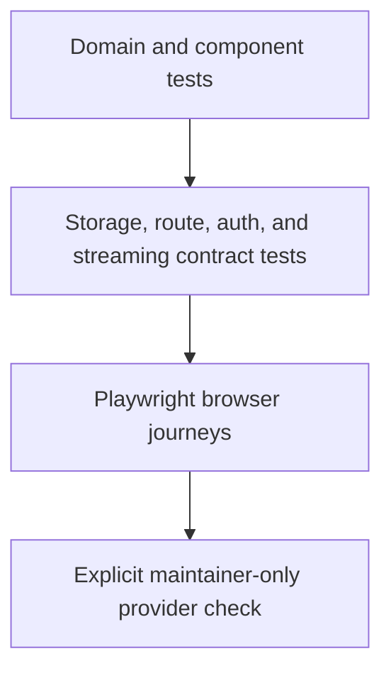

# Testing Strategy

## Invariant

> Browser tests prove that independently tested contracts work together through
> the interface a colleague actually uses.

The E2E suite is not a second copy of every schema, storage, security, or
provider test. Fast lower-level tests own exhaustive permutations. Playwright
owns the few seams that exist only in a real browser: hydration, accessible
interaction, file selection, cookie behavior, redirects, responsive layout,
and complete user journeys.



## Test Layers

| Layer | Owns | Must not own |
|---|---|---|
| Domain/unit | schemas, state transitions, recipes, normalization | browser layout |
| Adapter/contract | SQLite/D1 parity, auth denial, request limits, media state | Nuxt interaction |
| Built HTTP | production Nitro routing, session exchange, Host/Origin policy | visual behavior |
| Playwright | hydration, cookie/redirect flow, accessible controls, responsive journeys | exhaustive provider/error permutations |
| Live maintainer | current Gemini/provider compatibility with authorized data | pull-request CI |

## Current Browser Baseline

[`playwright.config.ts`](../playwright.config.ts) starts a production Nuxt build
with Bun and a disposable local environment. It runs with one worker because
the Studio intentionally has one process session and mutable process-secret
state:

| Project | Coverage |
|---|---|
| `setup` | exchanges the one-use URL fragment, verifies clean redirect and HttpOnly cookie, writes ignored storage state |
| `unauthenticated` | proves protected Studio page/API denial without a session |
| `bootstrap-replay` | proves the consumed launch capability cannot create another session |
| `chromium` | manages a synthetic process key; stages/deletes a synthetic recording; refreshes, reselects, verifies, and resumes an unfinished upload; imports/reviews a synthetic run |
| `mobile-chromium` | verifies the Connections surface and navigation remain usable without horizontal overflow |

The browser and server runners:

- launch Playwright workers and browser processes with an explicit environment
  allowlist instead of inheriting shell or dotenv secrets;
- inject parent-process canaries and assert they never reach the test worker;
- supplies an empty dotenv file;
- disable Bun's automatic dotenv loading for Playwright, the Nuxt build, and
  the production server;
- uses a temporary `XDG_CONFIG_HOME` so real OAuth files are not read;
- uses a temporary SQLite database;
- binds only to `127.0.0.1`;
- make the outer runner own temp cleanup so it works after success, failure,
  and Playwright's forceful Windows web-server shutdown;
- never calls Gemini, Bluedot, or Granola.

## Commands

Install Chromium once:

```bash
bunx playwright install chromium
```

Run the fast browser gate:

```bash
bun run test:e2e:smoke
```

Run all browser projects:

```bash
bun run test:e2e
```

Run one spec without bypassing environment isolation:

```bash
bun run test:e2e -- apps/web/e2e/studio-smoke.spec.ts
```

Debug with a visible browser:

```bash
bun run test:e2e:smoke -- --headed
```

Inspect a failed run:

```bash
bunx playwright show-report
```

Traces, screenshots, videos, reports, and authenticated storage state are
ignored by Git. The temporary database lives outside the checkout and the
runner removes its complete temp directory.

CI uses `bun run test:e2e:ci`, keeps bounded retries for diagnostic artifacts,
and passes `--fail-on-flaky-tests`. A test that fails once and passes on retry
still fails the job.

## Authoring Rules

- Use invented fixtures only.
- Prefer `getByRole`, `getByLabel`, and visible names.
- Add semantic labels before adding test IDs.
- Use Playwright web-first assertions and response/event waits; never fixed
  sleeps.
- Assert the outcome visible to the operator and one authoritative server
  receipt where relevant.
- End every state-changing test in a known state.
- Make retries idempotent: establish the expected precondition first and clean
  mutations at the end. The one-use authentication setup itself is not retried.
- Fail on unexpected browser console errors and uncaught page errors. Narrowly
  allowlist only an error that the test explicitly causes and verifies.
- Keep one happy browser journey per feature; put combinatorial cases below
  the browser.
- Never make a real provider request from CI.
- Retain trace, screenshot, and video only on failure/retry.

## Phase 3 Recording Drop Zone

Nuxt UI's `UFileUpload` is the selection surface. The upload composable and
media-session API remain the transfer authority. The implemented split is
tested at three levels:

### Browser-client contract — implemented

- extension, size, and browser-declared MIME validation independent of
  `accept`;
- opaque-ID-only session-storage serialization;
- confirmed-part hash verification before resume;
- missing-part-only upload with receipt-confirmed progress;
- explicit mismatch failure rather than silent continuation.

`apps/web/test/studio-media-upload.test.ts` owns this deterministic client
matrix. The selected `File` stays in a component-local `shallowRef`; it never
enters Nuxt SSR state.

### Media contract — implemented

- create, part receipt, out-of-order/concurrent rejection, retry, resume,
  digest mismatch, seal, abort, retention, expiry, and cleanup;
- bounded streaming and disk-space behavior;
- synthetic bytes only, outside the checkout.

`apps/web/test/studio-media-staging.test.ts` owns the adapter matrix.
`bun run test:studio-http` builds the real local Nitro target and verifies
session denial, same-origin enforcement, raw streamed upload, exact-offset
resume/replay, sealing, status, and cleanup. The Cloudflare boundary build
proves that the complete local media implementation and route strings are
absent.

### Browser journey — implemented

1. `studio-smoke.spec.ts` selects through the accessible file input, stages a
   small synthetic MP4 through the real local API, observes confirmed progress,
   seals it, and deletes the staged copy.
2. `studio-upload.spec.ts` seeds one real confirmed 8 MiB part, reloads the
   page, observes `reselect-required`, reselects the same synthetic recording,
   verifies the receipt, sends the missing part, seals, and deletes.
3. Lower-level browser-client tests own mismatched re-selection and
   missing-part assertions so those checks do not depend on browser timing.
4. The mobile Chromium project guards the responsive Studio header against
   horizontal overflow.

The browser suite will not call Gemini for this flow. Later composer tests use
an injected synthetic executor at the existing port boundary. A separate,
explicit maintainer check covers live Gemini/provider compatibility.

## Browser Matrix

Chromium desktop plus mobile emulation is the pull-request baseline. Firefox
and WebKit remain a release-hardening expansion once the complete composer and
media playback surface lands. Keep projects identical and do not add
browser-specific application behavior unless a documented platform limitation
requires it.
