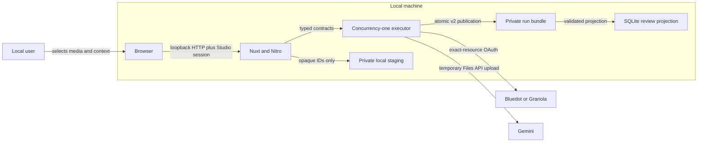

# Studio Threat Model

Status: Local and hosted implementation baseline

Last reviewed: 2026-08-24

This model covers the local Bun-controlled Studio defined by ADRs
[0006](adr/0006-local-studio-execution-and-session-boundary.md),
[0007](adr/0007-separate-media-job-and-run-lifecycles.md), and
[0008](adr/0008-local-secret-resolution.md). Those decisions are accepted
implementation constraints. The reference hosted instance went live on
2026-08-23 with Better Auth, invite-gated email magic links, and hosted creation
enabled; its Cloudflare Access application was retired. [ADR 0018](adr/0018-hosted-studio-trust-boundary.md)
and [ADR 0019](adr/0019-pluggable-auth-modes.md) preserve the hosted
trust-boundary and auth-mode decision history.

## Security Invariants

1. Network location is not authorization. Sensitive local routes require a
   per-launch Studio session in addition to loopback peer and Host checks.
2. Recording, context, credential, and model content never become source code,
   logs, telemetry, or committed fixtures.
3. Browser input names opaque resources; only the server resolves private
   filesystem paths.
4. Media, jobs, and published runs retain separate state and authority.
5. A Cloudflare review build contains no local credential, staging, execution,
   deletion, or media-serving implementation.
6. Cleanup failure is recorded and recoverable; it is never reported as
   successful deletion.

Opt-in diagnostics add one deliberately narrower outbound boundary. Sentry is
off unless `SENTRY_DSN` is set, uses `sendDefaultPii: false`, and receives only
synthetic error codes plus allowlisted job/recipe/model/timing/version metadata.
A shared pre-send scrubber drops raw messages and sensitive patterns, constructs
a new event from a closed allowlist, and never permits
transcripts, recordings, findings, filenames, provider meeting IDs,
credentials, bodies, query-bearing URLs, email addresses, or IP addresses.
See [ADR 0017](adr/0017-opt-in-sentry-telemetry.md).

## Hosted Studio Extension

Hosted creation adds Better Auth identity, D1 ownership, direct browser-to-Gemini
upload, Cloudflare Workflows, and optional retained R2 media. The local controls
below remain active for local mode; this table adds the hosted controls enforced
by the live reference topology and its release gates.

| Threat | Required control | Verification |
|---|---|---|
| Session exhaustion or recording-size denial of service | Atomically cap pending sessions per principal before Gemini, reject declarations above the configured ceiling, bound capability TTL, and keep bytes out of the Worker | Built-Worker third-session 429 and ceiling contract; provider start count proves admission order |
| Leaked upload capability substitutes same-size bytes | Scope capability to one pending file; require present exact Gemini SHA-256 and size at seal; delete mismatch and write no receipt | Real-Chromium/fake-Files contract covers same-size substitute, missing hash, size mismatch, and deletion |
| Cloudflare's default Workflow retry repeats a billable Gemini call | Every `step.do` has explicit 15-minute config; provider steps set `retries.limit: 0`, check a durable principal receipt before calling, and use `NonRetryableError` after success-without-receipt | Crash-after-Gemini test proves no second generate; user retry creates a new Workflow instance |
| D1 export exposes encrypted Gemini resumable-session URLs | Treat exports as secret-bearing, restrict and expire backups, never export the derived key with ciphertext, and abort/clear active sessions before Gemini-key rotation | Export/log scan plus rotation drill with exact deletion receipts |
| Better Auth user identity is recreated after membership removal | Never key ownership by email or auto-adopt old rows; require a reviewed migration naming both verified old/new subjects | Removed/re-added identity fixture cannot see old rows until explicit migration |
| Access compatibility assertion forges a Better Auth principal | Reserve the `ba:` prefix before an Access `sub` can become a principal | Signed Access fixture rejects `ba:forged` |
| Better Auth invite or email is mistaken for ownership | Use email only to admit/claim one Better Auth user; reject uninvited magic-link sends before verification storage or mail delivery; bind rows to `ba:<userId>` and require an explicit reviewed ID migration | Built-Worker `magic_link_invite` zero-mail/zero-verification receipt, unknown-email denial, and two-user foreign-ID contract |
| An invited address is used to exhaust email quota or sender reputation | Apply the production route limit and atomically reserve a 60-second cooldown on the invite row before delivery; never fall through from a binding failure to HTTP | Built-Worker second-send 429 proves `MAGIC_LINK_COOLDOWN` and one binding capture; unit tests pin both binding failure paths to zero HTTP calls |
| A mail scanner consumes a magic link before its recipient | Treat `GET /api/auth/magic-link/verify` as a session-minting, atomically consumed first fetch; expire links after five minutes and document scanner consumption rather than claiming all mutations are POST | Built-Worker one-use browser sign-in plus proposed ADR 0019 residual-risk statement |
| Stacked compatibility identities diverge | Require a valid Access assertion and session; bind the first Access `sub` to the Better Auth user and reject later mismatches before session insertion | `HOSTED_AUTH stacked_rebind=PASS mismatch_denied=true` and the stored-sub receipt |
| Import-overwrite IDOR reuses another principal's `run_id` | Parent, registry, and item keys include `principal_sub`; every list/detail/import/delete/insert predicate includes it; preflight rejects `run_principal_conflict` before mutation | Built-Worker two-principal HTTP suite covers list, detail, overwrite, child delete, and child insert |

## Data Flow And Trust Boundaries

Trust boundaries:

- Browser to local server: untrusted request metadata, bodies, filenames, and
  timing.
- Other local processes to local server: potentially hostile despite sharing
  the same user or loopback interface.
- DNS and browser origin resolution: potentially attacker-controlled.
- Provider and Gemini responses: private, untrusted external data.
- Local server to disk: subject to exhaustion, races, partial writes,
  replacement, permissions errors, and process termination.
- Local source tree to Cloudflare artifact: a build-time isolation boundary,
  not merely a runtime feature flag.

## Protected Assets

| Asset | Required protection |
|---|---|
| Gemini and Granola API keys | Environment or process memory only; never returned |
| Provider OAuth state | Exact-resource binding and private existing token store |
| Recording and context bytes | Private staging outside checkout; bounded retention |
| Signed provider URLs | Bearer-secret handling; never log or persist |
| Transcript and provider payload | In-memory processing; bounded excerpts only |
| Active job/event records | Atomic local operational authority |
| `analysis.json` and `manifest.json` | Atomic publication and digest validation |
| Private server paths | Never accepted from or returned to the browser |

## Threats And Required Controls

### Session bootstrap theft

Threat: the launch capability leaks through URLs, logs, browser history,
referrers, screenshots, or diagnostics.

Controls:

- generate at least 256 bits of operating-system randomness per launch;
- bind the bootstrap exchange to a loopback peer and approved Host;
- accept it once, set an HttpOnly `SameSite=Strict` cookie, and immediately
  redirect to a clean URL;
- set `Referrer-Policy: no-referrer` and prevent bootstrap responses from
  caching;
- redact query strings and the capability from request and error logs;
- invalidate the capability and cookie when the Bun process exits.

Verification: reuse, missing-token, wrong-token, log-capture, history, and
clean-redirect tests.

### DNS rebinding and hostile Host

Threat: an attacker-controlled page resolves a hostname to loopback and sends
requests to the local service.

Controls:

- listen on an explicit loopback address, never a wildcard;
- validate the connected peer address and an allowlist of literal local Hosts;
- if Bun omits the peer address, require both an allowlisted Host and an
  explicitly loopback-bound listener; never apply this fallback to a wildcard;
- require the Studio session for every data-bearing local Studio route;
- expose only the inert fragment-exchange page and bounded bootstrap mutation
  before authentication;
- require same-origin mutation semantics and JSON or an explicit non-simple
  request header;
- reject forwarded-host trust unless a future deployment mode defines it.

Verification: hostile Host, non-loopback peer abstraction, cross-site fetch,
simple-form request, forwarded-header, unauthenticated Home/run API, and inert
launch-page tests.

### Untrusted local process

Threat: another process owned by the user calls credential, analysis,
cancellation, deletion, or media routes.

Controls:

- treat loopback as reachability only;
- require the per-launch session for reads and mutations;
- never expose secret values through status APIs;
- bind mutations to strict schemas, body limits, resource state, and opaque
  identifiers;
- keep destructive operations idempotent and record cleanup receipts.

Residual risk: a process able to read browser memory, process memory, or the
launch terminal can steal the capability. Phase A does not defend against a
fully compromised user account.

### Disk exhaustion and partial writes

Threat: a large, concurrent, interrupted, or dishonest upload exhausts disk or
seals incomplete or corrupt media.

Controls:

- cap media at 2 GB and context files at an independent 8 MiB limit;
- reserve capacity before accepting bytes and retain a safety margin;
- enforce one writer per part or session transition;
- stream into a private temporary file while counting bytes;
- reject excess bytes immediately;
- stream the final SHA-256 and atomically rename only after exact byte-count
  and MIME validation;
- reconcile temporary and sealed receipts at startup.

Context files use an atomic one-request staging directory rather than media
multipart state. The server requires valid UTF-8 plus format-specific
JSON/caption validation, binds the receipt to exact bytes and SHA-256, and
deletes the copy after its one execution lease. A one-hour expiry and
non-overlapping minute sweep remove abandoned context. Context validation may
hold at most the explicit 8 MiB cap in memory after the request has streamed to
disk; recording paths remain bounded-memory streams.

Verification: bounded-memory measurement, insufficient-space simulation,
short or long body, digest mismatch, concurrent writer, interrupted write, and
restart tests.

### Path traversal and filesystem replacement

Threat: input names a private path, escapes the staging root, or races a
symlink or replacement between validation and use.

Controls:

- accept only generated opaque IDs;
- resolve paths from trusted receipts under one private server-owned root;
- create files without following user-selected paths;
- fail closed on symlinks or identity changes where the platform exposes the
  check;
- reject context deletion while its process-local execution lease is active;
- never delete the original user-selected file.

Verification: traversal encodings, separator variants, symlink fixtures,
unknown IDs, and post-seal replacement tests on supported platforms.

### Deletion and retention failure

Threat: the UI claims deletion that did not occur, deletes a user source, or
silently retains private media.

Controls:

- default staged copies to ephemeral;
- make retention explicit, time-bounded, visible, and manually revocable;
- resolve retained-media expiry on the server from a one-hour-to-seven-day TTL
  instead of accepting a client-authored timestamp;
- transition through `deleting` and persist success or a sanitized failure
  receipt;
- represent a retryable filesystem failure as `cleanup_failed`, then permit
  only `cleanup_failed -> deleting`; reserve terminal `failed` for corruption
  or irrecoverable state inconsistency;
- retry cleanup without changing an already-published manifest;
- require digest-verified reattachment after expiry or deletion.

Verification: success, missing file, permission failure, process interruption,
expiry, idempotent retry, and wrong-digest reattachment tests.

### Provider and model content injection

Threat: transcript, pixel, MCP, provider, or Gemini content attempts to change
system behavior or escape into HTML or logs.

Controls:

- treat all meeting content as evidence, never instructions;
- preserve immutable prompt constraints and recipe validation;
- render untrusted content as text without `v-html`;
- sanitize stored failures and omit raw provider or model bodies;
- never execute filenames, transcript text, or model-generated commands.

Verification: synthetic prompt-injection strings, HTML or script payloads,
control characters, oversized errors, and log-capture tests.

### Hosted bundle leakage

Threat: a build or import refactor places local control-plane code or callable
routes into the Cloudflare review artifact.

Controls:

- select local and hosted implementations at build time;
- keep local routes and `bun:` modules behind local-only source boundaries;
- make hosted local-control routes resolve to 404, not an authorization error
  that proves the route exists;
- scan the final Worker artifact for forbidden imports, route names, and
  implementation markers;
- run this gate before freezing Phase 3 APIs and in every later phase.

Verification: Cloudflare build, artifact scan, route-manifest scan, and hosted
request tests for every local-only endpoint family.

## Abuse And Failure Matrix

| Scenario | Expected result | Operator action |
|---|---|---|
| Invalid or reused bootstrap | 401 or 404; no cookie; no log disclosure | Restart Studio if capability may have leaked |
| Host or origin mismatch | Reject before body processing | Inspect local DNS and browser extensions |
| Upload exceeds limit | Abort stream and clean partial staging | Select a smaller recording |
| Insufficient disk | Reject reservation or write; never seal | Free disk and explicitly retry |
| Process dies during upload | Reconcile resumable receipt or clean orphan | Resume or abort |
| Process dies during Gemini work | Mark job interrupted; never auto-resume | Create linked retry |
| Cleanup permission failure | Preserve cleanup-failed receipt | Repair permission and retry cleanup |
| Worker contains local marker | Fail build and release | Fix the import or route boundary |

## Phase 1 Exit Evidence

Before API contracts freeze, Phase 1 must record:

- measured request-stream and memory behavior under Bun and Nitro;
- bounded `FileSink` write and atomic seal behavior;
- byte-range behavior for a private synthetic file;
- Cloudflare artifact and route-absence results;
- commands, Bun and Nuxt versions, operating system, fixture size, and peak
  memory measurement method;
- any platform-specific uncertainty that later phases must test.

No real recording, transcript, meeting identifier, provider payload, or
credential may be used as threat-model evidence.

The first measured result is recorded in
[Local Studio Streaming Spike](spikes/local-studio-streaming-20260726.md).
