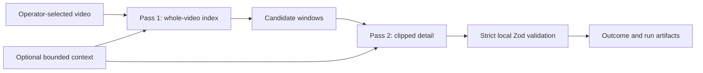

# Video Understanding Guide

This guide explains how Frame of Mind turns an authorized recording into
reviewable evidence, how to choose depth and context, and what the current
pipeline does not yet promise.

Primary Google references:

- [Video understanding](https://ai.google.dev/gemini-api/docs/video-understanding)
- [Files API prompt guide](https://ai.google.dev/gemini-api/docs/files#prompt-guide)
- [Prompting strategies](https://ai.google.dev/gemini-api/docs/prompting-strategies)
- [Gemini models](https://ai.google.dev/gemini-api/docs/models)

The checked-in Google companion skills route agents to current official docs.
Hosted documentation and the production adapter are authoritative when an old
sample, downloaded skill, or AI Studio template disagrees.

## Product invariant

Every conclusion should be reviewable against a bounded part of the recording.
Context may explain what the operator cares about, but it cannot replace visual
or spoken evidence.

## Choose the desired artifact first

Video analysis can support several different outcomes:

| Desired outcome | Current path | Future typed family |
|---|---|---|
| UX or product review | `issue-review` | findings/brief |
| Requirements or decisions | matching built-in recipe | findings/brief |
| Repository implementation artifact | `repo-plan`, then repository grounding | findings/brief plus composer |
| Communication or meeting self-review | `communication-coaching` | coaching report |
| Process walkthrough to SOP | custom recipe | procedure |
| Technical or construction explanation | custom recipe | technical explanation |
| Targeted video question | custom recipe plus `--focus` | Q&A |

The current v2/v3 contract stores neutral details. The proposed v4 architecture
in ADR 0014 will add typed evidence, claims, and artifact families. Do not claim
that proposed structure ships today.

## Context is optional but valuable

A video-only run is valid:

```bash
frameofmind analyze "<stable-id>" \
  --source none \
  --video "<recording.mp4>" \
  --recipe issue-review
```

Meeting context can add names, goals, and transcript searchability. A local
context file can also describe the task without using a meeting provider.

Useful operator context includes:

- purpose of the recording;
- intended audience;
- the decision or artifact needed;
- the operator's role and stated goal;
- terminology or system boundaries;
- known constraints;
- what should be ignored;
- questions the operator worries they missed.

For self-review, say what you were trying to accomplish. The analyzer can then
compare stated intent with observed delivery and audience response. Inferred
intent must remain labeled as interpretation, with an observed basis and a
plausible alternative.

Do not put credentials, signed URLs, or instructions to publish into context.

## Transcript ladder

A run resolves its transcript from the first rung that produces one:

1. a provider transcript from Bluedot or Granola;
2. a transcript inside the operator's `--context-file`;
3. a transcript derived from the recording's own audio;
4. none, for a silent recording or a deliberate opt-out.

Rung three runs only when the first two produced nothing, which in practice
means `--source none` or a context file that carried no transcript. `ffmpeg`
strips the recording's first audio stream into a private AAC derivative, the
run's own model transcribes it, and the remote audio upload is deleted
immediately. Pass `--no-derived-transcript` to skip the rung and analyze the
recording alone; a missing ffmpeg, a silent recording, or a failed
transcription produces a warning and the same transcript-less run.

Because the transcript comes from the recording being analyzed, its alignment
offset is zero by construction rather than model-estimated. Speakers carry
generic `Speaker N` labels derived from voice alone. Attributing a name to a
speaker stays an evidence job for the video passes, which can see a roster,
a shared screen, or a self-introduction; a diarizer guessing names from audio
would be inference presented as transcript.

Gemini bills audio at roughly 32 tokens per second against roughly 300 tokens
per second for video at the default resolution, so the pre-pass adds on the
order of ten percent to media cost. The local ffmpeg step is free. The derived
transcript is untrusted data like any other transcript, and it never enters the
run bundle: only its origin, model, and SHA-256 reach the manifest.

## Current two-pass pipeline



Pass 1 favors recall. It samples the complete selected video at low media
resolution and returns candidate windows. Pass 2 inspects each candidate clip
at medium resolution and one frame per second. It uses only a nearby aligned
transcript slice when transcript context exists.

“Complete selected video” never means every source recording available to a
provider. Use transcript timestamps and `ffmpeg` to create the smallest useful
local derivative before upload when the request targets one section.

## Standard and deep profiles

Standard:

```bash
frameofmind analyze "<stable-id>" \
  --source none \
  --video "<recording.mp4>" \
  --recipe requirements \
  --depth standard
```

- whole-video index at 0.5 FPS;
- current two-pass prompt;
- default model `gemini-3.6-flash` unless overridden.

Experimental deep review:

```bash
frameofmind analyze "<stable-id>" \
  --source none \
  --video "<recording.mp4>" \
  --recipe communication-coaching \
  --depth deep \
  --model gemini-pro-latest \
  --focus "Compare my stated goal with audience response and identify missed cues"
```

- whole-video index at 1 FPS;
- layered observation, intent, implication, alternative, uncertainty, and
  verification instructions;
- the selected model is used for both existing passes;
- output remains the current v2/v3 analysis schema.

Deep currently means denser sampling and a more rigorous prompt. It is not yet
the proposed Flash discovery, evidence extraction, Pro interpretation, and
citation-only synthesis pipeline. Mixed-model execution must wait for per-pass
model provenance.

`gemini-pro-latest` is allowed, but it is a mutable alias. The manifest records
the requested model string. Prefer a stable supported model ID when exact
reproducibility matters, and verify current availability in official model
documentation before a long run.

Higher FPS increases visual sampling and cost; it does not by itself produce
better reasoning. Fast UI motion may need a smaller derivative clip or future
configurable per-pass sampling. Long static presentations often need less.

## Files API behavior

Frame of Mind uses the Files API because recordings are large and the same
remote file is referenced across multiple bounded model requests.

Current operational constraints:

- recording input must be video;
- per-file size is capped at 2 GB;
- uploads are temporary and provider expiration is a backstop;
- the exact remote file is deleted by default after success or failure;
- `--keep-upload` is an explicit retention exception;
- the operator's local `--video` is never deleted;
- temporary downloaded or derivative media is separately cleaned up.

Media is placed before the textual task. Long context is delimited, and the
specific task appears after context. Transcript text, recipe text, focus text,
pixels, audio, and visible UI instructions are treated as untrusted data.

## Prompt shape

Each pass has one bounded responsibility. Prompts use consistent sections:

```text
<context>...</context>
<recipe>...</recipe>
<focus>...</focus>
<evidence-example>...</evidence-example>
<task>...</task>
```

The fixed system instruction defines the security and evidence boundary.
Delimiter escaping keeps untrusted content inside its section, but escaping is
not the security boundary. Strict local validation remains required.

Prompts should:

- name observable inclusion and nearby false positives;
- use exact timestamp requirements;
- distinguish verbatim evidence from paraphrase;
- distinguish observation, stated intent, interpreted intent, and inference;
- require alternatives or verification for consequential inference;
- permit rejection or “unanswerable” instead of forcing an answer;
- bound arrays and field lengths;
- request concise conclusions, not hidden chain-of-thought;
- include a small conforming example when the schema is non-obvious.

## Recipe patterns

### UX or implementation review

Extract visible state, user action, expected behavior only when established,
impact, affected surface, and exact text. A downstream agent must inspect the
target repository before adding file paths, APIs, data sources, architecture,
or delivery slices.

### Communication and self-review

Extract the speaker's stated goal, observable behavior, interpreted intent,
audience response, missed cues, strengths, growth opportunities, alternative
interpretations, and concrete next-time language or practice. Scope patterns to
the reviewed recording; do not diagnose personality, aptitude, mental health,
or protected or sensitive traits.

### SOP from a process walkthrough

A useful custom recipe should seek prerequisites, inputs, ordered actions,
decision points, branches, exceptions, warnings, observable completion checks,
and unresolved steps. Never promote one demonstrator's shortcut into a required
procedure without evidence.

### Technical explanation

Seek components, interfaces, spatial or causal relationships, sequence/flow,
terminology, stated constraints, safety caveats, assumptions, and open
questions. For electrical, construction, medical, legal, or other high-stakes
domains, the video explains what the speaker demonstrated; it does not replace
current authoritative code, engineering review, or professional judgment.

### Video Q&A

Record the exact question and allow `answered`, `partial`, or `unanswerable`.
Answers should cite bounded evidence and list assumptions and unanswered parts.
The current custom-recipe contract approximates this with neutral details; a
typed Q&A family is proposed for v4.

## Defensive structured output

Gemini response schemas improve conformance but do not replace local checks.
Frame of Mind:

1. parses provider text as unknown JSON;
2. validates it with strict Zod schemas;
3. losslessly removes only a `.000` timestamp suffix;
4. regenerates invalid JSON or an invalid object once using sanitized
   path/code feedback;
5. isolates a terminal typed detail failure to its candidate;
6. publishes valid candidates and a sanitized `analysis-outcome.json`;
7. publishes a sanitized `failure-manifest.json` when the whole run fails after
   a remote file was obtained;
8. never stores the rejected provider payload.

Do not round non-zero milliseconds, truncate evidence, cast invalid fields, or
relax the local schema to rescue a model response.

## Reading the result

Review in this order:

1. `manifest.json` for source, recipe, model, sampling, hashes, and cleanup;
2. `analysis-outcome.json` for indexed/selected/omitted/validated/accepted/
   rejected/failed counts;
3. `analysis.md` or `report.html` for human review;
4. screenshots and `analysis.json` for exact records.

If the run aborts before a normal bundle is published, look for
`failure-manifest.json`. It intentionally contains no raw error text or model
payload. `cleanup: unconfirmed` means provider expiration is the remaining
backstop and an operator should follow the exact-file cleanup runbook.

## Evaluation

Use synthetic or properly licensed golden videos. Track:

- candidate recall and precision;
- timestamp overlap/error;
- grounded-claim rate and unsupported-claim rate;
- verbatim quote and visible-text fidelity;
- speaker-attribution accuracy and attribution basis;
- observation-versus-inference classification;
- correct abstention on ambiguous material;
- first-pass schema validity, repair rate, and terminal candidate failures;
- stability by model version, latency, tokens, and cost;
- downstream artifact completeness for the selected family.

Do not use private exemplar meetings as committed fixtures. Reproduce their
useful structural properties with synthetic data.

## Roadmap boundaries

Not shipped yet:

- v4 claim-evidence graph;
- typed procedure, technical explanation, coaching, and Q&A families;
- per-pass Flash/Pro model roles;
- provider-resolved model-version provenance;
- citation-only cross-candidate synthesis;
- context caching for repeated long-video interrogation;
- arbitrary per-pass FPS/resolution controls;
- multi-video comparison;
- automatic external publication.

See ADR 0014 for the proposed contract and `docs/MCP_ROADMAP.md` for future
read-only MCP access to reviewed local runs.
