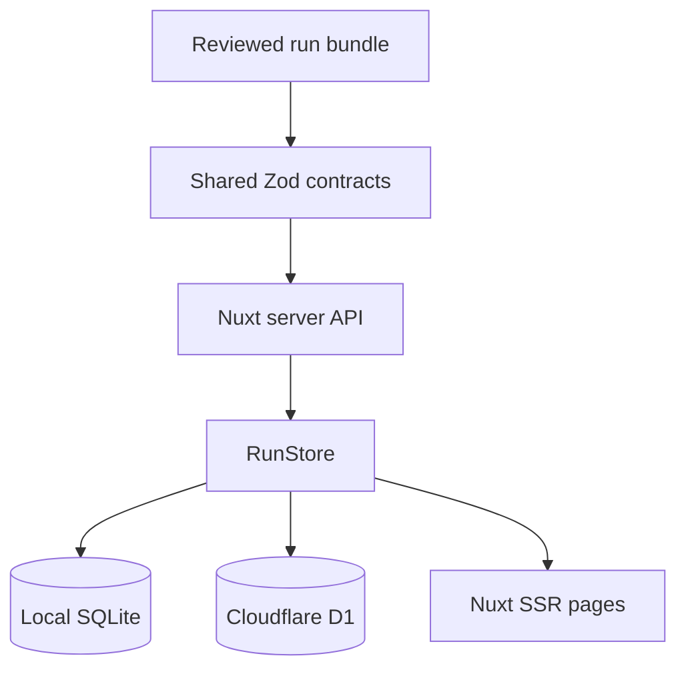

# Nuxt Review Workspace

## Purpose

The optional web workspace makes completed Frame of Mind runs easier to browse.
It is a Nuxt 4 SSR application built with Bun and Nuxt UI.

It does not analyze recordings, fetch provider context, or replace the portable
run directory. The invariant is:

> A database loss must not destroy the only usable copy of an analysis.

`analysis.json` and `manifest.json` remain authoritative. SQLite and D1 are
rebuildable projections.

## Local Studio preview

The completed-run workspace remains the stable v0.2 surface. A build-time
isolated local Studio preview now provides per-launch authentication,
Connections, and private recording staging:

```bash
cp .env.example .env
bun run studio
```

The command binds to loopback and prints a one-time launch URL. Its capability
is carried in the URL fragment, removed before the exchange request, and
exchanged once for an HttpOnly, SameSite=Strict session cookie. Sensitive
`/api/studio/*` routes require that session in addition to Host/peer validation.

The Studio-enabled node build selects a local-only Nuxt UI dashboard frame for
Runs, Recording, Connections, Import, and run detail. The frame provides one
responsive navigation model and a primary New Analysis entry point. Normal
review and Cloudflare builds select the pass-through review frame at build
time, retain their existing SSR header, and exclude the Studio frame module.

The Connections page supports:

- Gemini and Granola environment-key status;
- temporary process-memory Gemini and Granola keys;
- Bluedot and Granola OAuth status and browser initiation;
- source, lifetime, last verification, and sanitized failure display;
- `.env` guidance without writing the file or echoing a secret.

The Recording page uses Nuxt UI's accessible single-file picker/drop zone over
the authenticated resumable media API. It validates extension, declared MIME,
and bytes before create; streams server-advertised fixed parts; counts only
receipt-confirmed bytes; supports pause, retry, abort, and explicit
ephemeral/retained selection; and discloses local storage and the later Gemini
Files transfer before staging begins.

The selected browser `File` remains component-local. Session storage contains
only an opaque media ID. After refresh, Studio reconciles the server receipt,
requires file re-selection, verifies a complete-file binding using bounded
part hashes, and sends only missing parts. Both ephemeral and retained sessions
carry a visible server-owned expiry; browser storage is never cleanup
authority. Startup reconciliation and a non-overlapping lifecycle-owned
periodic sweep enforce that expiry even when the server remains open after the
originating tab closes. If session storage is unavailable, the current page
can finish but Studio explicitly reports that refresh-resume is disabled. The
analysis composer and job activity UI remain later track tasks; the protected
durable job runtime is already present underneath them.

The planned Studio distinguishes operational job data from the existing run
projection:

- active job/events in SQLite are operational authority until completion;
- a successful v2 run pair becomes completed-analysis authority;
- run/item rows remain rebuildable;
- recording and context bytes never enter SQLite;
- reviewer-authored notes remain out of scope until they have a durable
  sidecar contract.

Sensitive local Studio routes require a per-launch session, not only the
current loopback guard. The Cloudflare build remains review-only and must
exclude every local secret, staging, executor, and media-serving
implementation. See the [Conductor specification](../conductor/tracks/local-studio_20260726/spec.md)
and [ADR log](adr/README.md).

## Deployment modes

| Mode | Runtime | Database | Authentication | Intended use |
|---|---|---|---|---|
| Local review | Bun + Nuxt SSR | Bun SQLite | loopback Host/peer guard | browse completed runs |
| Local Studio | Bun + Nuxt SSR | Bun SQLite plus private filesystem staging | Host/peer guard plus per-launch session | configure providers and privately stage a recording; analysis jobs are phased |
| Hosted | Cloudflare Worker | D1 | Cloudflare Access plus in-app JWT validation | a controlled team workspace |

The run pages and API contracts are shared. The `RunStore`, Nitro preset, and
top-level application frame are selected at build time.



## What is stored

The `analysis_runs` table stores:

- run, meeting, recipe, provider, transport, and model identity;
- start/completion/import timestamps;
- accepted and rejected counts;
- match notes;
- validated `analysis.json` and `manifest.json`;
- optional authenticated importer email.

The `analysis_items` table stores one normalized row per analysis item:

- accepted state;
- kind, title, summary, and importance;
- candidate start/end times;
- screenshot filename, if present;
- candidate and result JSON.

The normalized table supports future filters without rewriting the durable
contract.

Local Studio recording bytes are stored separately under the operating
system's per-user application-data directory. Receipts and responses expose
opaque IDs, byte counts, hashes, lifecycle state, and expiry—not filesystem
paths or original filenames. Override the dedicated staging root only with an
absolute path outside the checkout:

```bash
FRAME_OF_MIND_MEDIA_ROOT="/private/path/frame-of-mind-media" bun run studio
```

## What is not stored

The import path does not copy:

- recordings;
- screenshot bytes;
- raw Bluedot or Granola payloads;
- complete transcripts;
- signed download URLs;
- Gemini uploads;
- Gemini, Granola, Asana, GitHub, or provider credentials.

The screenshot filename is retained only as a pointer back to the local bundle.
D1 is not blob storage. If shared screenshots are added later, they require an
explicit R2 retention and authorization design.

## Local setup

From the repository root:

```bash
bun install --frozen-lockfile
bun run test:web
bun run typecheck:web
bun run web
```

Open `http://127.0.0.1:3000`.

The default database is:

```text
.data/frame-of-mind.sqlite
```

Override it without changing source:

```bash
NUXT_SQLITE_PATH="/private/path/frame-of-mind.sqlite" bun run web
```

`.data/` is ignored by Git.
The local database is created with user-only permissions on POSIX systems.

## Browser smoke tests

The Playwright suite builds the local Studio, launches it with Bun on an
isolated loopback port, and uses only a temporary database, empty dotenv file,
temporary OAuth configuration root, and synthetic fixtures:

```bash
bunx playwright install chromium
bun run test:e2e:smoke
```

Run the complete browser matrix with `bun run test:e2e`. No provider or Gemini
network call is allowed. See [Testing Strategy](TESTING.md) for project
isolation, current journeys, CI behavior, and the recording-resume contract.

## Import a run

### Browser

1. Open **Import run**.
2. Select `analysis.json`.
3. Select the matching `manifest.json`.
4. Select **Validate and import**.
5. Review the run detail page.

The request is limited to 2 MiB and must use `application/json`. Browser
requests with cross-site Fetch Metadata or a foreign `Origin` are rejected.
Both files are parsed against the version 2 contract. The importer recomputes
the canonical analysis SHA-256 and rejects mismatched run/meeting/recipe/model
identity, invalid timestamps, contradictory provider transport, and modified
content.

### Terminal

```bash
bun run web:import -- "/path/to/runs/<meeting-id>/<run-id>"
```

The command reads only `analysis.json` and `manifest.json`. Re-importing the
same run ID refreshes the projection and its normalized items.

The import response's `created` flag is a user-interface hint, not a concurrency
primitive. D1 checks for an existing row immediately before its atomic batch;
two simultaneous first imports of the same run can both report `created: true`
while still converging on one correct primary-keyed projection.

The D1 batch has bounded query shape: run upsert, item delete, and one or more
byte-bounded `json_each` item expansions. It does not issue one statement per
analysis item. The request cap plus 900 KB expansion cap keeps the statement
count safely below the Worker invocation query limit; regressions cover both
1,000 small items and a sub-2 MiB multi-batch payload.

## Local authentication behavior

`NUXT_AUTH_MODE=off` is the local default. It is not equivalent to public
anonymous access.

When auth is off, server middleware requires one of these Host values:

- `localhost`;
- `127.0.0.1`;
- `::1`.

It also requires a loopback peer address. If Bun's Node compatibility layer
does not expose that address, the middleware requires the server's explicit
`NITRO_HOST`/`HOST` listener binding to be loopback. Starting Nuxt on
`0.0.0.0` does not bypass the guard. A remote Host receives 403 unless
`NUXT_ALLOW_UNAUTHENTICATED_REMOTE=true` is explicitly set.

That override is intentionally awkward. Do not use it for a public deployment.
Use Cloudflare Access.

## Local production build

```bash
bun run build:web
bun run --cwd apps/web preview
```

The local server bundle externalizes `bun:sqlite`; run it with Bun, not Node.

## Backup and restore

Stop the local server before copying the SQLite file:

```bash
cp .data/frame-of-mind.sqlite "/private/backup/frame-of-mind-$(date +%Y%m%d).sqlite"
```

Restore by placing a valid copy at `NUXT_SQLITE_PATH`, or delete the projection
and re-import the authoritative run bundles.

Do not commit a database backup. It contains meeting-derived analysis.

## Schema changes

The initial schema exists in two checked-in forms:

- `apps/web/server/data/sql.ts` for automatic local bootstrap;
- `apps/web/db/migrations/0001_initial.sql` for D1.

The Bun test suite compares the normalized SQL text and fails when they drift.

For a new migration:

1. add a numbered SQL file under `apps/web/db/migrations/`;
2. update local bootstrap behavior without changing prior migration files;
3. add a migration test;
4. apply locally;
5. build both targets;
6. back up D1 before applying remotely.

## API surface

| Method | Path | Purpose |
|---|---|---|
| `GET` | `/api/health` | authenticated liveness |
| `GET` | `/api/session` | current auth mode and verified email |
| `GET` | `/api/runs?limit=50&cursor=...` | keyset-paginate projected run summaries |
| `POST` | `/api/runs` | validate and import a run |
| `GET` | `/api/runs/:id` | fetch one projected run |
| `POST` | `/api/studio/media` | create an authenticated local upload session |
| `GET` | `/api/studio/media/:id` | read its resumable receipt |
| `PUT` | `/api/studio/media/:id/parts/:part` | stream one exact part with `Upload-Offset` |
| `POST` | `/api/studio/media/:id/complete` | verify and atomically seal media |
| `DELETE` | `/api/studio/media/:id` | abort and clean the staged copy |

The entire hostname should be protected by Access. `/api/health` is not a
public bypass because a health response can reveal deployment state.
The `/api/studio/*` rows above are local-only and are absent from Cloudflare
artifacts.

## Troubleshooting

### 403 in local mode

Use `http://127.0.0.1:3000` or `http://localhost:3000`. Check whether a reverse
proxy changed the Host header.

### `bun:sqlite` cannot be resolved

Run the local bundle with Bun:

```bash
bun run --cwd apps/web preview
```

Do not run `.output/server/index.mjs` with Node.

### Import returns 422

Confirm both files came from the same run directory and use schema version 2.
Do not hand-edit either file: the manifest binds the exact canonical
`analysis.json` bytes. For a v1 run, rerun the original source analysis under
v0.2 rather than relabeling the schema.

Existing v1 projection rows are hidden from list/detail queries, including
malformed legacy JSON. Re-running and importing the source analysis with v0.2
replaces the same run ID in place. If regeneration is impossible, retain the
authoritative v1 bundle outside the workspace and purge the obsolete projection
only through the exact-ID backup/purge procedure.

### Cloud build references SQLite

Build through the checked-in command:

```bash
bun run build:web:cloudflare
```

It selects the D1 adapter before Nuxt bundles the server. A raw `nuxi build`
uses local defaults and is not the hosted build contract.

### Empty page after a successful import

Refresh `/api/runs`. Check server logs for database errors. If the API returns
the run but the page fails, preserve the JSON bundle and report the UI issue;
do not mutate the analysis to make the renderer accept it.
