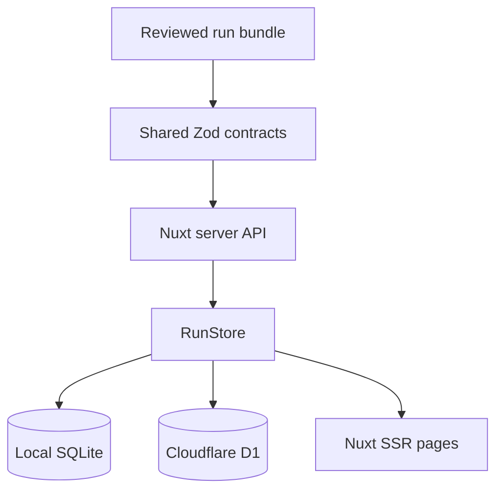

# Nuxt Review Workspace

## Purpose

The optional web workspace makes completed Frame of Mind runs easier to browse.
It is a Nuxt 4 SSR application built with Bun and Nuxt UI.

It does not analyze recordings, fetch provider context, or replace the portable
run directory. The invariant is:

> A database loss must not destroy the only usable copy of an analysis.

`analysis.json` and `manifest.json` remain authoritative. SQLite and D1 are
rebuildable projections.

## Deployment modes

| Mode | Runtime | Database | Authentication | Intended use |
|---|---|---|---|---|
| Local | Bun + Nuxt SSR | Bun SQLite | loopback-only guard | one colleague on one machine |
| Hosted | Cloudflare Worker | D1 | Cloudflare Access plus in-app JWT validation | a controlled team workspace |

The UI and API are shared. Only the `RunStore` adapter and Nitro preset change
at build time.



## What is stored

The `analysis_runs` table stores:

- run, meeting, recipe, provider, transport, and model identity;
- start/completion/import timestamps;
- accepted and rejected counts;
- match notes;
- validated `analysis.json` and `manifest.json`;
- optional authenticated importer email.

The `analysis_items` table stores one normalized row per analysis item:

- accepted state;
- kind, title, summary, and importance;
- candidate start/end times;
- screenshot filename, if present;
- candidate and result JSON.

The normalized table supports future filters without rewriting the durable
contract.

## What is not stored

The import path does not copy:

- recordings;
- screenshot bytes;
- raw Bluedot or Granola payloads;
- complete transcripts;
- signed download URLs;
- Gemini uploads;
- Gemini, Granola, Asana, GitHub, or provider credentials.

The screenshot filename is retained only as a pointer back to the local bundle.
D1 is not blob storage. If shared screenshots are added later, they require an
explicit R2 retention and authorization design.

## Local setup

From the repository root:

```bash
bun install --frozen-lockfile
bun run test:web
bun run typecheck:web
bun run web
```

Open `http://127.0.0.1:3000`.

The default database is:

```text
.data/frame-of-mind.sqlite
```

Override it without changing source:

```bash
NUXT_SQLITE_PATH="/private/path/frame-of-mind.sqlite" bun run web
```

`.data/` is ignored by Git.
The local database is created with user-only permissions on POSIX systems.

## Import a run

### Browser

1. Open **Import run**.
2. Select `analysis.json`.
3. Select the matching `manifest.json`.
4. Select **Validate and import**.
5. Review the run detail page.

The request is limited to 2 MiB. Both files are parsed against the version 1
contract. The importer rejects mismatched meeting IDs, recipe IDs, and model
identities.

### Terminal

```bash
bun run web:import -- "/path/to/runs/<meeting-id>/<run-id>"
```

The command reads only `analysis.json` and `manifest.json`. Re-importing the
same run ID refreshes the projection and its normalized items.

## Local authentication behavior

`NUXT_AUTH_MODE=off` is the local default. It is not equivalent to public
anonymous access.

When auth is off, server middleware requires both a loopback peer address and
one of these Host values:

- `localhost`;
- `127.0.0.1`;
- `::1`.

Starting Nuxt on `0.0.0.0` does not bypass the guard. A remote Host receives
403 unless `NUXT_ALLOW_UNAUTHENTICATED_REMOTE=true` is explicitly set.

That override is intentionally awkward. Do not use it for a public deployment.
Use Cloudflare Access.

## Local production build

```bash
bun run build:web
bun run --cwd apps/web preview
```

The local server bundle externalizes `bun:sqlite`; run it with Bun, not Node.

## Backup and restore

Stop the local server before copying the SQLite file:

```bash
cp .data/frame-of-mind.sqlite "/private/backup/frame-of-mind-$(date +%Y%m%d).sqlite"
```

Restore by placing a valid copy at `NUXT_SQLITE_PATH`, or delete the projection
and re-import the authoritative run bundles.

Do not commit a database backup. It contains meeting-derived analysis.

## Schema changes

The initial schema exists in two checked-in forms:

- `apps/web/server/data/sql.ts` for automatic local bootstrap;
- `apps/web/db/migrations/0001_initial.sql` for D1.

The Bun test suite compares the normalized SQL text and fails when they drift.

For a new migration:

1. add a numbered SQL file under `apps/web/db/migrations/`;
2. update local bootstrap behavior without changing prior migration files;
3. add a migration test;
4. apply locally;
5. build both targets;
6. back up D1 before applying remotely.

## API surface

| Method | Path | Purpose |
|---|---|---|
| `GET` | `/api/health` | authenticated liveness |
| `GET` | `/api/session` | current auth mode and verified email |
| `GET` | `/api/runs` | list projected runs |
| `POST` | `/api/runs` | validate and import a run |
| `GET` | `/api/runs/:id` | fetch one projected run |

The entire hostname should be protected by Access. `/api/health` is not a
public bypass because a health response can reveal deployment state.

## Troubleshooting

### 403 in local mode

Use `http://127.0.0.1:3000` or `http://localhost:3000`. Check whether a reverse
proxy changed the Host header.

### `bun:sqlite` cannot be resolved

Run the local bundle with Bun:

```bash
bun run --cwd apps/web preview
```

Do not run `.output/server/index.mjs` with Node.

### Import returns 422

Confirm both files came from the same run directory and use schema version 1.
Do not hand-edit model, recipe, or meeting identity.

### Cloud build references SQLite

Build through the checked-in command:

```bash
bun run build:web:cloudflare
```

It selects the D1 adapter before Nuxt bundles the server. A raw `nuxi build`
uses local defaults and is not the hosted build contract.

### Empty page after a successful import

Refresh `/api/runs`. Check server logs for database errors. If the API returns
the run but the page fails, preserve the JSON bundle and report the UI issue;
do not mutate the analysis to make the renderer accept it.
