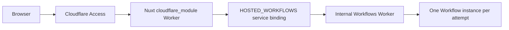

# Hosted Workflows topology spike — 2026-08-22

## Outcome

Task 3.0 selects **topology B**: keep the public Nuxt/Nitro Worker on the
existing Cloudflare Access hostname and deploy a sibling, internal-only Worker
that owns `WorkflowEntrypoint` exports. The Nuxt Worker reaches it through the
`HOSTED_WORKFLOWS` service binding.

The deployed review Worker remains unchanged. The spike handler is compiled
only when `FRAME_OF_MIND_HOSTED_WORKFLOW_SPIKE=1`; the normal Cloudflare build
forbids its route, source marker, and service binding. Neither spike Wrangler
configuration has a route, live database ID, secret, or production hostname.

## Why topology A stopped

The repository pins Nuxt 4.5.2 with Nitro 2.13.4. Its installed
`cloudflare_module` preset uses the fixed
`presets/cloudflare/runtime/cloudflare-module` entry, and that entry exports
only Nitro's default fetch handler. It has no supported `exports.cloudflare`
or `setupEntryExports` seam. The spike script inspects the installed preset and
will stop if a future dependency update adds one, so topology A can be
re-evaluated deliberately rather than remaining permanently excluded.

Review caveat (Grok, 2026-08-22): this is a preset inspection, not a failed
wrap. The pin already emits `exports: "named"` ESM, so a custom entry that
re-exports Nitro's default handler alongside a `WorkflowEntrypoint` subclass
(the same wrapper-entry mechanism Task 2.0b is exercising for streaming) is an
unattempted topology-A candidate. Topology B stands on its own merits —
isolation, separate secrets, independent deploys — but the freeze reason is
"not attempted on this pin", not "impossible".

An open Nitro request describes the same missing Workflows preset. Current
Nitro `main` has since gained general Cloudflare entry-export setup, but that is
not the version this repository builds or tests. A custom deep-runtime import,
post-build mutation, or Rollup chunk rewrite could force a named export today;
those shapes were rejected as fragile because they would own Nitro's generated
entry and deploy-config behavior outside the pinned public contract.

## Chosen boundary



Only Nuxt has the public hostname. The sibling config sets `workers_dev` to
false and defines no route. Cloudflare documents that Access context does not
propagate across a service binding, so production calls must carry only a
bounded principal-scoped job/attempt receipt; the sibling must rehydrate and
revalidate that receipt rather than treating the internal call itself as user
authentication.

Cloudflare also documents that service-bound Workers deploy separately and the
target must exist before the caller. Phase 6 deployment order is therefore:

1. deploy/version the sibling Workflows Worker;
2. dry-run and deploy the Nuxt Worker with its service binding;
3. keep browser/API traffic on the existing Access hostname;
4. verify the linked Worker + D1 + Workflow + Access release as one boundary.

## Wrangler configuration shape

Sibling Workflows Worker:

```jsonc
{
  "name": "frame-of-mind-hosted-workflows",
  "main": "src/index.ts",
  "workers_dev": false,
  "workflows": [
    {
      "name": "frame-of-mind-analysis",
      "binding": "HOSTED_WORKFLOW",
      "class_name": "HostedAnalysisWorkflow"
    }
  ]
}
```

Nuxt caller, added to the future reviewed deployment config rather than the
current ignored `apps/web/wrangler.jsonc`:

```jsonc
{
  "name": "frame-of-mind",
  "main": ".output/server/index.mjs",
  "services": [
    {
      "binding": "HOSTED_WORKFLOWS",
      "service": "frame-of-mind-hosted-workflows"
    }
  ]
}
```

These are shapes, not deployable production configuration: no live IDs,
routes, hostnames, Access audience, or secrets are recorded here.

## Executable proof

Run from the repository root:

```bash
bun --no-env-file scripts/spike-hosted-workflows.ts
```

The script:

1. inspects the pinned Nitro preset for a supported named-export seam;
2. builds Nuxt with the spike-only relay under `cloudflare_module`;
3. runs `wrangler deploy --dry-run --outdir` for both Workers;
4. verifies the sibling artifact exports `HostedWorkflowSpike` extending
   `WorkflowEntrypoint`;
5. starts two local Wrangler/workerd sessions;
6. creates one Workflow through Nuxt's service binding; and
7. polls until the persisted two-step output is complete.

The isolated configs use compatibility date `2026-08-18`, the newest date
supported by the workerd binary bundled with pinned Wrangler 4.123.0. They use
no provider credentials or production resources.

Receipt from the passing 2026-08-22 run:

```text
HOSTED_WORKFLOW same_module_export=FAIL nitropack_2_13_4_has_default_entry_only
HOSTED_WORKFLOW nitro_build=PASS preset=cloudflare_module workflow_class=absent
HOSTED_WORKFLOW workflow_dry_run=PASS class=HostedWorkflowSpike binding=HOSTED_WORKFLOW
HOSTED_WORKFLOW nuxt_dry_run=PASS binding=HOSTED_WORKFLOWS target=frame-of-mind-hosted-workflows-spike
HOSTED_WORKFLOW service_binding=PASS nuxt_to_sibling=connected
HOSTED_WORKFLOW instance_create=PASS id=opaque
HOSTED_WORKFLOW step_one=PASS value=14
HOSTED_WORKFLOW step_two=PASS value=workflow-14
HOSTED_WORKFLOW terminal_status=PASS status=complete
HOSTED_WORKFLOW_SPIKE PASSED
```

The expected `same_module_export=FAIL` selects the proven fallback and does not
make the overall spike fail.

## Phase 3 cleanup after `NonRetryableError`

An uncaught `NonRetryableError` ends a Workflow immediately, so a later linear
`cleanup` step would never run. In the sibling topology, the Workflow class
owns this terminal-path structure:

1. provider `step.do` calls use explicit 15-minute configs and zero platform
   retries;
2. the Workflow catches provider/receipt failures inside `run` and retains a
   bounded terminal error code plus exact owned Gemini cleanup identity;
3. a final explicit `cleanup` step runs before the caught terminal error is
   rethrown or the attempt is finalized;
4. rollback handlers are registered for steps whose committed output owns a
   cleanup action, providing termination rollback without replacing the final
   cleanup receipt; and
5. cleanup failure is recorded honestly and never rewrites a published run's
   provenance.

Task 3.3 must test success-without-receipt, crash-after-Gemini, cancellation,
rollback, cleanup failure, and an uncaught-error guard proving no provider call
is automatically duplicated. This spike proves topology only; it does not
authorize hosted provider execution or deployment.

## Sources fetched 2026-08-22

- [Cloudflare Workflows Workers API](https://developers.cloudflare.com/workflows/build/workers-api/)
- [Build your first Workflow](https://developers.cloudflare.com/workflows/get-started/guide/)
- [Workflows local development](https://developers.cloudflare.com/workflows/build/local-development/)
- [Cloudflare service bindings](https://developers.cloudflare.com/workers/runtime-apis/bindings/service-bindings/)
- [Nitro issue #3954: add a Cloudflare Workflows preset](https://github.com/nitrojs/nitro/issues/3954)
- [Nitro Cloudflare preset source](https://github.com/nitrojs/nitro/blob/main/src/presets/cloudflare/preset.ts)
